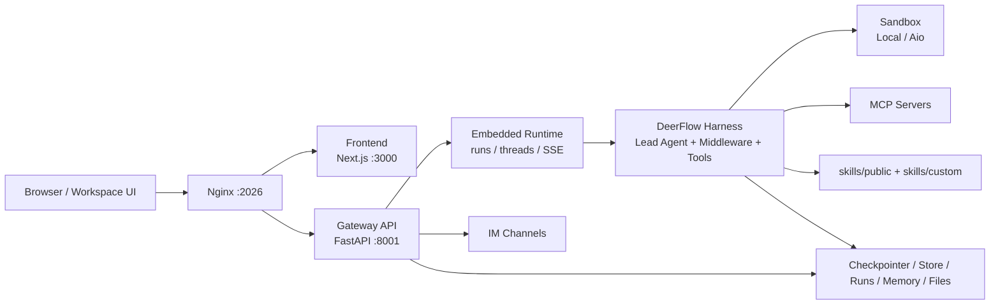
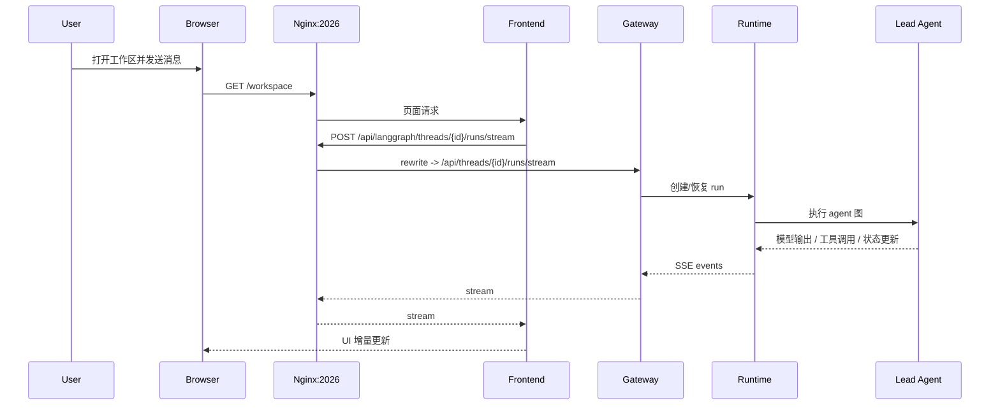

# DeerFlow 项目高层总览

## 1. 这是什么项目

DeerFlow 2.0 可以理解为一个面向通用智能体应用的 **super agent harness**。它不是单纯的聊天前端，也不是只暴露 LangGraph API 的后端服务，而是一整套把下面这些能力组织起来的运行框架：

- Web 工作区
- Gateway API
- 嵌入式 agent runtime
- sandbox 执行环境
- tools / MCP / skills 扩展体系
- thread state、run events、memory 等持久化能力
- 可选 IM channels

一个更准确的心智模型是：

- **产品层**：浏览器中的 DeerFlow App，负责对话、线程、上传、产物浏览、设置和管理界面。
- **运行时层**：Gateway + Harness，负责 agent 创建、状态管理、流式执行、工具调度和安全边界。
- **扩展层**：sandbox、skills、MCP、社区工具、子 agent、memory、外部渠道集成。

它也有几个容易误解的点：

- **不是**“一个独立 LangGraph server + 一个前端壳子”。
- **不是**“只有一个 prompt 的单 agent 项目”。
- **不是**“只能做 deep research 的特定工作流”。

DeerFlow 的核心价值在于：把模型、工具、子 agent、沙箱和状态持久化组合成一套可部署、可扩展、可观察的 agent 应用骨架。

## 2. 一句话架构

默认情况下，浏览器只需要访问 `http://localhost:2026`。`nginx` 作为统一入口，把页面请求发给前端，把 API 请求发给 Gateway；Gateway 内部再驱动 DeerFlow Harness 去执行 agent、工具、sandbox、skills、memory 和持久化逻辑。

最关键的边界是：

- 浏览器访问统一入口 `:2026`。
- `/api/langgraph/*` 会被 `nginx` rewrite 到 Gateway 原生的 `/api/*` 路由。
- **agent runtime 是嵌在 Gateway 进程里的**，默认没有单独常驻的 LangGraph upstream 服务。

## 3. 运行时分层

### Frontend

前端位于 [`frontend/`](../frontend)，使用 Next.js App Router 构建工作区 UI。它负责：

- 线程列表、聊天界面、设置页、上传与产物展示
- 通过 LangGraph SDK 调用 `/api/langgraph/*`
- 通过 REST 调用模型、技能、MCP、memory、uploads 等接口
- 在请求发出前注入 CSRF header

前端默认会把 LangGraph SDK base URL 设成当前 origin 下的 `/api/langgraph`，也就是浏览器通常不需要直接知道 `:8001`。

可读入口：

- [`frontend/src/core/config/index.ts`](../frontend/src/core/config/index.ts)
- [`frontend/src/core/api/api-client.ts`](../frontend/src/core/api/api-client.ts)

### Nginx

`nginx` 是统一入口和 same-origin 边界。它做两件事：

- 把页面和静态资源请求转给前端
- 把 `/api/*` 和 `/api/langgraph/*` 转给 Gateway

其中 `/api/langgraph/*` 的 rewrite 是关键兼容层。对外看起来像 LangGraph-compatible API，但实际仍然由 Gateway 的 `/api/*` routers 处理。

可读入口：

- [`docker/nginx/nginx.local.conf`](../docker/nginx/nginx.local.conf)
- [`docker/nginx/nginx.conf`](../docker/nginx/nginx.conf)

### Gateway

Gateway 位于 [`backend/app/gateway/`](../backend/app/gateway)，是整个应用的服务边界。它是一个 FastAPI 应用，负责：

- 暴露模型、技能、MCP、memory、uploads、artifacts、threads、runs 等 API
- 承载 LangGraph-compatible threads/runs/streaming 路由
- 维护认证、CSRF、CORS 等 Web 约束
- 在 lifespan 中初始化 runtime、持久化层和 channels

可以把它理解为“应用入口层”和“运行时宿主层”的结合体。

可读入口：

- [`backend/app/gateway/app.py`](../backend/app/gateway/app.py)
- [`backend/app/gateway/routers/`](../backend/app/gateway/routers)

### Harness / Lead Agent

真正执行任务的是 DeerFlow Harness，核心代码在 [`backend/packages/harness/deerflow/`](../backend/packages/harness/deerflow)。

这里的核心对象不是单个函数，而是一套协作系统：

- `make_lead_agent(...)` 负责组装 Lead Agent
- middleware chain 负责执行前后的横切逻辑
- tool system 负责把 sandbox、MCP、内建工具和社区工具绑定给 agent
- subagent system 负责把复杂任务拆给子 agent 并并发执行

可读入口：

- [`backend/packages/harness/deerflow/agents/lead_agent/agent.py`](../backend/packages/harness/deerflow/agents/lead_agent/agent.py)
- [`backend/packages/harness/deerflow/agents/thread_state.py`](../backend/packages/harness/deerflow/agents/thread_state.py)

### Sandbox / Tools / Skills / MCP

这一层是 DeerFlow 的扩展执行面：

- **Sandbox**：提供命令执行和文件系统隔离，常见实现是 `LocalSandboxProvider` 和 `AioSandboxProvider`
- **Tools**：给模型实际可执行的动作，比如文件读写、shell、web search、`task` 子 agent 调度等
- **Skills**：以 `SKILL.md` 为中心的提示词/工作流能力包，主要影响 agent 的“做事方法”
- **MCP**：把外部系统以 tool schema 的形式接入 DeerFlow

一个很重要的区分是：

- **skills 更偏认知/流程注入**
- **tools 更偏实际执行能力**
- **MCP 是外部能力的协议化接入层**

### Persistence / Memory

DeerFlow 不是只依赖聊天上下文存活。它有多层状态：

- **Thread state / checkpoint**：保存对话图状态、多轮消息、标题、todos、artifacts 等
- **Run metadata / events**：保存 run 生命周期、事件、反馈等应用级记录
- **Thread files**：每个 thread 的 workspace / uploads / outputs
- **Long-term memory**：用户事实、偏好、上下文摘要，供后续会话注入

这几层不是一回事。理解 DeerFlow 时，最好把“checkpoint state”和“memory”分开看。

## 4. 技术栈

| 层次 | 主要技术 |
| --- | --- |
| 前端 | Next.js 16、React 19、TypeScript、Tailwind CSS 4、Radix UI、TanStack Query |
| 前端 AI 接入 | `@langchain/langgraph-sdk`、Vercel AI SDK 相关 UI 组件 |
| Gateway | Python 3.12、FastAPI、Uvicorn、SSE |
| Agent Runtime | LangGraph、LangChain、`deerflow-harness` |
| 工具与扩展 | MCP、社区搜索/抓取工具、skills、subagents |
| 沙箱 | Local sandbox、Docker/Aio sandbox |
| 持久化 | LangGraph checkpointer/store、SQLAlchemy、SQLite，生产可选 PostgreSQL |
| 运维与启动 | `uv`、`pnpm`、`make`、Docker Compose、nginx |
| 认证与追踪 | Better Auth、CSRF/CORS、中间件 tracing（Langfuse/LangSmith） |

如果只想快速记住一句话，可以记成：

> **Next.js + FastAPI + LangGraph/LangChain + sandbox/tooling + 多层持久化**。

## 5. 核心组件

下表列的是最值得优先建立认知的组件，而不是所有模块。

| 组件 | 作用 | 代码入口 |
| --- | --- | --- |
| Gateway App | 应用统一后端入口，初始化 runtime、auth、CORS/CSRF、routers | [`backend/app/gateway/app.py`](../backend/app/gateway/app.py) |
| Gateway Routers | 暴露 models / skills / mcp / threads / runs / uploads / artifacts 等接口 | [`backend/app/gateway/routers/`](../backend/app/gateway/routers) |
| Lead Agent Factory | 根据配置组装模型、prompt、tools、middlewares、state schema | [`backend/packages/harness/deerflow/agents/lead_agent/agent.py`](../backend/packages/harness/deerflow/agents/lead_agent/agent.py) |
| ThreadState | 定义对话运行时的核心状态结构 | [`backend/packages/harness/deerflow/agents/thread_state.py`](../backend/packages/harness/deerflow/agents/thread_state.py) |
| Middleware Chain | 负责 thread 初始化、uploads、sandbox、summarization、todo、memory、loop detection、clarification 等横切逻辑 | [`backend/packages/harness/deerflow/agents/middlewares/`](../backend/packages/harness/deerflow/agents/middlewares) |
| Tool System | 汇总内建工具、sandbox 工具、社区工具、MCP 工具和 `task` 子 agent 工具 | [`backend/packages/harness/deerflow/tools/`](../backend/packages/harness/deerflow/tools) |
| Sandbox Provider | 提供线程级隔离的执行与文件访问能力 | [`backend/packages/harness/deerflow/sandbox/`](../backend/packages/harness/deerflow/sandbox) |
| Subagent Executor | 负责后台子任务执行、并发限制和结果回收 | [`backend/packages/harness/deerflow/subagents/`](../backend/packages/harness/deerflow/subagents) |
| Runtime 层 | 管理 runs、stream bridge、event journal、checkpointer/store 对接 | [`backend/packages/harness/deerflow/runtime/`](../backend/packages/harness/deerflow/runtime) |
| IM Channels | 对接 Slack、Telegram、Discord、飞书、企业微信、钉钉等渠道 | [`backend/app/channels/`](../backend/app/channels) |
| Frontend Workspace | 呈现线程、消息、任务、产物、上传和设置 | [`frontend/src/app/workspace/`](../frontend/src/app/workspace) 和 [`frontend/src/components/workspace/`](../frontend/src/components/workspace) |

其中最值得特别记住的 4 个概念是：

- **Gateway 是服务入口**
- **Lead Agent 是任务执行入口**
- **middleware chain 是行为编排骨架**
- **sandbox/tools/skills/MCP 是能力扩展面**

## 6. 关键调用链

### 6.1 Web 对话请求

这是最核心的一条链路：

1. 用户打开 `http://localhost:2026`
2. `nginx` 把页面请求转发到前端
3. 前端页面通过 LangGraph SDK 或 REST 发起请求
4. `/api/langgraph/*` 先被 `nginx` rewrite 到 `/api/*`
5. Gateway 的 `threads/runs` 路由接手
6. Gateway runtime 创建或恢复 thread/run 状态
7. Lead Agent 通过 middleware、tools、sandbox、MCP、skills 执行任务
8. 结果以 SSE/stream 形式回到前端

### 6.2 文件上传与产物

上传不是前端本地功能，而是 runtime 的一部分：

1. 前端把文件提交到 `/api/threads/{id}/uploads`
2. Gateway 把文件保存到 thread 关联目录
3. `UploadsMiddleware` 把新文件信息注入当前会话上下文
4. agent 可以通过文件工具或 sandbox 访问这些文件
5. 生成的新文件进入 `outputs/artifacts`，前端再通过 artifacts 接口展示或下载

理解这个链路后，就能明白 DeerFlow 的“文件处理”不是 UI 附加功能，而是 agent 工作区模型的一部分。

### 6.3 子 Agent / 外部能力调用

当 Lead Agent 自己不直接完成任务时，它会把能力委托出去：

- 通过 `task` 工具调用 subagent
- 通过 MCP 工具调用外部系统
- 通过 sandbox 工具执行命令或文件操作
- 通过 community tools 做搜索、抓取、网页获取等

所以 DeerFlow 的执行模型更像“一个调度者 + 多个能力提供者”，而不是单模型直接回答。

## 7. 仓库结构与边界

| 路径 | 主要职责 | 如何理解它的边界 |
| --- | --- | --- |
| [`backend/app/`](../backend/app) | Gateway 应用层与 IM channels | 这是“服务入口层”，不是 agent 核心实现层 |
| [`backend/packages/harness/deerflow/`](../backend/packages/harness/deerflow) | Harness、agent、runtime、sandbox、tools、persistence | 这是项目最核心的运行时实现 |
| [`frontend/src/`](../frontend/src) | Web UI、前端数据流、SDK 调用与页面 | 这是 DeerFlow App 的产品层 |
| [`skills/`](../skills) | public/custom skills 目录 | 这是能力包，而不是普通静态资源 |
| [`scripts/`](../scripts) | 本地启动、Docker 启动、配置升级、诊断脚本 | 这是运维与开发体验层 |
| [`docker/`](../docker) | Compose、nginx 配置、provisioner | 这是容器部署层 |
| [`docs/`](.) | 项目文档与深度讲解 | 这是阅读入口，不参与运行时 |
| [`frontend/src/content/`](../frontend/src/content) | 网站/文档站内容源文件 | 面向站点读者，不等于运行时实现本身 |

一个很实用的区分方法是：

- 想看“应用怎么对外服务”，先看 `backend/app`
- 想看“agent 怎么真正运行”，先看 `backend/packages/harness/deerflow`
- 想看“浏览器里发生了什么”，先看 `frontend/src`

## 8. 启动与部署模式

项目至少有 3 种常见运行形态：

| 命令 | 运行形态 | 说明 |
| --- | --- | --- |
| `make dev` | 本地开发 | 在宿主机启动 Gateway、Frontend、nginx，适合读代码和改代码 |
| `make docker-start` | Docker 开发 | 通过开发版 Compose 启动容器，必要时按配置附加 provisioner |
| `make up` | 生产 Docker | 通过生产 Compose 构建并启动长期运行服务 |

补充理解：

- `make dev` 最适合日常开发，因为前后端都能 hot reload。
- `make docker-start` 更接近容器化环境，但仍偏开发模式。
- `make up` 更偏共享部署或长期运行，Gateway 会以生产方式启动。

对应入口脚本：

- [`Makefile`](../Makefile)
- [`scripts/serve.sh`](../scripts/serve.sh)
- [`scripts/docker.sh`](../scripts/docker.sh)
- [`scripts/deploy.sh`](../scripts/deploy.sh)

## 9. 建议的阅读路径

如果你刚接手这个仓库，建议按下面顺序读：

1. [`README.md`](../README.md)
   先建立项目定位、启动方式和能力概览。
2. [`backend/docs/ARCHITECTURE.md`](../backend/docs/ARCHITECTURE.md)
   先理解 Gateway 和 runtime 的整体关系。
3. [`backend/app/gateway/app.py`](../backend/app/gateway/app.py)
   看 Gateway 如何初始化、挂载 router、接入 runtime。
4. [`backend/packages/harness/deerflow/agents/lead_agent/agent.py`](../backend/packages/harness/deerflow/agents/lead_agent/agent.py)
   看 Lead Agent 是如何被组装出来的。
5. [`backend/packages/harness/deerflow/agents/thread_state.py`](../backend/packages/harness/deerflow/agents/thread_state.py)
   看一次运行会保存哪些状态。
6. [`frontend/src/core/api/api-client.ts`](../frontend/src/core/api/api-client.ts)
   看前端如何接入 streaming API。
7. [`frontend/src/core/config/index.ts`](../frontend/src/core/config/index.ts)
   看为什么默认请求会走当前 origin 下的 `/api/langgraph`。

如果你更偏“从用户请求一路追进去”，也可以走这条链：

1. 前端 workspace 页面
2. `api-client.ts`
3. `nginx` rewrite
4. Gateway `thread_runs` / `runs` 路由
5. runtime
6. `make_lead_agent`
7. middleware / tools / sandbox

## 10. 更深入的文档

这个仓库已经有两套很有价值的深入资料：

### 10.1 `docs/deep-teaching`

如果你想看“按真实调用链展开”的深度讲解，优先读这里：

- [`docs/deep-teaching/01-system-overview.md`](./deep-teaching/01-system-overview.md)
- [`docs/deep-teaching/02-configuration-and-bootstrap.md`](./deep-teaching/02-configuration-and-bootstrap.md)
- [`docs/deep-teaching/03-gateway-runtime.md`](./deep-teaching/03-gateway-runtime.md)
- [`docs/deep-teaching/04-lead-agent-execution.md`](./deep-teaching/04-lead-agent-execution.md)
- [`docs/deep-teaching/05-middleware-chain.md`](./deep-teaching/05-middleware-chain.md)
- [`docs/deep-teaching/06-tools-mcp-subagents.md`](./deep-teaching/06-tools-mcp-subagents.md)
- [`docs/deep-teaching/07-sandbox-files-artifacts.md`](./deep-teaching/07-sandbox-files-artifacts.md)
- [`docs/deep-teaching/08-skills-and-agent-config.md`](./deep-teaching/08-skills-and-agent-config.md)
- [`docs/deep-teaching/09-memory-persistence-runtime-history.md`](./deep-teaching/09-memory-persistence-runtime-history.md)
- [`docs/deep-teaching/10-frontend-workspace-debugging.md`](./deep-teaching/10-frontend-workspace-debugging.md)

### 10.2 前端文档站内容

如果你想看“面向使用者和集成者”的正式文档源文件，可以看：

- [`frontend/src/content/zh/application/`](../frontend/src/content/zh/application)
- [`frontend/src/content/zh/harness/`](../frontend/src/content/zh/harness)
- [`frontend/src/content/en/application/`](../frontend/src/content/en/application)
- [`frontend/src/content/en/harness/`](../frontend/src/content/en/harness)

这些内容更像产品文档或集成文档；`deep-teaching` 更像源码导读。

## 11. 用一句话收尾

如果要用一句话概括 DeerFlow，可以写成：

> DeerFlow 是一个把 **Web 应用、Gateway、LangGraph agent runtime、sandbox、tools、skills、MCP 和多层状态持久化** 组合在一起的可扩展 super agent harness。
