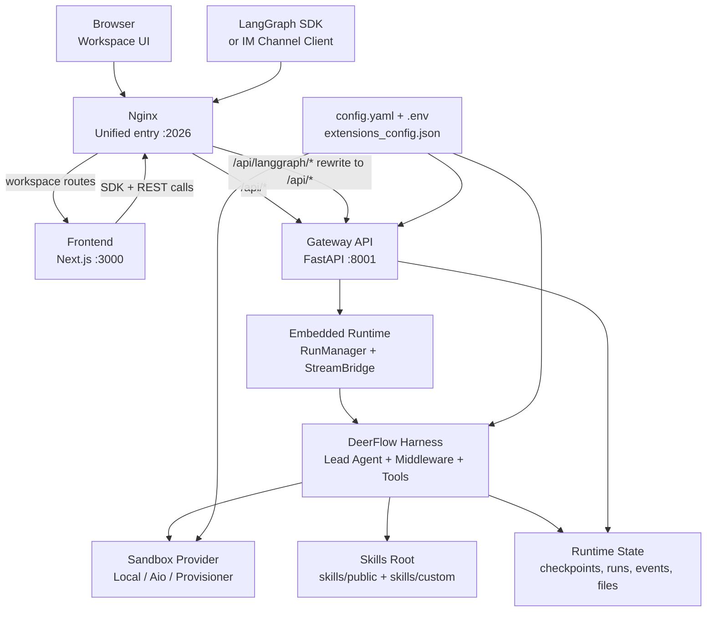
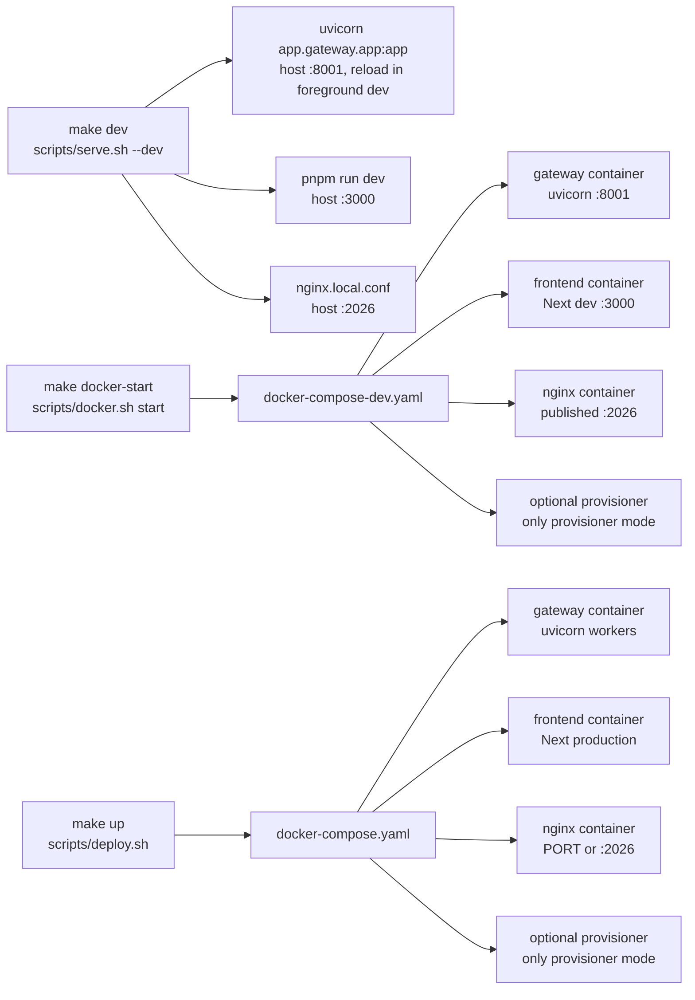

# 第 1 章：项目全景与运行边界

## 阅读目标

本章先建立 DeerFlow 的全局地图。DeerFlow 2.0 不是一个单独的 deep research 脚本，也不是只暴露 LangGraph Server 的后端项目；它是一个由 Next.js 前端、Nginx 统一入口、FastAPI Gateway、Gateway 内嵌的 LangGraph-compatible runtime、agent harness、sandbox、skills 和持久化层共同组成的 super agent harness。

读完本章后，需要能回答：

- 浏览器、Nginx、Frontend、Gateway 和 agent runtime 分别承担什么职责。
- `backend/`、`frontend/`、`skills/`、`scripts/`、`docker/` 的边界在哪里。
- `make dev`、`make docker-start`、`make up` 分别启动哪些服务，以及哪些服务只在特定 sandbox 模式下出现。
- 一次浏览器请求为什么通常只访问 `localhost:2026`，而不是直接访问 `localhost:3000` 或 `localhost:8001`。

后续章节会沿着真实执行路径继续展开：配置和启动见 [[02-configuration-and-bootstrap|配置系统与启动流程]]，Gateway run 和 SSE 见 [[03-gateway-runtime|Gateway API 与 LangGraph-compatible Runtime]]，agent 创建见 [[04-lead-agent-execution|Lead Agent 的创建与执行模型]]。

## 核心概念

### Super Agent Harness

README 对 DeerFlow 2.0 的定位是 super agent harness。这里的 harness 不是单个 agent 算法，而是一套把模型、工具、subagent、memory、skills、sandbox、上传文件和 artifact 服务组织起来的运行框架。真正执行任务的是 harness 里的 lead agent 和工具链；Web UI、Gateway、Nginx 和 Docker 只是让这套能力可访问、可部署、可观测。

### 统一入口

默认访问入口是 `http://localhost:2026`。Nginx 在本地和 Docker 场景中都监听 `2026`，再按路径分发：

- `/api/langgraph/*`：先 rewrite 成 Gateway 原生的 `/api/*`，再代理到 `gateway:8001` 或 `127.0.0.1:8001`。
- `/api/*`：直接代理到 Gateway REST API。
- 其它路径：代理到 Next.js 前端 `:3000`。

这个设计让浏览器默认保持 same-origin。跨域场景不是靠 Nginx 注入通配 CORS，而是由 Gateway 的 `GATEWAY_CORS_ORIGINS` 统一控制 CORS 和 CSRF origin 检查。

### Gateway 内嵌 Runtime

`scripts/serve.sh`、`scripts/docker.sh`、`scripts/deploy.sh` 和 Docker Compose 文件都指向同一个事实：agent runtime 嵌在 Gateway 进程里运行。项目不再默认启动独立 `langgraph dev` 服务，也没有 `langgraph` upstream。`/api/langgraph/*` 只是对外兼容 LangGraph SDK 的公开路径，最终仍落到 Gateway 的 `/api/threads`、`/api/runs`、`/api/assistants` 等 router。

### Sandbox 模式不是服务模式

服务模式回答“前端、Gateway、Nginx 怎么启动”；sandbox 模式回答“agent 执行命令和文件操作在哪里运行”。两者相关但不能混为一谈：

- Local sandbox：通常不需要额外容器服务，适合受信任本地开发。
- Aio/Docker sandbox：Gateway 通过 Docker socket 管理 sandbox 容器。
- Provisioner/Kubernetes sandbox：只有当 `config.yaml` 使用 AioSandboxProvider 且配置 `provisioner_url` 时，`make docker-start` 或 `make up` 才会把 `provisioner` 加进服务列表。

## 架构图说明

架构图以运行时组件为中心，而不是以源码目录为中心。浏览器只访问统一入口 `localhost:2026`，Nginx 根据路径把请求分发到 Next.js 前端或 FastAPI Gateway。Gateway 内嵌 LangGraph-compatible runtime，并通过 harness 调用模型、工具、sandbox、skills 和持久化能力。



## 服务拓扑图



## 请求路由流程图

```mermaid
flowchart TD
    A["User opens localhost:2026"] --> B{"Request path"}
    B -->|"/", "/workspace", static chunks| C["Nginx location /"]
    C --> D["Next.js frontend renders workspace"]
    D --> E["frontend/src/core/config<br/>builds /api/langgraph and /api URLs"]
    E --> F{"Client API call"}
    F -->|"/api/models", "/api/skills", "/api/mcp"| G["Gateway REST routers"]
    F -->|"/api/langgraph/threads/.../runs/stream"| H["Nginx rewrites to /api/threads/.../runs/stream"]
    H --> I["Gateway thread_runs router"]
    I --> J["Embedded runtime starts run"]
    J --> K["SSE frames flow back through Nginx"]
    K --> D
    G --> L["JSON response"]
    L --> D
```

## 顶层目录边界

| 目录或文件 | 职责 | 本章关注点 |
| --- | --- | --- |
| `backend/` | FastAPI Gateway、agent harness、runtime、sandbox、persistence、tests | Gateway 是服务边界，harness 是 agent 执行边界 |
| `frontend/` | Next.js workspace、LangGraph SDK client、上传、消息和 artifact UI | 默认通过 `localhost:2026` 调用后端 |
| `skills/` | public/custom skills，供 prompt 注入和 sandbox 挂载 | 不是前端静态资源，而是 agent 能力目录 |
| `scripts/` | 本地启动、Docker 启动、生产部署、配置升级、诊断 | `make` 目标最终大多落到这里 |
| `docker/` | Compose、Nginx 配置、provisioner 镜像 | Docker 场景里的服务拓扑和路由规则 |
| `config.example.yaml` / `config.yaml` | 模型、工具、sandbox、memory、skills、runtime 配置 | 第 2 章会展开配置解析 |

## 关键源码逐段讲解

### [Makefile](/Users/mrl/lgx/project/deer-flow/Makefile)

根 `Makefile` 是命令入口，不直接实现运行逻辑。关键点：

- `make dev` 先运行 `scripts/check.py`，再执行 `scripts/serve.sh --dev`。
- `make start` 走 `scripts/serve.sh --prod`。
- `make docker-start` 走 `scripts/docker.sh start`。
- `make up` 走 `scripts/deploy.sh`。
- `make clean` 会删除 `backend/.deer-flow`、`backend/.langgraph_api` 和日志，这是会影响本地运行状态的清理操作。

阅读这个文件时要注意：它没有 `langgraph dev` 目标，也没有单独的 LangGraph server 进程。Gateway 是唯一后端服务入口。

### [scripts/serve.sh](/Users/mrl/lgx/project/deer-flow/scripts/serve.sh)

这是本地开发和本地生产预览的核心启动脚本。它做了几件事：

1. 进入仓库根目录并读取 `.env`。
2. 解析 `--dev`、`--prod`、`--daemon`、`--stop`、`--restart`。
3. 检查 `config.yaml` 或 `DEER_FLOW_CONFIG_PATH` 是否存在，并执行 `scripts/config-upgrade.sh`。
4. 根据配置推断 `uv` extras，随后同步后端和前端依赖。
5. 启动三个本地进程：Gateway `:8001`、Frontend `:3000`、Nginx `:2026`。

开发模式下，Gateway 的 uvicorn 带 `--reload`，并包含 `.yaml` 和 `.env` reload 规则，但排除 `.deer-flow/`、`sandbox/` 和缓存目录。这里的 reload 是进程级重载；第 2 章还会看到请求期 `get_app_config()` 的 mtime 热读取，两者不是同一个机制。

### [scripts/docker.sh](/Users/mrl/lgx/project/deer-flow/scripts/docker.sh)

这是 Docker 开发入口。`detect_sandbox_mode()` 会读取 `config.yaml` 中的 `sandbox.use` 和 `sandbox.provisioner_url`：

- `LocalSandboxProvider`：服务列表是 `frontend gateway nginx`。
- `AioSandboxProvider` 且没有 `provisioner_url`：仍是 `frontend gateway nginx`，sandbox 容器由 Gateway 经 Docker socket 管理。
- `AioSandboxProvider` 且配置 `provisioner_url`：服务列表增加 `provisioner`。

因此 `make docker-start` 并不总是启动 provisioner。判断依据在配置文件，不在命令名。

### [scripts/deploy.sh](/Users/mrl/lgx/project/deer-flow/scripts/deploy.sh)

生产 Docker 入口会准备更多持久化和安全相关环境：

- 默认 `DEER_FLOW_HOME=$REPO_ROOT/backend/.deer-flow`。
- 默认 `DEER_FLOW_CONFIG_PATH=$REPO_ROOT/config.yaml`。
- 默认 `DEER_FLOW_EXTENSIONS_CONFIG_PATH=$REPO_ROOT/extensions_config.json`。
- 生成并持久化 `BETTER_AUTH_SECRET` 和 `DEER_FLOW_INTERNAL_AUTH_TOKEN`。
- 如果 sandbox 不是 local，会检查 `DEER_FLOW_DOCKER_SOCKET`。
- 最终启动 `frontend gateway nginx`，必要时追加 `provisioner`。

生产 Compose 里的 Gateway 默认 `--workers ${GATEWAY_WORKERS:-4}`。这会影响 run 的进程归属和 stream join 行为，第 3 章讲 `RunManager` 时会再回到这个点。

### [docker/nginx/nginx.local.conf](/Users/mrl/lgx/project/deer-flow/docker/nginx/nginx.local.conf) 与 [docker/nginx/nginx.conf](/Users/mrl/lgx/project/deer-flow/docker/nginx/nginx.conf)

两个 Nginx 配置都保留同一条关键规则：

```nginx
rewrite ^/api/langgraph/(.*) /api/$1 break;
```

这说明公开的 `/api/langgraph/*` 不是另一个后端，而是 rewrite 后进入 Gateway 原生 `/api/*` router。两个配置也都关闭 SSE/响应 buffering，并为长请求设置较长 proxy timeout。

另一个重要边界是 CORS：Nginx 配置没有直接写 `Access-Control-Allow-*`，而是把 split-origin 的控制交给 Gateway。修改跨域策略时，应去看 Gateway 的 CORS/CSRF 配置，而不是在 Nginx 里随手加通配头。

### [docker/docker-compose-dev.yaml](/Users/mrl/lgx/project/deer-flow/docker/docker-compose-dev.yaml) 与 [docker/docker-compose.yaml](/Users/mrl/lgx/project/deer-flow/docker/docker-compose.yaml)

开发 Compose 挂载源码，生产 Compose 构建镜像。两者都包含：

- `nginx`：发布 `2026`。
- `frontend`：内部访问 Gateway 使用 `http://gateway:8001`。
- `gateway`：运行 `uvicorn app.gateway.app:app --port 8001`。
- `provisioner`：定义在 compose 中，但只有启动脚本判定 provisioner 模式时才加入服务列表。

Gateway 容器里会设置 `DEER_FLOW_PROJECT_ROOT=/app` 和 `DEER_FLOW_HOME=/app/backend/.deer-flow`，并通过 `DEER_FLOW_HOST_BASE_DIR`、`DEER_FLOW_HOST_SKILLS_PATH` 解决 Docker-out-of-Docker 场景下的宿主机路径翻译。

### [frontend/src/core/config/index.ts](/Users/mrl/lgx/project/deer-flow/frontend/src/core/config/index.ts) 与 [frontend/src/core/api/api-client.ts](/Users/mrl/lgx/project/deer-flow/frontend/src/core/api/api-client.ts)

前端默认把 LangGraph SDK base URL 设为当前 origin 下的 `/api/langgraph`。这就是浏览器不需要知道 `:8001` 的原因。`api-client.ts` 创建 `LangGraphClient`，并在 `onRequest` 里为状态变更请求注入 CSRF header。

这一点解释了为什么直接用浏览器或 `curl` 调 Gateway run 接口时，常常会遇到认证或 CSRF 失败：Web UI 已经帮你带上 cookie 和 CSRF token，裸请求没有。

### [backend/docs/ARCHITECTURE.md](/Users/mrl/lgx/project/deer-flow/backend/docs/ARCHITECTURE.md)

这份文档把 Gateway 描述为 FastAPI 应用，同时提供 REST endpoints 和公开 LangGraph-compatible `/api/langgraph/*` runtime routes。它还明确说明 graph registry 仍可用于 tooling、Studio 或直接 LangGraph Server 兼容，但不是默认服务入口。

## 调用链追踪

### 浏览器打开工作台

1. 浏览器请求 `GET http://localhost:2026/workspace`。
2. Nginx 的 `location /` 转发到 Frontend `:3000`。
3. Next.js 返回 workspace 页面和静态资源。
4. 前端通过 `getLangGraphBaseURL()` 生成 `http://当前 origin/api/langgraph`。
5. 前端通过 `getBackendBaseURL()` 生成普通 REST base URL；默认是同 origin 下的 `/api/*`。

### 用户发送消息

1. 前端 `useStream()` 调 LangGraph SDK。
2. SDK 请求 `/api/langgraph/threads/{thread_id}/runs/stream`。
3. Nginx rewrite 成 `/api/threads/{thread_id}/runs/stream`。
4. Gateway `thread_runs.py` 接收请求。
5. `services.py::start_run()` 创建 run 并启动后台 agent task。
6. `runtime/runs/worker.py::run_agent()` 调用 lead agent，事件通过 `StreamBridge` 发布。
7. `services.py::sse_consumer()` 把事件格式化为 SSE frame，沿原连接返回前端。

这一段会在 [[03-gateway-runtime|Gateway API 与 LangGraph-compatible Runtime]] 逐行展开。

### 普通设置页或模型列表

1. 前端请求 `/api/models`、`/api/skills`、`/api/mcp` 等普通 REST 路径。
2. Nginx 不做 `/api/langgraph` rewrite，直接代理到 Gateway。
3. Gateway 对应 router 返回 JSON。
4. 如果 router 依赖 `get_config()`，它会走请求期配置读取；如果它依赖 startup runtime singleton，则仍使用启动时初始化出的对象。

## 三种运行方式对比

| 运行方式 | 命令 | 启动服务 | 适合场景 | 关键边界 |
| --- | --- | --- | --- | --- |
| 本地开发 | `make dev` | host 上的 Gateway、Frontend、Nginx | 改前后端源码、观察 hot reload | 依赖本机 Node/pnpm/uv/nginx，日志在 `logs/` |
| Docker 开发 | `make docker-start` | Compose dev 的 frontend/gateway/nginx，必要时 provisioner | 想接近容器环境，但仍挂载源码 | provisioner 只在配置命中时启动 |
| 生产 Docker | `make up` | Compose prod 的 frontend/gateway/nginx，必要时 provisioner | 长期运行或共享部署 | Gateway 多 worker、密钥和 runtime state 需要持久化 |

## 可运行验证实验

### 实验 1：确认 Nginx rewrite 规则

```bash
rg -n "rewrite \\^/api/langgraph" docker/nginx/nginx.local.conf docker/nginx/nginx.conf
```

预期能看到两个配置都把 `/api/langgraph/(.*)` rewrite 到 `/api/$1`。如果这里变成 `proxy_pass http://langgraph`，说明运行边界已经改变，需要重新审视本章。

### 实验 2：确认本地启动脚本的三服务模型

```bash
rg -n "Gateway|Frontend|Nginx|uvicorn app.gateway.app:app|pnpm run dev|nginx.local.conf" scripts/serve.sh
```

预期能看到 Gateway `:8001`、Frontend `:3000`、Nginx `:2026`。这比只看 README 更可靠，因为 `Makefile` 最终就是调用这个脚本。

### 实验 3：启动后验证统一入口

```bash
make dev
```

另开终端：

```bash
curl -sS http://localhost:2026/health
curl -I http://localhost:2026/
```

`/health` 应由 Gateway 响应，`/` 应由前端响应。若 `/` 可以打开但 `/health` 不通，优先看 `logs/gateway.log` 和 `logs/nginx.log`。若 `:8001`、`:3000` 可用但 `:2026` 不通，优先看 Nginx 启动和端口占用。

### 实验 4：验证 Docker 服务选择

```bash
rg -n "detect_sandbox_mode|services=\"frontend gateway nginx\"|provisioner" scripts/docker.sh scripts/deploy.sh
```

如果你想实跑：

```bash
make docker-start
docker compose -p deer-flow-dev -f docker/docker-compose-dev.yaml ps
```

预期服务列表是否有 `provisioner` 取决于 `config.yaml` 的 sandbox 配置，而不是 Docker 开发命令本身。

## 常见改造点

### 改统一访问端口

生产 Docker 可通过 `PORT` 改宿主机暴露端口，因为 `docker/docker-compose.yaml` 使用 `${PORT:-2026}:2026`。本地 `make dev` 的 Nginx 配置写死 `listen 2026`，要改需同步修改 `docker/nginx/nginx.local.conf` 和启动提示。

### 改 split-origin 前端访问

如果前端和 Gateway 不再同源，优先设置 `GATEWAY_CORS_ORIGINS`，并确认前端 `NEXT_PUBLIC_BACKEND_BASE_URL`、`NEXT_PUBLIC_LANGGRAPH_BASE_URL` 指向正确入口。不要只在 Nginx 加通配 CORS，因为 CSRF 检查仍由 Gateway 控制。

### 改 sandbox 部署方式

修改 `config.yaml` 的 `sandbox.use`、`provisioner_url`、Docker socket 和 host path 翻译变量。改动后重新跑 `scripts/docker.sh` 或 `scripts/deploy.sh` 的服务探测，不要假设 provisioner 会自动出现。

### 改 skills 目录

优先用 `skills.path` 或 `DEER_FLOW_SKILLS_PATH` 改 agent 读取目录；Docker/Aio sandbox 还要考虑 `DEER_FLOW_HOST_SKILLS_PATH`，否则 Gateway 容器内路径和宿主机挂载路径会不一致。skills 注入细节在 [[08-skills-and-agent-config|Skills、Agent 配置与可扩展工作流]]。

## 风险和调试入口

- 端口冲突：`scripts/serve.sh` 会检查 `8001`、`3000`、`2026`，冲突时先 `make stop`，再确认占用进程是否属于本仓库。
- Nginx rewrite 错误：前端 SDK 默认打 `/api/langgraph`，rewrite 缺失会导致 Gateway router 匹配不到请求。
- 认证与 CSRF：前端 SDK 会注入 CSRF header；手写 `curl` 到状态变更接口时需要先登录并带 cookie/token。
- Gateway 多 worker：生产 Compose 默认多个 uvicorn worker；活跃 run 的 `asyncio.Task` 是进程本地对象，join stream 时可能遇到“not active on this worker”类错误，第 3 章会解释。
- Docker-out-of-Docker 路径：Aio sandbox 通过宿主机 Docker daemon 起容器，挂载源路径必须是 daemon 能看到的宿主机路径，而不是 Gateway 容器内路径。
- 本地清理风险：`make clean` 会删除 `backend/.deer-flow`，会影响本地 threads、runs、memory、artifacts 等运行状态。

## 核心源码入口

- [README_zh.md](/Users/mrl/lgx/project/deer-flow/README_zh.md)
- [README.md](/Users/mrl/lgx/project/deer-flow/README.md)
- [Makefile](/Users/mrl/lgx/project/deer-flow/Makefile)
- [scripts/serve.sh](/Users/mrl/lgx/project/deer-flow/scripts/serve.sh)
- [scripts/docker.sh](/Users/mrl/lgx/project/deer-flow/scripts/docker.sh)
- [scripts/deploy.sh](/Users/mrl/lgx/project/deer-flow/scripts/deploy.sh)
- [docker/nginx/nginx.local.conf](/Users/mrl/lgx/project/deer-flow/docker/nginx/nginx.local.conf)
- [docker/nginx/nginx.conf](/Users/mrl/lgx/project/deer-flow/docker/nginx/nginx.conf)
- [docker/docker-compose-dev.yaml](/Users/mrl/lgx/project/deer-flow/docker/docker-compose-dev.yaml)
- [docker/docker-compose.yaml](/Users/mrl/lgx/project/deer-flow/docker/docker-compose.yaml)
- [frontend/src/core/config/index.ts](/Users/mrl/lgx/project/deer-flow/frontend/src/core/config/index.ts)
- [frontend/src/core/api/api-client.ts](/Users/mrl/lgx/project/deer-flow/frontend/src/core/api/api-client.ts)
- [backend/README.md](/Users/mrl/lgx/project/deer-flow/backend/README.md)
- [frontend/README.md](/Users/mrl/lgx/project/deer-flow/frontend/README.md)
- [backend/docs/ARCHITECTURE.md](/Users/mrl/lgx/project/deer-flow/backend/docs/ARCHITECTURE.md)
