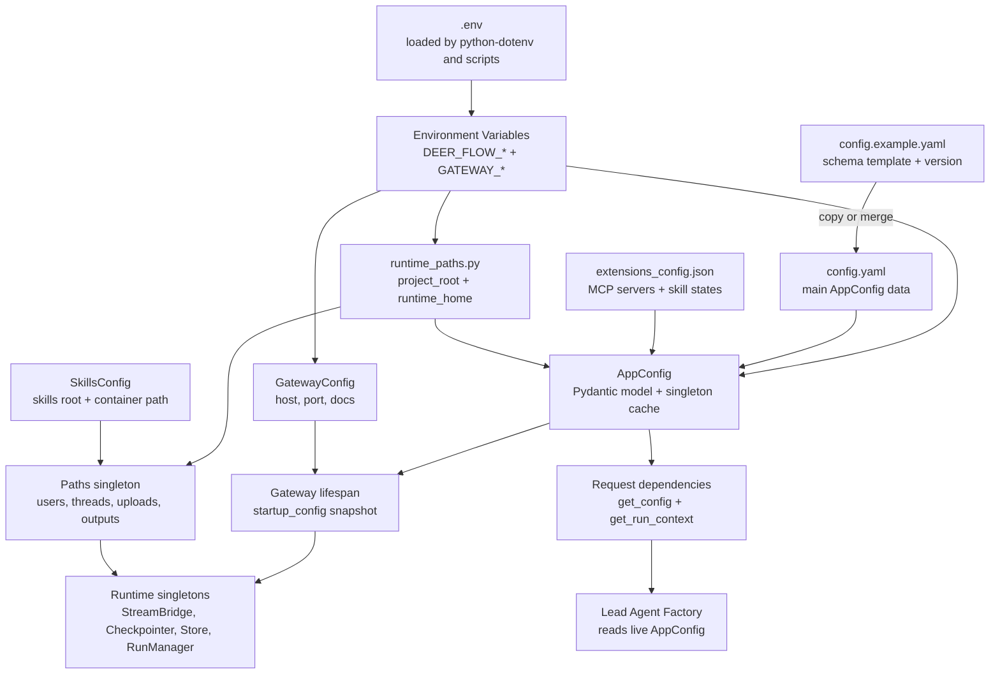
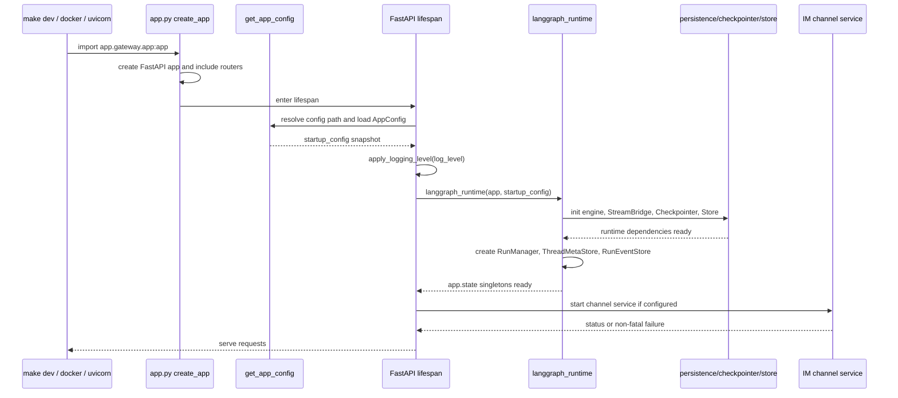
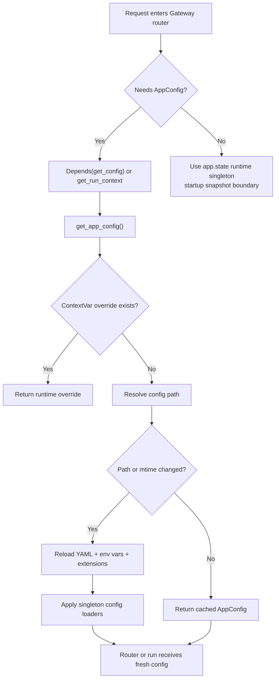

# 第 2 章：配置系统与启动流程

## 阅读目标

本章讲 DeerFlow 如何从 `config.yaml`、`.env`、环境变量、默认值和运行目录构造可运行应用。重点是理解“启动时快照”和“请求期热读取”的边界，避免修改配置后误判系统行为。

读完本章后，需要能回答：

- `config.yaml` 中模型、工具、sandbox、skills、memory、summarization、run_events、checkpointer、stream_bridge 等配置如何进入后端。
- `DEER_FLOW_PROJECT_ROOT`、`DEER_FLOW_CONFIG_PATH`、`DEER_FLOW_HOME`、`DEER_FLOW_SKILLS_PATH` 分别影响什么。
- Gateway lifespan 初始化了哪些 runtime singleton，哪些配置字段因此需要重启才完全生效。
- 为什么 `/api/models` 一类请求可以看到配置热更新，而 checkpointer/store/stream bridge 这类基础设施不能随便热切换。

上一章的服务拓扑见 [[01-system-overview|项目全景与运行边界]]；本章建立配置边界后，下一章会沿着这些配置进入 [[03-gateway-runtime|Gateway API 与 LangGraph-compatible Runtime]] 的 run 创建链路。

## 核心概念

### 项目根目录

`DEER_FLOW_PROJECT_ROOT` 是运行期“项目根”的显式覆盖。未设置时，`runtime_paths.project_root()` 使用当前工作目录 `Path.cwd()`。这意味着同一段代码从仓库根目录启动、从 `backend/` 启动、从 Docker 容器 `/app` 启动时，默认配置和运行目录都会不同。

这也是为什么本地脚本会先 `cd` 到仓库根目录，而 Docker Compose 会设置 `DEER_FLOW_PROJECT_ROOT=/app`。

### 配置文件路径

`AppConfig.resolve_config_path()` 的优先级是：

1. 显式传入的 `config_path` 参数。
2. `DEER_FLOW_CONFIG_PATH`。
3. 项目根目录下的 `config.yaml`。
4. 兼容旧 monorepo 结构的 `backend/config.yaml` 或仓库根 `config.yaml`。

如果这些路径都不存在，会抛出 `FileNotFoundError`。Gateway request boundary 会把配置加载失败包装成 503，而不是让请求以普通 500 失败。

### 运行目录

`DEER_FLOW_HOME` 控制 DeerFlow 的可写运行状态目录。未设置时默认是 `{project_root}/.deer-flow`。`Paths` 会在这个目录下组织 memory、per-user data、threads、uploads、outputs、ACP workspace 等。

注意：生产 `scripts/deploy.sh` 默认把 `DEER_FLOW_HOME` 设为 `backend/.deer-flow`，而 `runtime_paths.runtime_home()` 的通用默认是 `{project_root}/.deer-flow`。不要只看一个文件就推断所有启动方式。

### Skills 路径

`skills.path` 优先于 `DEER_FLOW_SKILLS_PATH`；都没有时，默认找项目根下的 `skills/`，再回退到兼容旧 monorepo 的仓库根 `skills/`。sandbox 容器内看到的是 `skills.container_path`，默认 `/mnt/skills`。

skills 的发现、启用状态和 prompt 注入会在 [[08-skills-and-agent-config|Skills、Agent 配置与可扩展工作流]] 继续展开。

### 启动快照与请求期读取

Gateway lifespan 中的 `startup_config = get_app_config()` 是启动快照，用于初始化 logging、stream bridge、persistence engine、checkpointer、store、run event store、run manager、thread store 和 channel service。

路由和 run path 需要读取可热更新字段时，不应该从 `app.state` 取一个旧 config，而是调用 `app.gateway.deps.get_config()` 或 `get_run_context()`，最终走 `get_app_config()`。`get_app_config()` 会比较配置路径和 mtime，必要时重新加载。

这个分层是为了避免 split-brain：请求期模型列表、模型参数、agent 配置可以热更新；但已经构造出的数据库连接、checkpointer、stream bridge、run event store 不会在进程内随意替换。

## 架构图说明

配置系统由项目根目录、配置文件、环境变量、扩展配置和运行期路径共同组成。Gateway 启动时读取一次配置完成基础设施初始化；请求期代码再通过 `get_app_config()` 获取最新可用配置。



## 启动时序图



## 配置热读取流程图



## 关键源码逐段讲解

### [backend/packages/harness/deerflow/config/runtime_paths.py](/Users/mrl/lgx/project/deer-flow/backend/packages/harness/deerflow/config/runtime_paths.py)

`project_root()` 是配置系统的起点。它先读 `DEER_FLOW_PROJECT_ROOT`，并验证路径必须存在且是目录；否则返回当前工作目录。这个失败行为很直接：根目录不存在或不是目录时抛 `ValueError`，不会静默回退。

`runtime_home()` 负责可写状态目录。它先读 `DEER_FLOW_HOME`，否则返回 `project_root() / ".deer-flow"`。

`resolve_path()` 把相对路径解释为相对于项目根目录的路径。`existing_project_file()` 在项目根目录下按给定文件名查找第一个存在的文件。`AppConfig.resolve_config_path()` 和 skills/extensions 配置都会用到这套规则。

### [backend/packages/harness/deerflow/config/app_config.py](/Users/mrl/lgx/project/deer-flow/backend/packages/harness/deerflow/config/app_config.py)

`AppConfig` 是主配置模型，字段覆盖了 DeerFlow 的主要运行能力：

- `models`：可选模型列表，后续由模型工厂和 `/api/models` 消费。
- `sandbox`：sandbox provider、容器、挂载、输出截断等。
- `tools` / `tool_groups`：配置工具来源。
- `skills` / `skill_evolution`：skills 存储和 agent 管理 skills 的开关。
- `extensions`：从 `extensions_config.json` 单独加载，包含 MCP 和 skill 状态。
- `tool_output` / `tool_search` / `title` / `summarization` / `memory`：middleware 和工具运行时配置。
- `agents_api` / `acp_agents` / `subagents`：自定义 agent、ACP agent、subagent 配置。
- `guardrails` / `loop_detection` / `safety_finish_reason` / `circuit_breaker`：稳定性和安全相关配置。
- `database` / `run_events` / `checkpointer` / `stream_bridge`：持久化和 runtime infrastructure 配置。

`from_file()` 的顺序很重要：

1. 解析配置路径。
2. `yaml.safe_load()` 读取 YAML，空文件按空 dict 处理。
3. `_check_config_version()` 对比同层或上层 `config.example.yaml` 的 `config_version`，低版本只记录 warning。
4. `resolve_env_variables()` 递归替换以 `$` 开头的字符串。环境变量缺失会抛 `ValueError`。
5. `_apply_database_defaults()` 在 `database` 缺失或为空时补 `backend: sqlite`、`sqlite_dir: .deer-flow/data`。
6. `ExtensionsConfig.from_file()` 单独读取扩展配置并写入 `config_data["extensions"]`。
7. `model_validate()` 构造 Pydantic `AppConfig`。
8. `_apply_singleton_configs()` 把 title、summarization、memory、subagents、tool_search、guardrails、checkpointer、stream_bridge、ACP 等配置同步到兼容层 singleton。

`get_app_config()` 是热读取入口。它维护 `_app_config_path` 和 `_app_config_mtime`，当路径或 mtime 变化时重新加载。测试和请求局部覆盖可以用 ContextVar 或 `set_app_config()`，这也是很多 router 测试能隔离配置的原因。

### [backend/packages/harness/deerflow/config/paths.py](/Users/mrl/lgx/project/deer-flow/backend/packages/harness/deerflow/config/paths.py)

`Paths` 是运行期文件系统布局的集中定义。它的 host 侧结构包含：

- `{base_dir}/memory.json`
- `{base_dir}/USER.md`
- `{base_dir}/users/{user_id}/memory.json`
- `{base_dir}/users/{user_id}/agents/{agent_name}/...`
- `{base_dir}/users/{user_id}/threads/{thread_id}/user-data/workspace`
- `{base_dir}/users/{user_id}/threads/{thread_id}/user-data/uploads`
- `{base_dir}/users/{user_id}/threads/{thread_id}/user-data/outputs`
- `{base_dir}/users/{user_id}/threads/{thread_id}/acp-workspace`

不带 `user_id` 时保留 legacy layout：`{base_dir}/threads/{thread_id}`。

需要特别关注三个方法：

- `ensure_thread_dirs()`：创建 workspace/uploads/outputs/acp-workspace，并 chmod 到 `0o777`，以便容器内不同 UID 能写入挂载目录。
- `delete_thread_dir()`：删除 thread 对应的持久化目录，Gateway 删除 thread 时会用到。
- `resolve_virtual_path()`：把 `/mnt/user-data/...` 转成 host 路径，并检查路径必须位于 thread 的 `user-data` 下，防止路径穿越。

`DEER_FLOW_HOST_BASE_DIR` 只影响 Docker-out-of-Docker 场景下的宿主机挂载源路径；普通本地运行一般不需要设置。

### [backend/packages/harness/deerflow/config/skills_config.py](/Users/mrl/lgx/project/deer-flow/backend/packages/harness/deerflow/config/skills_config.py)

`SkillsConfig.get_skills_path()` 的解析顺序是：配置字段 `skills.path`、`DEER_FLOW_SKILLS_PATH`、项目根 `skills/`、legacy repo-root `skills/`。`get_skill_container_path()` 则把 skill 名字映射到 sandbox 内路径，例如 `/mnt/skills/public/imagegen`。

这个文件没有列在大纲第 2 章的初始入口里，但它直接解释了 `DEER_FLOW_SKILLS_PATH`，所以本章需要一起读。

### [backend/app/gateway/config.py](/Users/mrl/lgx/project/deer-flow/backend/app/gateway/config.py)

这是 Gateway 自己的轻量配置，不属于 `config.yaml` 的 `AppConfig`：

- `GATEWAY_HOST`：默认 `0.0.0.0`。
- `GATEWAY_PORT`：默认 `8001`。
- `GATEWAY_ENABLE_DOCS`：默认 `true`，设为 `false` 会关闭 `/docs`、`/redoc`、`/openapi.json`。

它使用模块级 `_gateway_config` 缓存，不带 mtime 热读取。改这些环境变量通常需要重启进程。

### [backend/app/gateway/app.py](/Users/mrl/lgx/project/deer-flow/backend/app/gateway/app.py)

`create_app()` 创建 FastAPI 应用、安装 `AuthMiddleware`、`CSRFMiddleware`、可选 `CORSMiddleware`，然后 include 各个 router。它还定义 `GET /health`。

`lifespan()` 是启动流程核心：

1. 调 `get_app_config()` 取得 `startup_config`。
2. 调 `apply_logging_level()` 设置 `deerflow` 和 `app` logger 层级。
3. 调 `get_gateway_config()` 打印 Gateway 绑定地址。
4. `async with langgraph_runtime(app, startup_config)` 初始化 runtime。
5. runtime ready 后执行 admin bootstrap/orphan thread migration。
6. 尝试启动 IM channel service；失败记录日志但不阻断 Gateway。
7. shutdown 时用 5 秒 timeout 停止 channel service。

源码注释明确说明：`startup_config` 是局部变量，不缓存到 `app.state`。这个约束让请求期配置读取必须走 `get_app_config()`，避免旧配置对象在 `app.state` 中被误用。

### [backend/app/gateway/deps.py](/Users/mrl/lgx/project/deer-flow/backend/app/gateway/deps.py)

`get_config()` 是 router 读取配置的依赖入口。它调用 `get_app_config()`，任何配置 materialize 失败都会被记录日志并转成 503。

`langgraph_runtime()` 是 infrastructure 初始化入口：

- `make_stream_bridge(config)`：根据启动快照构造 stream bridge。
- `init_engine_from_config(config.database)`：初始化持久化 engine。
- `make_checkpointer(config)`：构造 checkpointer。
- `make_store(config)`：构造 LangGraph store。
- `RunRepository` / `MemoryRunStore`：构造 run store。
- `make_thread_store()`：构造 thread metadata store。
- `make_run_event_store(run_events_config)`：构造 run event store。
- `RunManager(store=...)`：管理 run lifecycle。
- SQLite 场景下启动时会 reconcile orphan inflight runs，把重启前未完成的 run 标成错误。

`get_run_context()` 会把 `app.state` 的基础设施 singleton 和请求期 `get_config()` 返回的最新 `AppConfig` 组合成 `RunContext`。其中 `run_events_config` 仍使用启动快照，避免“新配置指向一个 backend，旧 event_store 仍绑定另一个 backend”的组合错误。

## 配置字段和环境变量速查

| 名称 | 读取位置 | 默认值或行为 | 改动是否通常需要重启 |
| --- | --- | --- | --- |
| `DEER_FLOW_PROJECT_ROOT` | `runtime_paths.project_root()` | 未设置时用当前工作目录 | 是，路径根改变会影响配置、skills、runtime home |
| `DEER_FLOW_CONFIG_PATH` | `AppConfig.resolve_config_path()` | 未设置时找项目根 `config.yaml` | 不一定；请求期可热读取，但启动基础设施仍需重启 |
| `DEER_FLOW_HOME` | `runtime_paths.runtime_home()` / `Paths.base_dir` | `{project_root}/.deer-flow`，生产脚本默认 `backend/.deer-flow` | 是，已创建的 store/path singleton 不会自动搬迁 |
| `DEER_FLOW_SKILLS_PATH` | `SkillsConfig.get_skills_path()` | 项目根 `skills/` | 通常需要重新构造 agent 或重启，取决于消费路径 |
| `GATEWAY_HOST` | `get_gateway_config()` | `0.0.0.0` | 是 |
| `GATEWAY_PORT` | `get_gateway_config()` | `8001` | 是 |
| `GATEWAY_ENABLE_DOCS` | `get_gateway_config()` | `true` | 是 |
| `GATEWAY_CORS_ORIGINS` | CSRF/CORS middleware | 空表示 same-origin 默认 | 是，middleware 已安装 |
| `config.yaml.models` | `AppConfig.models` | 空列表 | 请求期路由可热读取；运行中的 run 不会重组 |
| `config.yaml.database` | `AppConfig.database` | 缺失时补 sqlite + `.deer-flow/data` | 是，engine 在 lifespan 初始化 |
| `config.yaml.checkpointer` | `AppConfig.checkpointer` | `None` 时由 provider 默认处理 | 是，checkpointer 在 lifespan 初始化 |
| `config.yaml.stream_bridge` | `AppConfig.stream_bridge` | `None` 或 memory bridge | 是，bridge 在 lifespan 初始化 |
| `config.yaml.run_events` | `AppConfig.run_events` | 由 `RunEventsConfig` 默认值决定 | 是，event_store 和 matching config 在 startup 冻结 |

## 调用链追踪

### 启动阶段

1. `make dev`、Docker entrypoint 或 `uvicorn` 导入 `app.gateway.app:app`。
2. 模块底部 `app = create_app()` 创建 FastAPI 应用。
3. 请求开始前 FastAPI 进入 `lifespan()`。
4. `lifespan()` 调 `get_app_config()` 读取 `config.yaml` 和 `extensions_config.json`。
5. `apply_logging_level()` 应用启动时日志级别。
6. `langgraph_runtime()` 用启动快照构造 stream bridge、persistence engine、checkpointer、store、event store、run manager、thread store。
7. `app.state` 只保存 runtime singleton，不保存 `AppConfig`。
8. Gateway 开始处理请求。

### `/api/models` 请求阶段

1. Nginx 把 `/api/models` 代理到 Gateway。
2. `models.py::list_models()` 通过 `Depends(get_config)` 拿配置。
3. `get_config()` 调 `get_app_config()`。
4. 如果 `config.yaml` mtime 已变，重新加载并更新 `_app_config`。
5. router 从新 `config.models` 生成响应，过滤掉 API key 等敏感字段。

这个实验适合验证模型显示名或 `supports_thinking` 这类请求期字段是否热更新。

### `/api/threads/{id}/runs/stream` 请求阶段

1. `thread_runs.py::stream_run()` 调 `services.start_run()`。
2. `start_run()` 通过 `get_run_context(request)` 构造 `RunContext`。
3. `RunContext.app_config` 来自请求期 `get_config()`，可以看到热更新。
4. `RunContext.checkpointer/store/event_store/thread_store` 来自 `app.state`，绑定启动快照。
5. `run_agent()` 把 `ctx.app_config` 传给支持该参数的 agent factory。

因此，同一次 run 的 agent 组装可以看到新的模型配置，但它使用的 checkpointer/store/stream bridge 仍是启动时那套基础设施。

## 可运行验证实验

### 实验 1：验证路径解析策略

```bash
cd backend
uv run pytest tests/test_runtime_paths.py
```

这组测试覆盖：

- 当前工作目录作为 project root。
- `DEER_FLOW_PROJECT_ROOT` 覆盖当前工作目录。
- `DEER_FLOW_SKILLS_PATH` 覆盖 skills 默认目录。
- project root 不存在或不是目录时抛错。
- legacy config/skills 回退行为。

### 实验 2：验证 `get_app_config()` mtime 热读取

```bash
cd backend
uv run pytest tests/test_app_config_reload.py::test_get_app_config_reloads_when_file_changes
```

测试会写入一个临时 `config.yaml`，第一次读取 `supports_thinking=false`，修改文件并 bump mtime 后再次读取，预期得到新对象且 `supports_thinking=true`。

### 实验 3：验证 Gateway 请求期配置新鲜度

```bash
cd backend
uv run pytest tests/test_gateway_config_freshness.py
```

这组测试比单纯测试 `AppConfig` 更接近真实 Gateway：它验证 `get_config()` 和 `get_run_context()` 都能看到 `config.yaml` 的 mtime 更新，同时确认 `run_events_config` 仍按 startup snapshot 冻结。

### 实验 4：手工观察 `/api/models` 配置热更新

前提：Gateway 已启动，并且你已经通过 Web UI 登录，手工请求要带上有效 cookie 和 CSRF header。

1. 在 `config.yaml` 增加或修改一个模型的 `display_name`。
2. 确认文件 mtime 变化。
3. 请求：

```bash
curl -sS \
  -H "Cookie: access_token=...; csrf_token=..." \
  -H "X-CSRF-Token: ..." \
  http://localhost:2026/api/models
```

如果响应仍是旧值，先确认请求是否到达同一个 Gateway 进程，再检查 `get_app_config()` 日志里是否出现 reload 信息。

### 实验 5：确认 runtime home 布局

启动一次会话后查看：

```bash
find .deer-flow -maxdepth 4 -type d | sort | sed -n '1,80p'
```

如果是生产脚本默认路径，目录可能在 `backend/.deer-flow`。如果设置了 `DEER_FLOW_HOME`，应检查该环境变量指向的目录。thread 目录下的 `user-data/workspace`、`uploads`、`outputs` 会在 agent 或 upload 流程中创建。

## 常见改造点

### 增加新的 `config.yaml` 配置段

推荐顺序：

1. 在 `backend/packages/harness/deerflow/config/` 新增或扩展 Pydantic config model。
2. 在 `AppConfig` 上增加字段，并写清默认值和 description。
3. 在 `config.example.yaml` 增加示例和说明。
4. 如果有旧 singleton 兼容层，在 `_apply_singleton_configs()` 里同步加载。
5. 在真正消费配置的 router、agent factory、middleware 或 runtime provider 中使用。
6. 加测试覆盖默认值、热读取或重启边界。

不要为了“以后可能扩展”提前加空配置段。配置字段一旦进入模板，就会成为用户长期维护成本。

### 修改数据库、checkpointer 或 stream bridge

这些属于启动期基础设施。虽然 `get_app_config()` 可以热读取新 YAML，但已有 engine、checkpointer、store、stream bridge 不会自动替换。改这类配置后应重启 Gateway，并确认旧 run 是否被正确 reconcile。

### 修改模型、title、memory 或 summarization

这些字段可能被请求期读取，也可能已经被某个运行中的 agent/middleware 捕获。最稳妥的理解是：新请求会更容易看到新配置，已启动 run 不保证中途切换。

### 修改运行目录

`DEER_FLOW_HOME` 会影响 memory、thread 文件、uploads、outputs、auth secret、生产密钥文件等。改它之前要先决定是否迁移旧数据。不要直接清空旧目录，除非你明确要丢弃运行历史。

### 修改 skills 目录

同时检查三层路径：

- host 上的 `skills.path` 或 `DEER_FLOW_SKILLS_PATH`。
- sandbox 内的 `skills.container_path`。
- Docker/Aio 场景下的 `DEER_FLOW_HOST_SKILLS_PATH`。

这三层不一致时，常见症状是前端能看到 skill，agent prompt 能列出 skill，但 sandbox 工具读取 `/mnt/skills/...` 失败。

## 风险和调试入口

- 当前工作目录错误：`DEER_FLOW_PROJECT_ROOT` 未设置时，`project_root()` 使用 cwd。症状是找不到 `config.yaml` 或 `.deer-flow` 出现在意外目录。
- 环境变量缺失：`config.yaml` 中 `$OPENAI_API_KEY` 这类值会被递归解析；缺失时加载配置失败。
- mtime 分辨率：快速连续编辑配置时，如果文件系统 mtime 未变化，`get_app_config()` 可能不触发 reload。测试里会显式 `os.utime()` bump mtime。
- 启动快照误用：不要把 `startup_config` 挂到 `app.state` 再到处使用。源码已经刻意避免这样做。
- singleton 测试污染：配置相关测试需要 `reset_app_config()`，并重置 title/memory/subagents/tool_search/checkpointer/store 等兼容层 singleton。
- Docker host path 翻译：Gateway 容器内路径和宿主机 Docker daemon 看到的路径不同，Aio sandbox 挂载失败时重点查 `DEER_FLOW_HOST_BASE_DIR`。
- 文档接口裸请求失败：默认 Web 模式有认证和 CSRF，配置实验里的 `curl` 需要带登录态，或改用已有 pytest 直接验证请求期依赖。

## 核心源码入口

- [backend/packages/harness/deerflow/config/app_config.py](/Users/mrl/lgx/project/deer-flow/backend/packages/harness/deerflow/config/app_config.py)
- [backend/packages/harness/deerflow/config/paths.py](/Users/mrl/lgx/project/deer-flow/backend/packages/harness/deerflow/config/paths.py)
- [backend/packages/harness/deerflow/config/runtime_paths.py](/Users/mrl/lgx/project/deer-flow/backend/packages/harness/deerflow/config/runtime_paths.py)
- [backend/packages/harness/deerflow/config/skills_config.py](/Users/mrl/lgx/project/deer-flow/backend/packages/harness/deerflow/config/skills_config.py)
- [backend/packages/harness/deerflow/config/model_config.py](/Users/mrl/lgx/project/deer-flow/backend/packages/harness/deerflow/config/model_config.py)
- [backend/packages/harness/deerflow/config/sandbox_config.py](/Users/mrl/lgx/project/deer-flow/backend/packages/harness/deerflow/config/sandbox_config.py)
- [backend/app/gateway/app.py](/Users/mrl/lgx/project/deer-flow/backend/app/gateway/app.py)
- [backend/app/gateway/config.py](/Users/mrl/lgx/project/deer-flow/backend/app/gateway/config.py)
- [backend/app/gateway/deps.py](/Users/mrl/lgx/project/deer-flow/backend/app/gateway/deps.py)
- [backend/app/gateway/routers/models.py](/Users/mrl/lgx/project/deer-flow/backend/app/gateway/routers/models.py)
- [config.example.yaml](/Users/mrl/lgx/project/deer-flow/config.example.yaml)
- [backend/tests/test_runtime_paths.py](/Users/mrl/lgx/project/deer-flow/backend/tests/test_runtime_paths.py)
- [backend/tests/test_app_config_reload.py](/Users/mrl/lgx/project/deer-flow/backend/tests/test_app_config_reload.py)
- [backend/tests/test_gateway_config_freshness.py](/Users/mrl/lgx/project/deer-flow/backend/tests/test_gateway_config_freshness.py)
