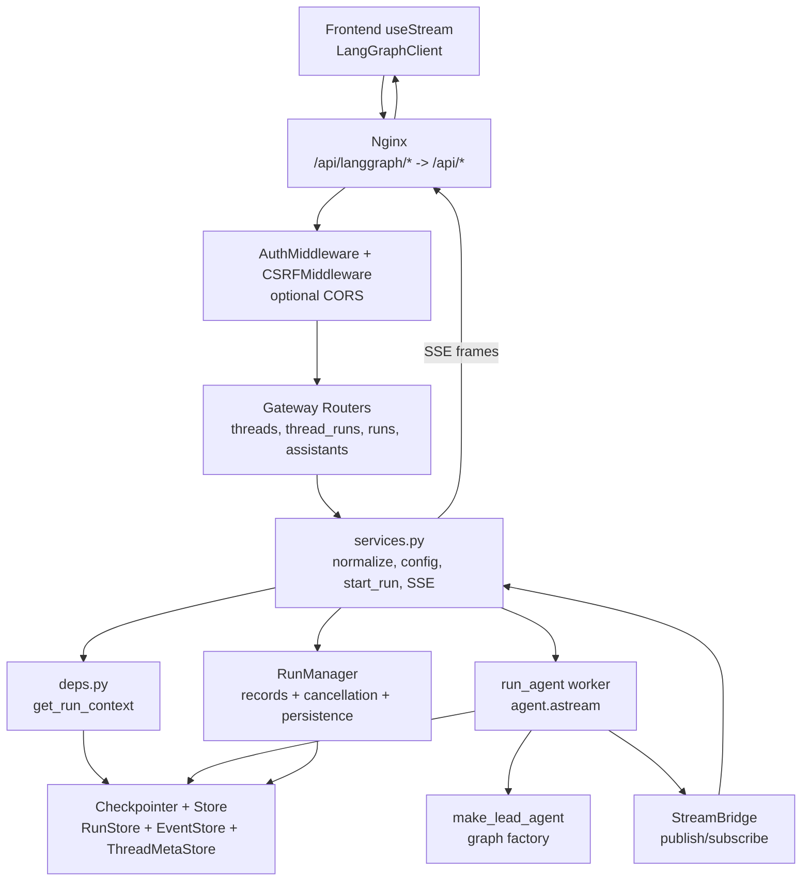
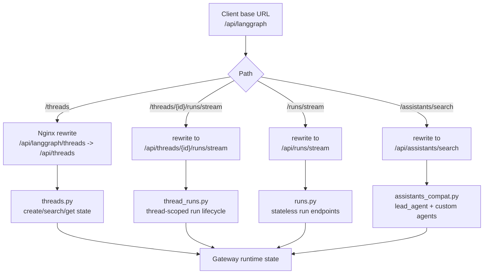
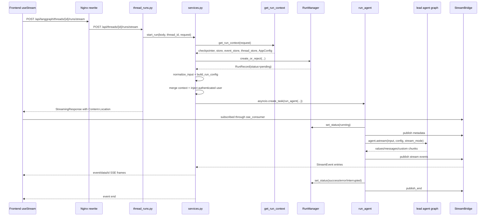

# 第 3 章：Gateway API 与 LangGraph-compatible Runtime

## 阅读目标

本章解释 Gateway 如何同时扮演普通 REST API 和 LangGraph-compatible API。重点是理解 thread、run、assistant、stream mode、`context`/`configurable` 和 SSE 的生命周期。

读完本章后，需要能回答：

- `/api/langgraph/*` 和 `/api/*` 的职责差异，以及为什么它们最终都会进入 Gateway。
- 前端创建 thread、启动 run、消费 stream 时经过哪些后端组件。
- `body.context`、`body.config.context` 与旧式 `body.config.configurable` 如何被兼容处理。
- `RunManager`、`run_agent()`、`StreamBridge` 和 `sse_consumer()` 如何协作。
- raw SSE 里的 `values`、`messages`、`custom`、`metadata`、`error`、`end` 分别来自哪里；`messages-tuple` 在请求字段和 LangGraph 内部 `messages` 模式之间如何映射。

本章承接 [[02-configuration-and-bootstrap|配置系统与启动流程]] 中的 runtime singleton。后续 agent graph 的创建和 prompt/tool 注入见 [[04-lead-agent-execution|Lead Agent 的创建与执行模型]]，事件持久化和历史读取见 [[09-memory-persistence-runtime-history|Memory、Persistence、Checkpointer 与运行历史]]。

## 核心概念

### Gateway 是协议边界

Gateway 不是只给前端用的 REST API，也不是独立 LangGraph Server 的旁路代理。它把两类入口收拢到一个 FastAPI 应用：

- 普通 REST：`/api/models`、`/api/skills`、`/api/mcp`、`/api/threads/{id}/uploads`、`/api/threads/{id}/artifacts` 等。
- LangGraph-compatible：公开路径是 `/api/langgraph/*`，经 Nginx rewrite 后进入 Gateway 原生 `/api/*` router，例如 `/api/langgraph/threads/{id}/runs/stream` 会落到 `/api/threads/{id}/runs/stream`。

这个设计让前端可以使用 `@langchain/langgraph-sdk`，同时后端仍保持 DeerFlow 自己的 runtime、认证、CSRF、persistence 和 artifact 管理。

### Thread

thread 是一次会话的状态边界。Gateway 的 `threads.py` 同时维护两类东西：

- LangGraph checkpoint state：用于恢复 graph state 和消息。
- DeerFlow thread metadata：让 `/threads/search` 能列出会话、状态和显示名。

文件系统上的 thread 目录由 `Paths` 管理，上传和 artifact 生命周期在 [[07-sandbox-files-artifacts|Sandbox、文件系统与 Artifact 生命周期]] 展开。

### Run

run 是在某个 thread 上执行 agent graph 的一次任务。`RunManager` 负责创建 run record、处理同一 thread 上的并发策略、取消 run、持久化状态和恢复 orphan inflight runs。

支持的 `multitask_strategy` 是 `reject`、`interrupt`、`rollback`。虽然请求模型里也列出了 `enqueue`，但 `RunManager.create_or_reject()` 当前只接受这三个；其它值会走 `UnsupportedStrategyError`。

### Assistant

LangGraph SDK 会带 `assistant_id`。Gateway 当前把所有 assistant 都解析到同一个 `make_lead_agent` factory：默认 `lead_agent` 不额外注入 agent name；非默认 assistant 会被规范化后写入 `agent_name`，由 lead agent 读取自定义 agent 配置和 `SOUL.md`。

### `context` 与 `configurable`

旧调用路径依赖 `config.configurable` 传递 `thread_id`、`model_name`、`agent_name` 等；LangGraph 新版本引入 `config.context`。DeerFlow 的兼容策略是：

- `build_run_config()` 如果发现 request config 有 `context`，优先使用 `context`，并忽略同时传入的 `configurable`。
- 没有 `context` 时，创建 `configurable` 并写入 `thread_id`。
- `merge_run_context_overrides()` 把 `body.context` 中白名单字段写入 `configurable` 和 `context` 两边，保证旧消费者和 `ToolRuntime.context` 都能看到。
- 认证用户的 `user_id` 由服务端 `inject_authenticated_user_context()` 写入 `context`，不会信任客户端伪造值。

### StreamBridge

`StreamBridge` 把后台 agent task 和 HTTP SSE 连接解耦。producer 侧是 `run_agent()`，它把 metadata、values、messages、custom、error 等事件 publish 到 bridge；consumer 侧是 `sse_consumer()`，它订阅 run_id，把事件格式化成 SSE frame。

内存实现 `MemoryStreamBridge` 保留有界事件日志，支持 `Last-Event-ID` 断线重连回放，并在空闲时产生 heartbeat。

## 架构图说明

Gateway 是 DeerFlow 的系统边界：它接收 Web UI、SDK 或 IM channel 的请求，完成认证、CSRF、参数归一化和 run lifecycle 管理，然后把 run 交给内嵌 runtime。runtime 通过 RunManager 管理 run 状态，通过 StreamBridge 把 agent 执行事件转成 SSE。



## 路由兼容流程图



## Run Stream 时序图



## 关键源码逐段讲解

### [backend/app/gateway/app.py](/Users/mrl/lgx/project/deer-flow/backend/app/gateway/app.py)

`create_app()` 装配 Gateway 应用：

- `AuthMiddleware`：非公开路径的认证边界。
- `CSRFMiddleware`：状态变更请求的 CSRF 边界。
- `CORSMiddleware`：只有 `GATEWAY_CORS_ORIGINS` 配置了显式 origin 时才安装。
- routers：models、mcp、memory、skills、artifacts、uploads、threads、agents、suggestions、channels、assistants_compat、auth、feedback、thread_runs、runs。
- `/health`：基础健康检查。

这里要注意 include 顺序不是“业务执行顺序”。真正启动 run 的流程在 router handler 里委托给 `services.py`。

### [frontend/src/core/config/index.ts](/Users/mrl/lgx/project/deer-flow/frontend/src/core/config/index.ts) 与 [frontend/src/core/api/api-client.ts](/Users/mrl/lgx/project/deer-flow/frontend/src/core/api/api-client.ts)

前端默认 LangGraph base URL 是 `window.location.origin + "/api/langgraph"`。`api-client.ts` 创建 `LangGraphClient`，并包装 `runs.stream()` 和 `runs.joinStream()`，调用 `sanitizeRunStreamOptions()` 过滤不支持的 stream mode。

`injectCsrfHeader()` 会在 SDK 的状态变更请求上补 `X-CSRF-Token`。这解释了为什么在文档里手写 stream `curl` 时必须考虑认证和 CSRF，而不是只给一个裸 POST。

### [backend/app/gateway/routers/threads.py](/Users/mrl/lgx/project/deer-flow/backend/app/gateway/routers/threads.py)

`threads.py` 覆盖 thread CRUD、state、history 和删除清理。

`POST /api/threads`：

1. 生成或接收 `thread_id`。
2. 写 `thread_store.create()`，让 `/threads/search` 立即可见。
3. 通过 `checkpointer.aput()` 写入空 checkpoint，让 state endpoints 在空会话上也可用。

`POST /api/threads/search` 通过 `ThreadMetaStore` 搜索 thread metadata。`GET /api/threads/{id}` 先读 metadata，再读 checkpoint channel values，并通过 `serialize_channel_values()` 转成前端可消费的 JSON。

### [backend/app/gateway/routers/thread_runs.py](/Users/mrl/lgx/project/deer-flow/backend/app/gateway/routers/thread_runs.py)

这是 thread-scoped run router。核心模型是 `RunCreateRequest`，字段包括：

- `assistant_id`：默认或自定义 agent 名。
- `input`：graph input，常见是 `{messages: [...]}`。
- `metadata`：run metadata。
- `config`：RunnableConfig override。
- `context`：DeerFlow 扩展字段，例如 `model_name`、`thinking_enabled`、`is_plan_mode`、`subagent_enabled`。
- `stream_mode`、`stream_subgraphs`、`stream_resumable`：stream 相关选项。
- `on_disconnect`：SSE 断开后取消或继续。
- `multitask_strategy`：同 thread 并发策略。

`POST /{thread_id}/runs/stream` 的 handler 很薄：取 bridge/run manager，调用 `start_run()`，然后返回 `StreamingResponse(sse_consumer(...))`。响应头里的 `Content-Location` 指向 `/api/threads/{thread_id}/runs/{run_id}`，SDK 会用它提取 run metadata。

### [backend/app/gateway/routers/runs.py](/Users/mrl/lgx/project/deer-flow/backend/app/gateway/routers/runs.py)

这是 stateless run router，路径是 `/api/runs/*`。如果 `body.config.configurable.thread_id` 存在，就复用该 thread；否则 `_resolve_thread_id()` 生成一个临时 UUID。

它和 thread-scoped router 共用 `RunCreateRequest`、`start_run()`、`sse_consumer()`、`wait_for_run_completion()`。区别主要是 thread_id 来源不同。

### [backend/app/gateway/routers/assistants_compat.py](/Users/mrl/lgx/project/deer-flow/backend/app/gateway/routers/assistants_compat.py)

这是 LangGraph Platform-compatible assistants API 的最小兼容层。它返回默认 `lead_agent`，并尝试从自定义 agent 配置中列出更多 assistant。所有 assistant 的 `graph_id` 都指向 `lead_agent`，这和 `services.resolve_agent_factory()` 的实现一致：实际 graph factory 始终是 `make_lead_agent`。

### [backend/app/gateway/services.py](/Users/mrl/lgx/project/deer-flow/backend/app/gateway/services.py)

`services.py` 是 run lifecycle 的业务层。

`format_sse()` 把事件格式化为：

```text
event: <event>
data: <json>
id: <event_id>

```

`id` 可选，`data` 使用 `json.dumps(..., ensure_ascii=False)`，所以中文内容不会被强行转义。

`normalize_stream_modes()` 把 `stream_mode` 统一成 list。源码当前在 `None` 或空 list 时返回 `["values"]`；如果调用方显式传 `"messages-tuple"`，会保留成 `["messages-tuple"]`，后续 worker 再映射。

`normalize_input()` 使用 LangChain 的 `convert_to_messages()` 把 dict 消息转成 LangChain message 对象，并保留 `additional_kwargs`、`id`、`name` 和非 human role。这个实现修复了上传文件 metadata 被丢失的问题：前端把文件列表放在 `additional_kwargs.files`，如果这里手写转换只取 `content`，`UploadsMiddleware` 后面就看不到文件。

`build_run_config()` 构造 `RunnableConfig` dict。关键规则：

- 默认 `recursion_limit` 是 `100`。
- 没有 request config 时写 `configurable.thread_id`。
- request config 有 `context` 时进入 context 模式，忽略同时传入的 `configurable` 并记录 warning。
- custom `assistant_id` 会规范化成小写短横线格式，并写入 `agent_name`。
- `metadata` 会合并到 `config.metadata`。

`merge_run_context_overrides()` 把 `body.context` 中白名单字段写入 `configurable` 和 `context`。白名单包括 `model_name`、`mode`、`thinking_enabled`、`reasoning_effort`、`is_plan_mode`、`subagent_enabled`、`max_concurrent_subagents`、`agent_name`、`is_bootstrap`。`user_id` 只写入 `context`，且用 `setdefault` 避免覆盖服务端认证身份。

`start_run()` 完成 run 启动：

1. 从 request 取 bridge、run manager、run context。
2. 根据 `on_disconnect` 选择取消或继续。
3. 如果 `body.context.model_name` 存在，检查它必须在 `config.models` allowlist 中。
4. 调 `RunManager.create_or_reject()` 创建 run record。
5. upsert thread metadata。
6. 解析 agent factory。
7. 规范化 input、构造 config、合并 context、注入 authenticated user。
8. `asyncio.create_task(run_agent(...))` 启动后台任务。
9. 把 task 挂到 `record.task`，返回 `RunRecord`。

`sse_consumer()` 订阅 bridge。它会处理 `Last-Event-ID`、heartbeat、end sentinel 和普通 StreamEvent。若客户端断开且 run 仍 pending/running，`on_disconnect=cancel` 时会调用 `run_mgr.cancel()`。

### [backend/packages/harness/deerflow/runtime/runs/manager.py](/Users/mrl/lgx/project/deer-flow/backend/packages/harness/deerflow/runtime/runs/manager.py)

`RunManager` 是内存 run registry，也可以绑定持久化 `RunStore`。核心状态是 `RunRecord`，包含 run_id、thread_id、assistant_id、status、task、abort_event、model_name、token usage 和消息统计。

重点方法：

- `create_or_reject()`：在一个 lock 里检查同 thread inflight runs 并创建新 run，避免 TOCTOU。`reject` 有 inflight 时抛 `ConflictError`；`interrupt`/`rollback` 会取消旧 run 后创建新 run；其它策略抛 `UnsupportedStrategyError`。
- `cancel()`：设置 abort event，取消 asyncio task，并把状态持久化为 interrupted。
- `reconcile_orphaned_inflight_runs()`：SQLite-backed Gateway 重启后，把持久化中 pending/running 但没有本地 task 的 run 标成明确错误。
- `update_run_completion()` / `update_run_progress()`：把 token usage、message count、最后消息等写回 store。

生产多 worker 时要记住：`RunStore` 可持久化 run row，但 `task` 和 `abort_event` 是 worker 进程本地对象。

### [backend/packages/harness/deerflow/runtime/runs/worker.py](/Users/mrl/lgx/project/deer-flow/backend/packages/harness/deerflow/runtime/runs/worker.py)

`run_agent()` 是后台执行函数。执行顺序：

1. 创建 `RunJournal` 并记录 human message 事件。
2. `run_manager.set_status(run_id, running)`。
3. 捕获 pre-run checkpoint，供 rollback 使用。
4. `bridge.publish(..., "metadata", {"run_id", "thread_id"})`。
5. 构造 runtime context，至少包含 `thread_id`、`run_id`，并合并 caller context 和 `app_config`。
6. 手动把 `Runtime(context=..., store=...)` 放进 `config["configurable"]["__pregel_runtime"]`，让 LangGraph runtime 和 tools 能读到 context。
7. 注入 run journal callback 和 Langfuse metadata。
8. 调 agent factory 创建 lead agent graph，并挂上 checkpointer/store。
9. 把请求的 stream mode 转成 LangGraph `astream()` 接受的模式。
10. 遍历 `agent.astream(...)`，把 chunk 序列化后 publish 到 bridge。
11. 根据 abort/error/fallback 设置最终 run status。
12. finally 中 flush journal、持久化 completion、同步 thread title/status、`publish_end()`，并延迟 cleanup bridge buffer。

stream mode 需要单独说明：

- 请求里的 `messages-tuple` 会映射到 LangGraph 内部的 `messages` 模式。
- raw SSE event name 由 `_lg_mode_to_sse_event()` 返回，当前 `"messages"` 保持 `"messages"`，不会改名为 `"messages-tuple"`。
- 如果你用 SDK，SDK 层可能把 messages-mode 数据作为 message tuple 处理；如果你直接抓 raw SSE，请看 `event: messages`。
- `events` 模式当前被记录为不支持并跳过，因为 Gateway 走 `graph.astream()`，不是 `astream_events()`。

### [backend/packages/harness/deerflow/runtime/stream_bridge/base.py](/Users/mrl/lgx/project/deer-flow/backend/packages/harness/deerflow/runtime/stream_bridge/base.py) 与 [backend/packages/harness/deerflow/runtime/stream_bridge/memory.py](/Users/mrl/lgx/project/deer-flow/backend/packages/harness/deerflow/runtime/stream_bridge/memory.py)

`StreamBridge` 抽象定义 producer/consumer 协议：

- `publish(run_id, event, data)`：写入一个事件。
- `publish_end(run_id)`：通知没有更多事件。
- `subscribe(run_id, last_event_id=None, heartbeat_interval=15.0)`：异步迭代事件。
- `cleanup(run_id, delay=0)`：释放 run 对应 buffer。

`MemoryStreamBridge` 为每个 run 保留一个有界 event log。事件 id 是 `timestamp-sequence` 字符串。订阅者可以用 `Last-Event-ID` 从已保留 buffer 的下一个事件开始回放；buffer 超限时会丢弃最早事件，并更新 `start_offset`。

## 调用链追踪

### 创建 thread

1. 前端或 SDK 请求 `/api/langgraph/threads`。
2. Nginx rewrite 成 `/api/threads`。
3. `threads.py::create_thread()` 接收 `ThreadCreateRequest`。
4. 如果 body 没有 `thread_id`，后端生成 UUID。
5. `thread_store.create()` 写 metadata。
6. `checkpointer.aput()` 写空 checkpoint。
7. 返回 `ThreadResponse`。

如果 thread 已存在，该 endpoint 幂等返回已有 record，不重复写 checkpoint。

### 启动 thread-scoped stream run

1. 前端 `useThreadStream().sendMessage()` 调 `thread.submit()`。
2. 提交 payload 中包含 `messages`、`config.recursion_limit`、`context.mode`、`thinking_enabled`、`is_plan_mode`、`subagent_enabled`、`reasoning_effort`、`thread_id` 等。
3. SDK 请求 `/api/langgraph/threads/{thread_id}/runs/stream`。
4. Nginx rewrite 到 `/api/threads/{thread_id}/runs/stream`。
5. `thread_runs.py::stream_run()` 调 `start_run()`。
6. `start_run()` 创建 `RunRecord`，规范化 input/config，并启动 `run_agent()` task。
7. HTTP handler 立即返回 StreamingResponse，不等待 agent 完成。
8. `sse_consumer()` 订阅 bridge 并持续产出 SSE。

### 后台 agent 执行

1. `run_agent()` 标记 run running。
2. 发布 `metadata`，前端 `onCreated` 可以拿到 run_id/thread_id。
3. 创建 lead agent graph，注入 checkpointer/store/runtime context。
4. `agent.astream()` 按 stream mode 产生 chunk。
5. `serialize()` 把 LangChain message、Pydantic 对象和 channel values 转成 JSON-safe 数据。
6. `StreamBridge.publish()` 写入事件。
7. run 结束后 publish end sentinel，`sse_consumer()` 输出 `event: end`。

## SSE 输出说明

| raw SSE event | 来源 | 用途 |
| --- | --- | --- |
| `metadata` | `run_agent()` 在 agent 创建前发布 | 告诉客户端 `run_id` 和 `thread_id` |
| `values` | LangGraph `astream(stream_mode="values")` | 完整 state snapshot，适合更新消息、title、artifacts、todos 等 channel values |
| `updates` | LangGraph `updates` 模式 | 节点写入的增量结果，前端 `onUpdateEvent` 可处理 |
| `messages` | 请求 `messages-tuple` 后映射到 LangGraph `messages` 模式 | message chunk 和 metadata tuple；raw SSE 名称是 `messages` |
| `custom` | graph 或工具通过 LangGraph custom stream 发出 | DeerFlow 用于任务进度、LLM retry 等自定义 UI 事件 |
| `error` | `run_agent()` 捕获异常后发布 | 给客户端显示错误原因 |
| `end` | `bridge.publish_end()` 后由 `sse_consumer()` 输出 | 告诉客户端 stream 结束 |
| heartbeat comment | `StreamBridge.subscribe()` 超时无事件 | 保持连接活跃，不是 JSON event |

一个 raw SSE frame 的形状如下：

```text
event: metadata
data: {"run_id":"...","thread_id":"..."}
id: 1760000000000-0

```

## 可运行验证实验

### 实验 1：验证 Gateway service helper

```bash
cd backend
uv run pytest tests/test_gateway_services.py
```

这组测试覆盖：

- SSE frame 格式。
- `normalize_stream_modes()` 的默认和显式值。
- `normalize_input()` 保留 `additional_kwargs.files`、message id、name 和非 human role。
- `build_run_config()` 对 `context`/`configurable` 的优先级。
- custom assistant 注入 `agent_name`。
- `merge_run_context_overrides()` 和 authenticated user context。

### 实验 2：验证 StreamBridge 回放和 heartbeat

```bash
cd backend
uv run pytest tests/test_stream_bridge.py
```

关注这些行为：

- 同一 run 的事件按 publish 顺序收到。
- 无事件时会产生 heartbeat sentinel。
- `Last-Event-ID` 可以从 buffer 中回放后续事件。
- buffer 有上限，慢订阅者可能只能从最早保留事件继续。

### 实验 3：验证 Gateway-owned `/api/langgraph` 路由

```bash
cd backend
uv run pytest tests/test_gateway_runtime_cleanup.py::test_nginx_routes_official_langgraph_prefix_to_gateway_api
```

这个测试确认 Nginx 配置没有指向独立 `langgraph` upstream，而是 rewrite 到 Gateway `/api/*`。

### 实验 4：抓一个最小 stream 请求

前提：Gateway 已启动，已有登录态，下面的 cookie 和 CSRF token 要替换成真实值。默认认证开启时，裸请求通常会被拒绝。

```bash
THREAD_ID="demo-thread-001"

curl -sS \
  -H "Content-Type: application/json" \
  -H "Cookie: access_token=...; csrf_token=..." \
  -H "X-CSRF-Token: ..." \
  -X POST \
  http://localhost:2026/api/langgraph/threads/${THREAD_ID}/runs/stream \
  -d '{
    "assistant_id": "lead_agent",
    "input": {
      "messages": [
        {
          "type": "human",
          "content": [{"type": "text", "text": "用一句话介绍 DeerFlow"}],
          "additional_kwargs": {}
        }
      ]
    },
    "config": {
      "recursion_limit": 100
    },
    "context": {
      "mode": "flash",
      "thinking_enabled": false,
      "is_plan_mode": false,
      "subagent_enabled": false
    },
    "stream_mode": ["values", "messages-tuple", "custom"],
    "stream_subgraphs": true,
    "on_disconnect": "cancel",
    "multitask_strategy": "reject"
  }'
```

字段归宿：

- `assistant_id`：进入 `RunRecord.assistant_id`，非默认时会注入 `agent_name`。
- `input.messages`：经 `normalize_input()` 转为 LangChain message。
- `config.recursion_limit`：进入 `RunnableConfig`，如果没有覆盖，Gateway 默认是 `100`。
- `context.mode` 等：经 `merge_run_context_overrides()` 写入 `configurable` 和 `context`。
- `stream_mode`：经 `normalize_stream_modes()` 保留，worker 把 `messages-tuple` 映射为 LangGraph `messages`。
- `on_disconnect`：控制 SSE 断开后是取消后台 run 还是继续。
- `multitask_strategy`：交给 `RunManager.create_or_reject()`。

### 实验 5：观察活跃 run 断开行为

1. 发起一个长任务 stream 请求。
2. 在客户端断开 SSE 连接。
3. 如果 payload 里 `on_disconnect` 是 `cancel`，检查 run 最终应进入 interrupted 或 error 相关状态。
4. 如果是 `continue`，后台 task 会继续运行，但当前 SSE consumer 不再接收事件。

对应源码入口是 `services.py::sse_consumer()` 的 `finally` 块和 `RunManager.cancel()`。

## 常见改造点

### 新增 LangGraph-compatible endpoint

先确认公开路径是否需要经过 `/api/langgraph/*`。如果需要，Gateway router 的真实路径通常仍应挂在 `/api/*`，由 Nginx rewrite 负责兼容。新增 endpoint 后检查：

- `docker/nginx/nginx.local.conf` 和 `docker/nginx/nginx.conf` 是否已有足够通用的 `/api/langgraph/` rewrite。
- FastAPI router prefix 是否和 rewrite 后路径匹配。
- 前端 SDK 是否需要包装或 sanitize options。

### 调整 run context 字段

如果新增字段需要进入 agent、middleware 或 tool runtime，不要只塞进 `body.context`。需要同步检查：

- `RunCreateRequest.context` 是否允许该字段。
- `_CONTEXT_CONFIGURABLE_KEYS` 是否应加入该字段。
- `merge_run_context_overrides()` 是否应该写入 `configurable`、`context` 或两者。
- `worker._build_runtime_context()` 是否会保留它。
- 目标消费者读的是 `RunnableConfig.configurable` 还是 `ToolRuntime.context`。

### 改并发策略

`RunCreateRequest` 目前允许 `enqueue`，但 `RunManager.create_or_reject()` 不支持。要实现 enqueue，不是只改 Pydantic literal，还要设计队列、run record 状态、取消语义、SSE join、worker 恢复和持久化状态。

### 改 stream mode

新增或调整 stream mode 时，至少要同步：

- frontend `sanitizeRunStreamOptions()` 的 allowlist。
- `services.normalize_stream_modes()` 默认值。
- `worker._VALID_LG_MODES` 和 `messages-tuple` 映射。
- `serialization.serialize()` 的 mode-specific 序列化。
- 前端 `useStream()` 的回调处理。

不要把 LangGraph `events` 直接加进 `graph.astream()`；源码注释明确说明 Gateway 当前不支持 `events`，因为那需要 `astream_events()` 路径。

### 改 SSE 保留窗口

内存 bridge 的保留窗口由 `StreamBridgeConfig.queue_maxsize` 或默认 256 控制。调大能帮助重连回放，但也会增加每个活跃 run 的内存占用。若未来接 Redis bridge，还要重新定义 event id、回放范围和 cleanup 语义。

## 风险和调试入口

- 裸 `curl` 失败：优先检查认证 cookie 和 CSRF header，而不是先怀疑 run 逻辑。
- `/api/langgraph/*` 404：检查 Nginx rewrite 是否生效，确认请求是否真的从 `:2026` 统一入口进入。
- 模型名被拒：`start_run()` 会检查 `body.context.model_name` 是否在 `config.models` allowlist 中。
- `context` 丢失：检查调用方是不是把字段放进了 `body.config.context` 而不是 `body.context`；再看 `build_run_config()` 和 `merge_run_context_overrides()` 的合并规则。
- 上传文件 metadata 丢失：检查 `normalize_input()` 是否保留了 `additional_kwargs.files`。
- stream 没有结束：看 `worker.py` finally 是否执行到 `bridge.publish_end()`；event store 或 journal 初始化异常也应该走异常处理并 publish `error` 和 end。
- join stream 返回 409：生产多 worker 下，run row 可能存在，但当前 worker 没有该 run 的本地 task 和 bridge buffer。
- `messages-tuple` 抓不到：raw SSE event 名当前是 `messages`；不要只用字符串搜索 `event: messages-tuple`。
- run 状态一直 running：SQLite 启动恢复只在 Gateway startup reconcile orphan inflight runs；活跃进程内要检查 worker task 是否卡在工具调用或外部模型请求。

## 核心源码入口

- [backend/app/gateway/app.py](/Users/mrl/lgx/project/deer-flow/backend/app/gateway/app.py)
- [backend/app/gateway/services.py](/Users/mrl/lgx/project/deer-flow/backend/app/gateway/services.py)
- [backend/app/gateway/routers/thread_runs.py](/Users/mrl/lgx/project/deer-flow/backend/app/gateway/routers/thread_runs.py)
- [backend/app/gateway/routers/runs.py](/Users/mrl/lgx/project/deer-flow/backend/app/gateway/routers/runs.py)
- [backend/app/gateway/routers/threads.py](/Users/mrl/lgx/project/deer-flow/backend/app/gateway/routers/threads.py)
- [backend/app/gateway/routers/assistants_compat.py](/Users/mrl/lgx/project/deer-flow/backend/app/gateway/routers/assistants_compat.py)
- [frontend/src/core/config/index.ts](/Users/mrl/lgx/project/deer-flow/frontend/src/core/config/index.ts)
- [frontend/src/core/api/api-client.ts](/Users/mrl/lgx/project/deer-flow/frontend/src/core/api/api-client.ts)
- [frontend/src/core/api/stream-mode.ts](/Users/mrl/lgx/project/deer-flow/frontend/src/core/api/stream-mode.ts)
- [frontend/src/core/threads/hooks.ts](/Users/mrl/lgx/project/deer-flow/frontend/src/core/threads/hooks.ts)
- [backend/packages/harness/deerflow/runtime/runs/manager.py](/Users/mrl/lgx/project/deer-flow/backend/packages/harness/deerflow/runtime/runs/manager.py)
- [backend/packages/harness/deerflow/runtime/runs/worker.py](/Users/mrl/lgx/project/deer-flow/backend/packages/harness/deerflow/runtime/runs/worker.py)
- [backend/packages/harness/deerflow/runtime/serialization.py](/Users/mrl/lgx/project/deer-flow/backend/packages/harness/deerflow/runtime/serialization.py)
- [backend/packages/harness/deerflow/runtime/stream_bridge/base.py](/Users/mrl/lgx/project/deer-flow/backend/packages/harness/deerflow/runtime/stream_bridge/base.py)
- [backend/packages/harness/deerflow/runtime/stream_bridge/memory.py](/Users/mrl/lgx/project/deer-flow/backend/packages/harness/deerflow/runtime/stream_bridge/memory.py)
- [backend/packages/harness/deerflow/runtime/stream_bridge/async_provider.py](/Users/mrl/lgx/project/deer-flow/backend/packages/harness/deerflow/runtime/stream_bridge/async_provider.py)
- [backend/tests/test_gateway_services.py](/Users/mrl/lgx/project/deer-flow/backend/tests/test_gateway_services.py)
- [backend/tests/test_stream_bridge.py](/Users/mrl/lgx/project/deer-flow/backend/tests/test_stream_bridge.py)
- [backend/tests/test_gateway_runtime_cleanup.py](/Users/mrl/lgx/project/deer-flow/backend/tests/test_gateway_runtime_cleanup.py)
