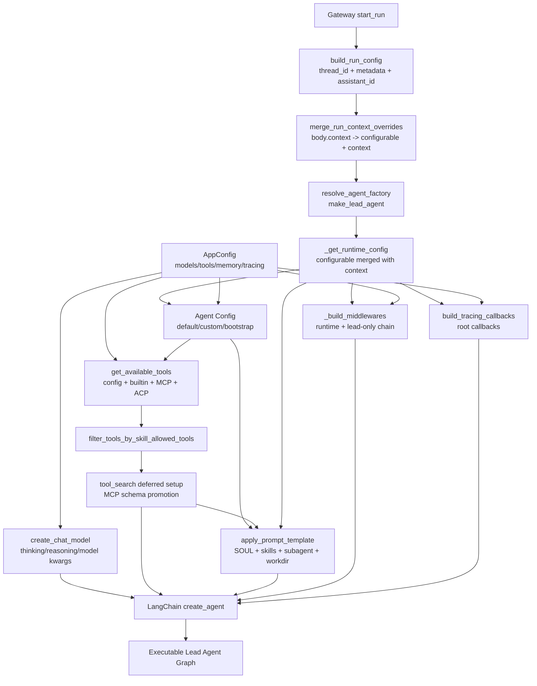
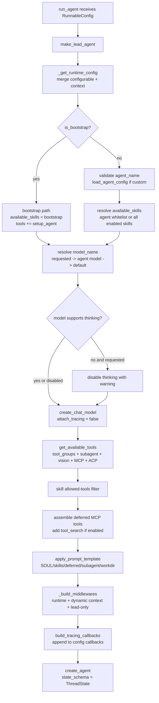

# 第 4 章：Lead Agent 的创建与执行模型

## 阅读目标

本章深入 Lead Agent 的创建过程。DeerFlow 的核心 agent 不是固定 prompt 加固定工具，而是在每次运行时根据配置、上下文、skills、agent_name、model_name 和 middleware 动态组装。

读完本章后，需要能回答：

- `make_lead_agent()` 如何选择模型、工具、prompt 和 middleware。
- 默认 lead agent、bootstrap agent 与自定义 agent 的关系。
- model selection、thinking、reasoning effort、vision、tool groups 和 deferred tools 如何共同影响一次运行。
- tracing callback 为什么挂在 graph invocation root，而不是重复挂在每个模型实例上。

相关章节可以对照 [[03-gateway-runtime|Gateway API 与 LangGraph-compatible Runtime]]、[[05-middleware-chain|Middleware 链路与横切能力]]、[[06-tools-mcp-subagents|工具系统、MCP 与 Subagent 委派]] 和 [[08-skills-and-agent-config|Skills、Agent 配置与可扩展工作流]] 阅读。

## 核心概念

Lead Agent 是 DeerFlow 的默认执行图工厂。Gateway 不直接保存一个全局 agent 实例，而是在 run 启动时解析 `RunnableConfig`，调用 `make_lead_agent(config)` 生成一个 LangChain/LangGraph agent graph。这样做的直接结果是：同一个后端进程中，不同 run 可以使用不同模型、不同 custom agent、不同 plan mode、不同 subagent 开关和不同工具集合。

这里要区分三层配置来源：

- `config.yaml` 经过 `AppConfig` 解析，提供全局模型、工具、memory、summarization、title、tracing、tool_search 等配置。
- Gateway 请求里的 `body.config` 和 `body.context` 会进入 `RunnableConfig`。其中 `context` 中的 `model_name`、`thinking_enabled`、`reasoning_effort`、`is_plan_mode`、`subagent_enabled`、`max_concurrent_subagents`、`agent_name`、`is_bootstrap` 等键会被白名单转发。
- 自定义 agent 的 `config.yaml` 和 `SOUL.md` 位于用户 agent 目录下，提供 `model`、`tool_groups`、`skills` 和 persona prompt。

`agent_name` 为 `None` 时运行默认 lead agent。`agent_name` 非空时，`load_agent_config()` 读取自定义 agent 配置，并把 `update_agent` 工具暴露给该 agent，让它可以更新自己的 `SOUL.md` 或 config。`is_bootstrap=True` 是另一条特殊路径：它不读取自定义 agent 配置，只注入 `setup_agent` 工具和 `bootstrap` skill，用于创建初始自定义 agent。

## 架构图说明

Lead Agent Factory 是后端 agent harness 的中心。它读取 runtime config，解析 agent 配置，创建模型，组装工具，构建 system prompt，并把多个 middleware 交给 LangChain `create_agent()`。注意 tracing 的位置：DeerFlow 在 graph invocation root 注入 callbacks，内部 `create_chat_model()` 调用显式传 `attach_tracing=False`。



## Agent 创建流程图



## 核心源码入口

- [backend/app/gateway/services.py](/Users/mrl/lgx/project/deer-flow/backend/app/gateway/services.py)
- [backend/packages/harness/deerflow/agents/lead_agent/agent.py](/Users/mrl/lgx/project/deer-flow/backend/packages/harness/deerflow/agents/lead_agent/agent.py)
- [backend/packages/harness/deerflow/agents/lead_agent/prompt.py](/Users/mrl/lgx/project/deer-flow/backend/packages/harness/deerflow/agents/lead_agent/prompt.py)
- [backend/packages/harness/deerflow/agents/factory.py](/Users/mrl/lgx/project/deer-flow/backend/packages/harness/deerflow/agents/factory.py)
- [backend/packages/harness/deerflow/config/agents_config.py](/Users/mrl/lgx/project/deer-flow/backend/packages/harness/deerflow/config/agents_config.py)
- [backend/packages/harness/deerflow/models/factory.py](/Users/mrl/lgx/project/deer-flow/backend/packages/harness/deerflow/models/factory.py)
- [backend/packages/harness/deerflow/tools/tools.py](/Users/mrl/lgx/project/deer-flow/backend/packages/harness/deerflow/tools/tools.py)
- [backend/packages/harness/deerflow/skills/tool_policy.py](/Users/mrl/lgx/project/deer-flow/backend/packages/harness/deerflow/skills/tool_policy.py)
- [backend/packages/harness/deerflow/tools/builtins/tool_search.py](/Users/mrl/lgx/project/deer-flow/backend/packages/harness/deerflow/tools/builtins/tool_search.py)
- [backend/packages/harness/deerflow/tracing/factory.py](/Users/mrl/lgx/project/deer-flow/backend/packages/harness/deerflow/tracing/factory.py)

## 关键源码逐段讲解

### 1. Gateway 如何把请求变成 agent runtime config

[backend/app/gateway/services.py](/Users/mrl/lgx/project/deer-flow/backend/app/gateway/services.py) 里有三段和本章强相关。

第一段是 `_CONTEXT_CONFIGURABLE_KEYS` 和 `merge_run_context_overrides()`。Gateway 只把 agent 运行相关的键从 `body.context` 转发到 run config，包括 `model_name`、`thinking_enabled`、`reasoning_effort`、`is_plan_mode`、`subagent_enabled`、`max_concurrent_subagents`、`agent_name`、`is_bootstrap`。这些键会同时写入 `config["configurable"]` 和 `config["context"]`。原因是旧代码习惯读 `configurable`，而 LangGraph 新版本的 `ToolRuntime.context` 更依赖 `context`。

第二段是 `build_run_config()`。它负责设置默认 `recursion_limit=100`，合并调用方传入的 `config`，并在 `assistant_id` 不是 `lead_agent` 时把它规范化为 `agent_name`。所以自定义 agent 并不是另一个 factory，而是同一个 `make_lead_agent()` 加上一个不同的 runtime 参数。

第三段是 `start_run()`。它会先校验 `body.context.model_name` 是否在 `AppConfig.models` 中。如果请求直接指定了不存在的模型，Gateway 这里会返回 400；如果运行时后续从 agent 配置读到未知模型，`_resolve_model_name()` 会回退到默认模型并记录 warning。

### 2. `make_lead_agent()` 的入口和 runtime config 合并

[backend/packages/harness/deerflow/agents/lead_agent/agent.py](/Users/mrl/lgx/project/deer-flow/backend/packages/harness/deerflow/agents/lead_agent/agent.py) 中，公开入口是：

```python
def make_lead_agent(config: RunnableConfig):
    runtime_config = _get_runtime_config(config)
    runtime_app_config = runtime_config.get("app_config")
    return _make_lead_agent(config, app_config=runtime_app_config or get_app_config())
```

`_get_runtime_config()` 先复制 `config["configurable"]`，再用 `config["context"]` 覆盖同名键。教学时可以把它理解为兼容层：老调用方继续走 `configurable`，新调用方优先走 `context`。

`runtime_app_config` 是一个可选注入点。大多数请求使用全局 `get_app_config()`，测试或 SDK 风格调用可以把一个显式 `AppConfig` 放进 runtime config，从而避免读全局配置文件。

### 3. agent_name、bootstrap 和 custom agent

`_make_lead_agent()` 先解析这些运行时参数：

- `thinking_enabled` 默认 `True`。
- `reasoning_effort` 默认 `None`，只对支持该字段的模型生效。
- `requested_model_name` 来自 `model_name` 或兼容字段 `model`。
- `is_plan_mode` 控制是否加入 `TodoMiddleware`。
- `subagent_enabled` 和 `max_concurrent_subagents` 控制 `task` 工具和 prompt 中的编排说明。
- `is_bootstrap` 控制是否走 bootstrap agent。
- `agent_name` 先经 `validate_agent_name()` 校验，只允许字母、数字和连字符。

非 bootstrap 路径会调用 `load_agent_config(agent_name)`。`agent_name=None` 时返回 `None`，也就是默认 lead agent。`agent_name` 非空时，它从用户 agent 目录或 legacy shared 目录读取 `config.yaml`。这个 config 支持 `model`、`tool_groups`、`skills`：`model` 是自定义 agent 默认模型，`tool_groups` 是配置工具分组白名单，`skills` 是 prompt 中可见 skill 的白名单。

bootstrap 路径不会读取 custom agent config。它把可用 skill 限定成 `{"bootstrap"}`，并额外注入 `setup_agent` 工具。非 bootstrap 的 custom agent 则会额外注入 `update_agent`，默认 lead agent 不会看到这个工具。

### 4. 模型选择和 thinking/reasoning 处理

模型选择发生在 `_resolve_model_name()` 和 `create_chat_model()` 两层。

`_resolve_model_name()` 的优先级是：

1. 请求里的 `model_name` 或 `model`。
2. 自定义 agent config 里的 `model`。
3. `config.yaml` 中 `models[0].name`。

如果 `models` 为空，会抛出 `ValueError("No chat models are configured...")`。如果请求或 agent config 指向的模型不存在，它会回退到默认模型并记录 warning。这里和 Gateway 的请求前校验不同：Gateway 只校验请求体直接传入的 `model_name`，自定义 agent 配置的模型是在 agent factory 内解析。

`create_chat_model()` 读取 [backend/packages/harness/deerflow/config/model_config.py](/Users/mrl/lgx/project/deer-flow/backend/packages/harness/deerflow/config/model_config.py) 中的 `ModelConfig`。关键字段包括：

- `use`：模型类路径，例如 `langchain_openai:ChatOpenAI` 或 DeerFlow 自定义 provider。
- `model`：真实 provider model id。
- `supports_thinking`：是否允许 thinking 配置。
- `supports_reasoning_effort`：是否允许 `reasoning_effort` 透传。
- `when_thinking_enabled`、`when_thinking_disabled`、`thinking`：thinking 开关对应的 provider kwargs。
- `supports_vision`：是否加入 `view_image` 工具和 `ViewImageMiddleware`。

`_make_lead_agent()` 会先检查 `thinking_enabled and not model_config.supports_thinking`，这种情况下不报错，而是 warning 后把 thinking 关掉。`create_chat_model()` 内部还会处理几类 provider 差异：OpenAI-compatible gateway 默认启用 `stream_usage`，Codex Responses API 会把 thinking 映射为 `reasoning_effort`，不支持 `supports_reasoning_effort` 的模型会丢弃 `reasoning_effort` 参数。

### 5. 工具集合、skill policy 和 deferred tools

工具组装从 `get_available_tools()` 开始，源码在 [backend/packages/harness/deerflow/tools/tools.py](/Users/mrl/lgx/project/deer-flow/backend/packages/harness/deerflow/tools/tools.py)。它的输入有四个关键参数：

- `groups`：来自 custom agent 的 `tool_groups`，只保留配置中属于这些 group 的工具。
- `model_name`：用于判断是否加入 `view_image_tool`。
- `subagent_enabled`：为 `True` 时加入 `task_tool`。
- `app_config`：读取全局工具、skill evolution、ACP agent 等配置。

函数会先加载 `config.tools` 中配置的工具，并在 LocalSandboxProvider 不允许 host bash 时过滤 host bash 工具。之后追加内置工具：`present_files`、`ask_clarification`，如果 skill evolution 开启还会追加 `skill_manage`。`subagent_enabled=True` 时追加 `task`。模型支持 vision 时追加 `view_image`。MCP 工具从缓存中取出，并用 `metadata["deerflow_mcp"] = True` 标记来源。ACP agent 配置存在时追加 `invoke_acp_agent`。最后按工具名去重，配置工具优先。

工具加载后还不是最终集合。`_load_enabled_skills_for_tool_policy()` 会读取当前 agent 可见的 enabled skills，再交给 [backend/packages/harness/deerflow/skills/tool_policy.py](/Users/mrl/lgx/project/deer-flow/backend/packages/harness/deerflow/skills/tool_policy.py) 的 `filter_tools_by_skill_allowed_tools()`。规则是：如果没有任何 skill 声明 `allowed_tools`，保留全部工具；只要至少一个 skill 声明了 `allowed_tools`，最终工具集合就是这些显式声明的并集。

最后 `_assemble_deferred()` 调用 [backend/packages/harness/deerflow/tools/builtins/tool_search.py](/Users/mrl/lgx/project/deer-flow/backend/packages/harness/deerflow/tools/builtins/tool_search.py) 的 `build_deferred_tool_setup()`。当 `tool_search.enabled` 开启时，MCP 工具不会把完整 schema 一次性绑定给模型，而是进入 deferred catalog。agent 的 system prompt 只看到 `<available-deferred-tools>` 里的名字；模型需要先调用 `tool_search`，把匹配工具的 schema promotion 写入 `ThreadState.promoted`，随后工具才可被调用。这个步骤在 skill policy 之后执行，所以被 skill 禁用的 MCP 工具不会进入 deferred catalog。

### 6. Prompt 组装：静态 prompt 与动态上下文分离

Prompt 入口是 [backend/packages/harness/deerflow/agents/lead_agent/prompt.py](/Users/mrl/lgx/project/deer-flow/backend/packages/harness/deerflow/agents/lead_agent/prompt.py) 的 `apply_prompt_template()`。它把以下块组合到 `SYSTEM_PROMPT_TEMPLATE`：

- `<role>`：默认名字是 `DeerFlow 2.0`，custom agent 使用 `agent_name`。
- `<soul>`：`get_agent_soul(agent_name)` 读取自定义 agent 或默认 base dir 下的 `SOUL.md`。
- `<self_update>`：只有 custom agent 才出现，要求自我更新必须通过 `update_agent` 工具。
- `<thinking_style>` 与 `<clarification_system>`：约束先澄清再行动。
- `<skill_system>`：由 `get_skills_prompt_section()` 生成，列出 enabled skills 的名称、描述和容器路径。
- `<available-deferred-tools>`：列出 deferred MCP 工具名。
- `<subagent_system>`：仅在 `subagent_enabled=True` 时出现，并写入 `max_concurrent_subagents` 限制。
- `<working_directory>`：固定说明 `/mnt/user-data/uploads`、`workspace`、`outputs`，以及 ACP/custom mount 说明。
- `<response_style>`、`<citations>`、`<critical_reminders>`：通用行为约束。

一个容易误解的点是 memory。`prompt.py` 里有 `_get_memory_context()`，但 `apply_prompt_template()` 的结尾明确说明：memory 和当前日期由 `DynamicContextMiddleware` 按轮次注入到隐藏的 `<system-reminder>` HumanMessage 中，而不是直接放进静态 system prompt。这样静态 prompt 在不同用户和不同日期之间更稳定，有利于 prefix cache。

### 7. Middleware 链由 Lead Agent 组装，但细节属于第 5 章

`_build_middlewares()` 先调用 `build_lead_runtime_middlewares()` 生成共享 runtime middleware，再追加 lead-only middleware。真实顺序和每个 hook 的作用见 [[05-middleware-chain|Middleware 链路与横切能力]]。本章只需要抓住三点：

- middleware 列表和工具列表一样，是每次 `make_lead_agent()` 按当前 runtime config 生成的。
- `is_plan_mode`、`model_name.supports_vision`、`subagent_enabled`、`loop_detection.enabled`、`safety_finish_reason.enabled` 等配置都会影响链路。
- `ClarificationMiddleware` 总是最后追加；`SafetyFinishReasonMiddleware` 刻意放在它之前，但由于 LangChain 的 `after_model` 是反向顺序执行，Safety 会先于 Loop 观察模型输出。

### 8. Tracing 为什么挂在 graph invocation root

`agent.py` 文件顶部有一段明确的不变量说明：在 `make_lead_agent()` 可达的 graph 内部，所有 `create_chat_model()` 调用都必须传 `attach_tracing=False`。原因有两个：

- 如果 graph root 和 model instance 都挂 callbacks，同一次 LLM 调用会产生重复 span。
- Langfuse handler 的 `session_id`、`user_id` 传播依赖 root-level `on_chain_start(parent_run_id=None)`，如果 callbacks 只挂在模型层，模型会变成 nested observation，`langfuse_*` metadata 会被剥离。

因此 `_make_lead_agent()` 先把 `agent_name`、`model_name`、`thinking_enabled`、`reasoning_effort`、`is_plan_mode`、`subagent_enabled`、`tool_groups`、`available_skills` 写入 `config["metadata"]`，再调用 [backend/packages/harness/deerflow/tracing/factory.py](/Users/mrl/lgx/project/deer-flow/backend/packages/harness/deerflow/tracing/factory.py) 的 `build_tracing_callbacks()`，把 callbacks 追加到 `config["callbacks"]`。`create_chat_model(..., attach_tracing=False)` 则用于 lead agent、bootstrap agent、summarization middleware 和 TitleMiddleware 的内部模型。

## 调用链追踪

一次前端发送消息到 Lead Agent 创建，大致路径如下：

1. 前端 input box 读取 `/api/models` 的模型列表，并把当前线程设置里的 `model_name`、`thinking_enabled`、`reasoning_effort`、`is_plan_mode`、`subagent_enabled` 放入 run context。
2. Gateway `start_run()` 校验 `body.context.model_name` 是否在模型 allowlist 中。
3. `build_run_config()` 设置 `thread_id`、`metadata`、`assistant_id`，必要时把 `assistant_id` 规范化为 `agent_name`。
4. `merge_run_context_overrides()` 把 DeerFlow 运行参数写入 `configurable` 和 `context`。
5. `run_agent()` 使用 `resolve_agent_factory()` 返回的 `make_lead_agent` 创建 graph。
6. `make_lead_agent()` 合并 runtime config，解析 app config，并进入 `_make_lead_agent()`。
7. `_make_lead_agent()` 解析 agent config、模型、工具、prompt、middleware 和 tracing callbacks。
8. `create_agent()` 返回可执行 graph，后续消息循环由 LangGraph agent runtime 执行。

自定义 agent 的分支只在第 3 步和第 6 步多出 `agent_name`：Gateway 把非默认 `assistant_id` 写入 runtime config，`_make_lead_agent()` 读取对应 `SOUL.md` 和 `config.yaml`。这也是为什么 agent 不是由 `assistant_id` 映射到多个 Python factory，而是由同一个 factory 根据参数切换行为。

## 可运行验证实验

以下实验都可以在仓库根目录运行。它们不需要真实调用模型，只验证配置解析和 factory 组装的可观察部分。

### 实验 1：确认 runtime config 合并优先级

```bash
PYTHONPATH=backend/packages/harness:backend python - <<'PY'
from deerflow.agents.lead_agent.agent import _get_runtime_config

config = {
    "configurable": {"model_name": "from-configurable", "thinking_enabled": False},
    "context": {"model_name": "from-context"},
}
print(_get_runtime_config(config))
PY
```

预期现象：输出中的 `model_name` 是 `from-context`，`thinking_enabled` 仍是 `False`。这说明 `context` 覆盖同名键，但不会删除 `configurable` 里独有的键。

### 实验 2：确认自定义 agent 名称校验

```bash
PYTHONPATH=backend/packages/harness python - <<'PY'
from deerflow.config.agents_config import validate_agent_name

for value in [None, "research-agent", "bad/name"]:
    try:
        print(value, "=>", validate_agent_name(value))
    except Exception as exc:
        print(value, "=>", type(exc).__name__, str(exc))
PY
```

预期现象：`research-agent` 通过，`bad/name` 抛出 `ValueError`。这可以解释为什么 Gateway 会先把 `assistant_id` 规范化为小写连字符形式。

### 实验 3：检查模型列表暴露给前端的字段

启动后端后运行：

```bash
curl -sS http://127.0.0.1:8000/api/models
```

预期现象：响应只包含非敏感字段，例如 `name`、`model`、`display_name`、`description`、`supports_thinking`、`supports_reasoning_effort` 和 `token_usage.enabled`。它不会返回 API key、base URL 等敏感配置。

### 实验 4：观察一次 run context 如何选择模型

启动后端后构造一个最小 stream 请求，替换其中的 `thread_id` 和 `model_name`：

```bash
curl -N -X POST "http://127.0.0.1:8000/api/langgraph/threads/demo-thread/runs/stream" \
  -H "Content-Type: application/json" \
  -d '{
    "assistant_id": "lead_agent",
    "input": {"messages": [{"role": "user", "content": "只回复 OK"}]},
    "stream_mode": ["values"],
    "context": {
      "model_name": "your-configured-model-name",
      "thinking_enabled": false,
      "reasoning_effort": "low",
      "is_plan_mode": false,
      "subagent_enabled": false
    }
  }'
```

预期现象：如果模型名不存在，Gateway 在 `start_run()` 返回 400；如果模型名存在，后端日志会出现 `Create Agent(...) -> thinking_enabled... model_name...`。

## 常见改造点

新增模型时，优先改 `config.yaml` 的 `models` 列表。前端模型下拉来自 `/api/models`，后端执行来自 `create_chat_model()`，二者共享 `AppConfig.models`。如果模型支持 thinking 或 vision，需要显式设置 `supports_thinking`、`supports_reasoning_effort` 或 `supports_vision`，否则前端不会展示对应能力，后端也不会加入 vision 工具。

新增 provider 时，通常只需要让 `ModelConfig.use` 指向一个可由 `resolve_class()` 加载的 `BaseChatModel` 子类。如果 provider 对 thinking 的开关字段不同，不要在 agent factory 中写特例，优先放进 `when_thinking_enabled`、`when_thinking_disabled` 或 provider 类内部。

新增 custom agent 能力时，优先通过 agent config 的 `tool_groups` 和 `skills` 控制，而不是在 `_make_lead_agent()` 写 agent 名称判断。`tool_groups` 控制配置工具来源，`skills` 控制 prompt 中可见技能和 allowed-tools policy。

新增内置工具时，需要判断它属于所有 agent 都应看到的 builtin，还是只在某个 feature 开关下出现。例如 `task` 只在 `subagent_enabled=True` 时出现，`view_image` 只在模型支持 vision 时出现。工具名必须唯一，否则 `get_available_tools()` 会跳过后出现的重复项并记录 warning。

新增 tracing provider 时，应扩展 `build_tracing_callbacks()`，不要把 callbacks 直接挂到 lead agent 的模型实例上。凡是在 graph 内部创建模型的地方，都要检查是否需要 `attach_tracing=False`。

## 风险和调试入口

模型选择问题先看三处：Gateway 的 `start_run()` 是否因请求模型不在 allowlist 返回 400；`_resolve_model_name()` 是否因为 agent config 的模型不存在而 fallback；`create_chat_model()` 是否因为 provider class 或 thinking 参数不匹配抛错。

工具缺失问题先看 `get_available_tools()` 日志。常见原因是 custom agent 的 `tool_groups` 过滤掉了配置工具、LocalSandboxProvider 禁用了 host bash、模型不支持 vision 导致没有 `view_image`、`subagent_enabled` 没开导致没有 `task`、skill 的 `allowed_tools` policy 进一步缩小了工具集合，或者 MCP 工具被 deferred，需要先用 `tool_search` promotion。

Prompt 不符合预期时，先区分静态 prompt 和动态上下文。`SOUL.md`、skills、subagent、工作目录说明来自 `apply_prompt_template()`；memory 和 current date 来自 `DynamicContextMiddleware`，不应在静态 system prompt 中寻找。

Tracing 重复或缺少 session/user metadata 时，检查 `config["callbacks"]` 是否在 root config 上，内部模型是否误用了默认 `attach_tracing=True`。`agent.py` 顶部列出的不变量是排查这类问题的第一入口。

自定义 agent 无效时，沿 `assistant_id -> build_run_config() -> agent_name -> validate_agent_name() -> load_agent_config()` 追踪。如果 `assistant_id` 是 `lead_agent` 或空值，就不会加载 custom agent。若 agent 目录或 `config.yaml` 不存在，`load_agent_config()` 会抛出文件错误。

## 后续深读任务

- 从 `services.py::build_run_config()` 跟踪到 `agent.py::_get_runtime_config()`，解释 `context` 和 `configurable` 的兼容关系。
- 解释 model fallback 的失败行为：未配置模型、请求不存在模型、custom agent 默认模型不存在、默认模型为空。
- 阅读 prompt 组装逻辑，区分 system prompt、skills prompt、deferred tools prompt、memory reminder 和工作目录约束。
- 对照 [[05-middleware-chain|Middleware 链路与横切能力]]，把 `_build_middlewares()` 的顺序与 LangChain hook 执行时机对应起来。
