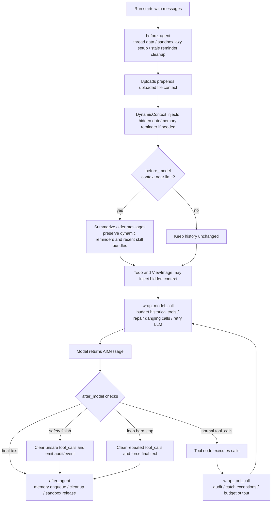

# 第 5 章：Middleware 链路与横切能力

## 阅读目标

本章解释 DeerFlow 为什么把大量能力放到 middleware，而不是塞进 prompt 或 agent 主逻辑。Middleware 负责线程目录、上传文件、sandbox、上下文压缩、todo、标题、memory、图像、错误处理、循环检测和安全终止等横切能力。

读完本章后，需要能回答：

- middleware 顺序为什么影响正确性。
- 哪些 middleware 修改 state，哪些修改 prompt/messages，哪些包裹 tool call 或 model call。
- `ThreadState` 扩展了哪些 DeerFlow 运行时字段。
- tool error、LLM error、loop detection、token usage、tool output budget 如何提高 agent 运行稳定性。

本章承接 [[04-lead-agent-execution|Lead Agent 的创建与执行模型]]，也会和 [[07-sandbox-files-artifacts|Sandbox、文件系统与 Artifact 生命周期]]、[[09-memory-persistence-runtime-history|Memory、Persistence、Checkpointer 与运行历史]] 交叉。

## 核心概念

DeerFlow 使用 LangChain `AgentMiddleware` 把横切能力插入 agent 执行。一个 middleware 可以在不同阶段介入：

- `before_agent`：一次 agent run 开始前修改 state，例如准备 thread data、清理旧 run 的临时提醒。
- `before_model`：每次模型调用前修改消息，例如上下文压缩、todo reminder、图片注入。
- `wrap_model_call`：包裹模型请求/响应，例如 LLM 重试、熔断、历史 ToolMessage 截断、延迟注入 loop/todo 提醒。
- `after_model`：模型返回后检查 AIMessage，例如生成标题、检测循环、拦截 safety finish reason。
- `wrap_tool_call`：包裹工具执行，例如 bash 审计、工具异常转 ToolMessage、工具输出预算。
- `after_agent`：一次 agent run 完成后收尾，例如 memory enqueue、清理临时提醒、释放 sandbox。

顺序重要，不只是因为“先后处理”。更关键的是 LangGraph 对消息格式有严格要求：带 `tool_calls` 的 AIMessage 后面必须紧跟对应 ToolMessage。任何 middleware 如果在错误时机插入 HumanMessage，都可能让 OpenAI-compatible provider 报 “tool_call_ids did not have response messages”。因此 DeerFlow 的 loop warning、todo completion reminder、dangling tool-call patch 都刻意选择特定 hook。

## 架构图说明

`make_lead_agent()` 中的 middleware 来自两段：基础 runtime chain 由 `build_lead_runtime_middlewares()` 生成，lead-only chain 由 `_build_middlewares()` 继续追加。下面的图体现真实拼接顺序；其中带条件的节点只有配置或运行时开关满足时才加入。

```mermaid
flowchart TB
    Start[make_lead_agent]
    Runtime[build_lead_runtime_middlewares]
    ToolBudget[0 ToolOutputBudgetMiddleware]
    ThreadData[1 ThreadDataMiddleware]
    Uploads[2 UploadsMiddleware]
    Sandbox[3 SandboxMiddleware]
    Dangling[4 DanglingToolCallMiddleware]
    LLMError[5 LLMErrorHandlingMiddleware]
    Guardrail[6 GuardrailMiddleware<br/>if configured]
    SandboxAudit[7 SandboxAuditMiddleware]
    ToolError[8 ToolErrorHandlingMiddleware]
    LeadOnly[_build_middlewares lead-only append]
    Dynamic[9 DynamicContextMiddleware]
    Summary[10 DeerFlowSummarizationMiddleware<br/>if enabled]
    Todo[11 TodoMiddleware<br/>if plan mode]
    TokenUsage[12 TokenUsageMiddleware<br/>if enabled]
    Title[13 TitleMiddleware]
    Memory[14 MemoryMiddleware]
    ViewImage[15 ViewImageMiddleware<br/>if model supports vision]
    Deferred[16 DeferredToolFilterMiddleware<br/>if deferred tools]
    SubagentLimit[17 SubagentLimitMiddleware<br/>if subagent enabled]
    Loop[18 LoopDetectionMiddleware<br/>if enabled]
    Custom[19 custom_middlewares<br/>if injected]
    Safety[20 SafetyFinishReasonMiddleware<br/>if enabled]
    Clarify[21 ClarificationMiddleware<br/>always last]
    Agent[create_agent]

    Start --> Runtime
    Runtime --> ToolBudget --> ThreadData --> Uploads --> Sandbox --> Dangling --> LLMError --> Guardrail --> SandboxAudit --> ToolError
    ToolError --> LeadOnly
    LeadOnly --> Dynamic --> Summary --> Todo --> TokenUsage --> Title --> Memory --> ViewImage --> Deferred --> SubagentLimit --> Loop --> Custom --> Safety --> Clarify --> Agent
```



## State、Prompt、Tool、Model、Error 交互图

下面的图从一次用户消息进入 agent 后的交互角度看 middleware。它不是另一套顺序，而是说明每类 middleware 主要操作什么对象。

```mermaid
flowchart LR
    User[User Message] --> State[ThreadState.messages]
    State --> ThreadData[ThreadData<br/>thread_data paths + message metadata]
    ThreadData --> Uploads[Uploads<br/>prepend uploaded_files block]
    Uploads --> Dynamic[Dynamic Context<br/>hidden system-reminder]
    Dynamic --> Summary[Summarization<br/>RemoveMessage + summary]
    Summary --> PromptMsgs[Model-bound messages]

    PromptMsgs --> ToolBudgetModel[ToolOutputBudget<br/>patch historical ToolMessages]
    ToolBudgetModel --> Dangling[DanglingToolCall<br/>repair missing ToolMessages]
    Dangling --> TodoBefore[Todo/ViewImage/Loop queued reminders<br/>before/wrap model]
    TodoBefore --> LLMError[LLMError<br/>retry/circuit/fallback]
    LLMError --> Model[Chat Model]
    Model --> AfterModel[after_model hooks]
    AfterModel --> Safety[Safety finish reason<br/>clear unsafe tool_calls]
    AfterModel --> Loop[Loop detection<br/>warn or hard stop]
    AfterModel --> Title[Title generation]

    Model --> ToolCall{tool_calls?}
    ToolCall -->|yes| SandboxAudit[SandboxAudit<br/>bash block/warn]
    SandboxAudit --> ToolExec[Tool Execution]
    ToolExec --> ToolError[ToolErrorHandling<br/>exception -> error ToolMessage]
    ToolError --> ToolBudgetTool[ToolOutputBudget<br/>externalize/truncate output]
    ToolBudgetTool --> State
    ToolCall -->|ask_clarification| Clarify[Clarification<br/>Command goto END]
    ToolCall -->|no| Finish[Assistant response]
    Finish --> Memory[Memory after_agent<br/>enqueue update]
```



## 单轮执行流程图



## 核心源码入口

- [backend/packages/harness/deerflow/agents/thread_state.py](/Users/mrl/lgx/project/deer-flow/backend/packages/harness/deerflow/agents/thread_state.py)
- [backend/packages/harness/deerflow/agents/lead_agent/agent.py](/Users/mrl/lgx/project/deer-flow/backend/packages/harness/deerflow/agents/lead_agent/agent.py)
- [backend/packages/harness/deerflow/agents/middlewares/tool_error_handling_middleware.py](/Users/mrl/lgx/project/deer-flow/backend/packages/harness/deerflow/agents/middlewares/tool_error_handling_middleware.py)
- [backend/packages/harness/deerflow/agents/middlewares/thread_data_middleware.py](/Users/mrl/lgx/project/deer-flow/backend/packages/harness/deerflow/agents/middlewares/thread_data_middleware.py)
- [backend/packages/harness/deerflow/agents/middlewares/uploads_middleware.py](/Users/mrl/lgx/project/deer-flow/backend/packages/harness/deerflow/agents/middlewares/uploads_middleware.py)
- [backend/packages/harness/deerflow/sandbox/middleware.py](/Users/mrl/lgx/project/deer-flow/backend/packages/harness/deerflow/sandbox/middleware.py)
- [backend/packages/harness/deerflow/agents/middlewares/dynamic_context_middleware.py](/Users/mrl/lgx/project/deer-flow/backend/packages/harness/deerflow/agents/middlewares/dynamic_context_middleware.py)
- [backend/packages/harness/deerflow/agents/middlewares/summarization_middleware.py](/Users/mrl/lgx/project/deer-flow/backend/packages/harness/deerflow/agents/middlewares/summarization_middleware.py)
- [backend/packages/harness/deerflow/agents/middlewares/todo_middleware.py](/Users/mrl/lgx/project/deer-flow/backend/packages/harness/deerflow/agents/middlewares/todo_middleware.py)
- [backend/packages/harness/deerflow/agents/middlewares/title_middleware.py](/Users/mrl/lgx/project/deer-flow/backend/packages/harness/deerflow/agents/middlewares/title_middleware.py)
- [backend/packages/harness/deerflow/agents/middlewares/memory_middleware.py](/Users/mrl/lgx/project/deer-flow/backend/packages/harness/deerflow/agents/middlewares/memory_middleware.py)
- [backend/packages/harness/deerflow/agents/middlewares/view_image_middleware.py](/Users/mrl/lgx/project/deer-flow/backend/packages/harness/deerflow/agents/middlewares/view_image_middleware.py)
- [backend/packages/harness/deerflow/agents/middlewares/clarification_middleware.py](/Users/mrl/lgx/project/deer-flow/backend/packages/harness/deerflow/agents/middlewares/clarification_middleware.py)
- [backend/packages/harness/deerflow/agents/middlewares/llm_error_handling_middleware.py](/Users/mrl/lgx/project/deer-flow/backend/packages/harness/deerflow/agents/middlewares/llm_error_handling_middleware.py)
- [backend/packages/harness/deerflow/agents/middlewares/loop_detection_middleware.py](/Users/mrl/lgx/project/deer-flow/backend/packages/harness/deerflow/agents/middlewares/loop_detection_middleware.py)
- [backend/packages/harness/deerflow/agents/middlewares/safety_finish_reason_middleware.py](/Users/mrl/lgx/project/deer-flow/backend/packages/harness/deerflow/agents/middlewares/safety_finish_reason_middleware.py)

## 关键源码逐段讲解

### 1. `ThreadState` 是 middleware 共享状态的边界

[backend/packages/harness/deerflow/agents/thread_state.py](/Users/mrl/lgx/project/deer-flow/backend/packages/harness/deerflow/agents/thread_state.py) 定义 `ThreadState(AgentState)`，在 LangChain 默认消息状态上加入 DeerFlow 字段：

- `sandbox`：保存 sandbox id。
- `thread_data`：保存 `workspace_path`、`uploads_path`、`outputs_path`。
- `title`：TitleMiddleware 写入的线程标题。
- `artifacts`：使用 `merge_artifacts()` 去重合并。
- `todos`：使用 `merge_todos()`，新值非 `None` 时覆盖旧值。
- `uploaded_files`：UploadsMiddleware 写入当前消息上传文件。
- `viewed_images`：`view_image` 工具和 ViewImageMiddleware 共享的图片数据。
- `promoted`：deferred tool promotion 状态，带 catalog hash，避免 catalog 变化后旧工具名误暴露。

读 middleware 时要先看它声明的 `state_schema`。如果 middleware 要写 `todos`、`viewed_images`、`promoted` 这类 reducer-backed 字段，必须复用 `ThreadState` 或兼容 schema，否则 LangGraph 不知道如何合并多次 state update。

### 2. 基础 runtime chain：工具预算、线程目录、上传、sandbox、错误防线

真实基础链在 [backend/packages/harness/deerflow/agents/middlewares/tool_error_handling_middleware.py](/Users/mrl/lgx/project/deer-flow/backend/packages/harness/deerflow/agents/middlewares/tool_error_handling_middleware.py) 的 `_build_runtime_middlewares()` 中：

```text
ToolOutputBudget
ThreadData
Uploads
Sandbox
DanglingToolCall
LLMErrorHandling
Guardrail(if configured)
SandboxAudit
ToolErrorHandling
```

`ToolOutputBudgetMiddleware` 放在最前面，但它主要通过 `wrap_tool_call` 和 `wrap_model_call` 生效。工具返回内容太长时，它会优先把完整内容写入 `outputs_path` 下的预算目录，再把 ToolMessage 替换成 head/tail preview 和虚拟路径。如果无法持久化，则退回纯截断。它也会在 model call 前再次扫描历史 ToolMessage，避免旧的大输出继续撑爆上下文。

`ThreadDataMiddleware` 在 `before_agent` 解析 `thread_id`。它优先读 `runtime.context["thread_id"]`，没有则读 LangGraph `configurable.thread_id`。默认 `lazy_init=True` 时只计算路径，不急着创建目录；`lazy_init=False` 才会立即创建。它还会把最后一条 HumanMessage 的 `name` 设为 `user-input`，并写入 `run_id` 和 timestamp。

`UploadsMiddleware` 必须在 ThreadData 之后，因为它需要 thread 的 uploads 目录做文件存在性检查。它读取最后一条 HumanMessage 的 `additional_kwargs.files` 作为本轮新上传文件，同时扫描历史 uploads 目录，把新旧文件列表整理成 `<uploaded_files>` block 并 prepend 到最后一条 HumanMessage。对于已转换成 Markdown 的文件，它会提取 outline；没有标题时读前几行作为 fallback preview。

`SandboxMiddleware` 默认 lazy acquisition。`before_agent` 不一定马上分配 sandbox；真正需要执行 sandbox 工具时再由 provider acquire。它的 `after_agent` 会释放 state 或 runtime context 中的 sandbox id。这里和 [[07-sandbox-files-artifacts|Sandbox、文件系统与 Artifact 生命周期]] 强相关：thread data 提供路径，sandbox middleware 提供执行环境。

`DanglingToolCallMiddleware` 选择 `wrap_model_call` 而不是 `before_model`，因为它要把 synthetic ToolMessage 插入到出问题的 AIMessage 后面，而不是追加到消息末尾。它修复的是“AIMessage 有 tool_calls，但历史中缺少对应 ToolMessage”的情况，常见于中断、取消或 provider 返回 malformed tool call。

`LLMErrorHandlingMiddleware` 包裹模型调用。它会识别 transient/busy、quota、auth 等错误；可重试错误按指数退避重试，连续失败会触发 circuit breaker；最终失败时返回一个带 `deerflow_error_fallback` metadata 的 AIMessage，而不是让整个 run 直接崩掉。`GraphBubbleUp` 会被原样抛出，因为那是 LangGraph 的控制流信号。

`SandboxAuditMiddleware` 包裹 bash 工具。它把命令按风险分为 block、warn、pass：高风险命令直接返回 error ToolMessage，中风险命令执行后把 warning 追加到结果。它还会写结构化 audit log。

`ToolErrorHandlingMiddleware` 是工具异常的兜底。除 `GraphBubbleUp` 外，工具执行抛出的异常都会被转换成 status 为 `error` 的 ToolMessage，内容提示模型继续使用已有上下文或换工具。这样单个工具失败不会直接终止 agent loop。

### 3. Lead-only chain：动态上下文、压缩、todo、标题、memory、vision、clarification

`_build_middlewares()` 在 [backend/packages/harness/deerflow/agents/lead_agent/agent.py](/Users/mrl/lgx/project/deer-flow/backend/packages/harness/deerflow/agents/lead_agent/agent.py) 中继续追加 lead agent 专属 middleware。

`DynamicContextMiddleware` 在 `before_agent` 注入隐藏的 `<system-reminder>` HumanMessage，内容包含当前日期和可选 memory。第一次注入时使用 ID-swap 技巧：reminder message 继承原始用户消息 id，原用户消息变成 `{id}__user`，从而保持消息位置。跨午夜时，它只在当前轮前注入日期更新 reminder。这个设计让 system prompt 保持静态，减少 prefix cache 抖动。

`DeerFlowSummarizationMiddleware` 在 `before_model` 判断是否需要压缩。它基于 LangChain SummarizationMiddleware 扩展了三点：压缩前触发 hook，例如 memory flush；把 summary 包成 `HumanMessage(name="summary")`，前端可以隐藏；保护 dynamic context reminder 和近期 skill 文件读取 bundle，避免刚加载的 skill 被摘要抹掉。

`TodoMiddleware` 只在 `is_plan_mode=True` 时加入。它继承 LangChain 的 TodoListMiddleware，但增加两类保护：如果原始 `write_todos` 调用被摘要移出上下文，它会在 `before_model` 注入 hidden todo reminder；如果模型在 todos 未完成时想直接给最终回答，它会在 `after_model` 阶段排队一个 completion reminder，并通过 `jump_to="model"` 让 agent 回到模型节点。completion reminder 不直接写入 state，而是在下一次 `wrap_model_call` 加到请求末尾，避免污染用户可见历史。

`TokenUsageMiddleware` 只在 `app_config.token_usage.enabled` 时加入。第 4 章提到 `create_chat_model()` 会尽量开启 `stream_usage`，这正是为了让 token usage middleware 能拿到模型返回的 usage metadata。

`TitleMiddleware` 在 `after_model` 生成标题。它只在标题配置启用、state 还没有 `title`、且已有一个完整用户/助手交换时运行。异步路径会调用一个独立模型，并用 `run_name="title_agent"`、`tags=["middleware:title"]` 标记该 LLM 调用。它也必须传 `attach_tracing=False`，继承 graph root 的 tracing callbacks。

`MemoryMiddleware` 放在 Title 之后，在 `after_agent` 把有意义的用户输入和最终 assistant response 放入 memory queue。它会检测 correction/reinforcement，并在 request context 还活着时捕获 `user_id`，因为后续 debounced timer 在线程中执行，ContextVar 不会自动传播。

`ViewImageMiddleware` 只在当前模型 `supports_vision=True` 时加入。它在 `before_model` 检查最近一次 assistant 是否调用了 `view_image`，并确认所有对应 ToolMessage 已返回。满足条件后，它把 `viewed_images` 中的 base64 图片作为 multimodal HumanMessage 注入，让模型能继续分析图片。

`DeferredToolFilterMiddleware` 只在 deferred tools 存在时加入。它和 `ThreadState.promoted` 搭配，控制 MCP deferred tool 的 schema 何时真正暴露给模型。第 4 章的 deferred tool 组装说明了这条链路。

`SubagentLimitMiddleware` 只在 `subagent_enabled=True` 时加入，用于限制单轮并行 `task` 调用数量，避免 prompt 中的并发上限只停留在文字约束。

`LoopDetectionMiddleware` 在 `after_model` 检测重复工具调用。它有两层检测：相同工具调用集合 hash 反复出现；同一种工具被调用次数过高。warning 不会立刻插入消息，而是排队到下一次 `wrap_model_call`，因为 `after_model` 此时 ToolMessage 还没生成。hard stop 则会清空最后一个 AIMessage 的 tool_calls，把内容改成强制收尾提示。

`SafetyFinishReasonMiddleware` 放在 LoopDetection 之后注册，但 LangChain 的 `after_model` 调度是反向顺序，所以 Safety 会先看到模型原始输出。如果 provider 的 `finish_reason`/`stop_reason` 是 safety/content filter/refusal 一类，并且 AIMessage 里还有 tool_calls，它会清空 tool_calls、追加用户可见解释，并发出 SSE/audit 事件。这样可以避免执行被安全截断的半截工具参数。

`ClarificationMiddleware` 总是最后追加。它包裹 `ask_clarification` 工具调用，返回 `Command(update={messages: [...]}, goto=END)`，让 agent 暂停在澄清问题上。普通工具调用会继续交给 handler。

### 4. 顺序约束为什么不能随意改

`ThreadDataMiddleware` 必须早于 `UploadsMiddleware` 和需要 `outputs_path` 的工具预算外置逻辑。Uploads 需要 thread uploads 目录；ToolOutputBudget 在 tool result 阶段需要 `thread_data.outputs_path`，虽然它注册在最前，但真正执行时 state 已经被 ThreadData 写入。

`DanglingToolCallMiddleware` 必须在模型调用前包裹 request，并且要保持“紧跟 AIMessage 插入 ToolMessage”的能力。把它改成简单 `before_model` 会导致修复消息落到末尾，仍然可能不满足 provider 的工具配对规则。

`DynamicContextMiddleware` 要早于 Summarization。否则 summarization 可能把第一个用户消息或 hidden reminder 的关系打乱。当前 Summarization 还专门识别 `dynamic_context_reminder`，防止它被摘要吞掉。

`ToolErrorHandlingMiddleware` 和 `ClarificationMiddleware` 都是 `wrap_tool_call`，但 Clarification 总是最后注册。教学时要注意：列表顺序不等同于所有 hook 的直觉执行顺序，具体取决于 LangChain 对该 hook 的包装方式。DeerFlow 的意图是让 clarification tool 被专门拦截并以 `Command goto END` 结束，而普通工具异常由 ToolErrorHandling 转成 error ToolMessage。

`SafetyFinishReasonMiddleware` 的注释明确要求它注册在 LoopDetection 之后。因为 `after_model` 反向执行，Safety 会先清掉 safety-terminated response 中的 tool_calls，然后 Loop 再基于清理后的消息做统计，避免把 provider 安全截断误判为正常工具循环。

`MemoryMiddleware` 放在 Title 之后，因为标题更新不应被 memory queue 逻辑阻挡；memory 只需要最终对话消息，不需要参与 model/tool 循环。

## 调用链追踪

一次普通文本 run 的 middleware 路径可以这样追：

1. `make_lead_agent()` 调用 `_build_middlewares(config, model_name, agent_name, app_config, deferred_setup)`。
2. `_build_middlewares()` 先拿到基础 runtime middlewares，再追加 DynamicContext、Summarization、Todo、TokenUsage、Title、Memory、ViewImage、Deferred、SubagentLimit、Loop、custom、Safety、Clarification。
3. `create_agent(..., middleware=middlewares, state_schema=ThreadState)` 把它们编译进 LangGraph agent。
4. run 开始后，`before_agent` 阶段准备 `thread_data`、上传上下文、动态 reminder，并清理上一 run 残留的 loop/todo 临时提醒。
5. 每次模型调用前，`before_model` 和 `wrap_model_call` 处理 summary、todo reminder、view image、历史 ToolMessage 预算、dangling tool call、LLM retry。
6. 模型返回后，`after_model` 处理 title、todo premature exit、loop detection、safety suppression 等。
7. 如果有 tool_calls，工具节点执行时进入 `wrap_tool_call`，处理 bash 审计、clarification、tool error、tool output budget。
8. 没有 tool_calls 或被 middleware 清空 tool_calls 时，agent run 收尾，`after_agent` 触发 memory queue、清理临时提醒和 sandbox release。

带上传文件的 run 多一步：用户上传路由先把文件放入 thread uploads 目录并可能生成转换后的 Markdown；消息发送时 frontend 把文件 metadata 放进 `additional_kwargs.files`；UploadsMiddleware 把当前文件和历史文件合并成 `<uploaded_files>` 上下文。

带图片查看的 run 是两轮模型调用：第一轮模型调用 `view_image` 工具，工具把 base64/mime 写入 `ThreadState.viewed_images`；工具返回后进入下一次 `before_model`，ViewImageMiddleware 把图片 blocks 注入模型请求，模型再基于图片内容回答。

## 可运行验证实验

### 实验 1：打印 Lead Agent middleware 的真实类名顺序

这个实验只构造 middleware，不执行模型调用。需要保证 Python 能找到 backend package。

```bash
PYTHONPATH=backend/packages/harness python - <<'PY'
from deerflow.agents.lead_agent.agent import _build_middlewares, _resolve_model_name
from deerflow.config.app_config import get_app_config

config = {"configurable": {"thread_id": "demo", "is_plan_mode": True, "subagent_enabled": True}}
app_config = get_app_config()
model_name = _resolve_model_name(app_config=app_config)
middlewares = _build_middlewares(config, model_name=model_name, app_config=app_config)

for index, middleware in enumerate(middlewares):
    print(index, type(middleware).__name__)
PY
```

预期现象：输出中能看到 `ToolOutputBudgetMiddleware`、`ThreadDataMiddleware`、`UploadsMiddleware`、`SandboxMiddleware`、`DanglingToolCallMiddleware`、`LLMErrorHandlingMiddleware`、`SandboxAuditMiddleware`、`ToolErrorHandlingMiddleware`，以及 lead-only 的 `DynamicContextMiddleware`、`TitleMiddleware`、`MemoryMiddleware`、`ClarificationMiddleware`。是否出现 Summarization、Todo、TokenUsage、ViewImage、SubagentLimit、Loop、Safety 取决于当前 config 和 runtime 参数。

### 实验 2：验证 ThreadData 写入 state

```bash
PYTHONPATH=backend/packages/harness python - <<'PY'
from langchain_core.messages import HumanMessage
from deerflow.agents.middlewares.thread_data_middleware import ThreadDataMiddleware

class Runtime:
    context = {"thread_id": "teaching-thread", "run_id": "run-1"}

middleware = ThreadDataMiddleware(lazy_init=True)
result = middleware.before_agent({"messages": [HumanMessage(content="hello", id="m1")]}, Runtime())
print(result["thread_data"])
print(result["messages"][-1].name)
print(result["messages"][-1].additional_kwargs)
PY
```

预期现象：`thread_data` 中出现 workspace/uploads/outputs 三个路径；最后一条 HumanMessage 的 `name` 是 `user-input`，`additional_kwargs` 包含 `run_id` 和 timestamp。

### 实验 3：验证 UploadsMiddleware 如何注入上传上下文

先准备一个临时 thread uploads 文件，再直接调用 middleware：

```bash
PYTHONPATH=backend/packages/harness python - <<'PY'
from pathlib import Path
from tempfile import TemporaryDirectory
from langchain_core.messages import HumanMessage
from deerflow.agents.middlewares.uploads_middleware import UploadsMiddleware

class Runtime:
    context = {"thread_id": "t1"}

with TemporaryDirectory() as tmp:
    uploads = Path(tmp) / "threads" / "t1" / "user-data" / "uploads"
    uploads.mkdir(parents=True)
    (uploads / "notes.txt").write_text("hello", encoding="utf-8")

    msg = HumanMessage(
        content="请读取文件",
        additional_kwargs={"files": [{"filename": "notes.txt", "size": 5}]},
    )
    middleware = UploadsMiddleware(base_dir=tmp)
    result = middleware.before_agent({"messages": [msg]}, Runtime())
    print(result["messages"][-1].content)
PY
```

预期现象：输出开头出现 `<uploaded_files>`，并包含 `/mnt/user-data/uploads/notes.txt`。

### 实验 4：验证 ToolErrorHandling 把工具异常转成 ToolMessage

```bash
PYTHONPATH=backend/packages/harness python - <<'PY'
from deerflow.agents.middlewares.tool_error_handling_middleware import ToolErrorHandlingMiddleware

class Request:
    tool_call = {"name": "demo_tool", "id": "call-1"}

middleware = ToolErrorHandlingMiddleware()
result = middleware.wrap_tool_call(Request(), lambda request: (_ for _ in ()).throw(RuntimeError("boom")))
print(type(result).__name__)
print(result.status)
print(result.content)
PY
```

预期现象：输出是 `ToolMessage`，`status` 为 `error`，内容包含工具名、异常类型和继续处理建议。

### 实验 5：用一次真实 run 观察 middleware 效果

启动后端后发送一个最小请求：

```bash
curl -N -X POST "http://127.0.0.1:8000/api/langgraph/threads/mw-demo/runs/stream" \
  -H "Content-Type: application/json" \
  -d '{
    "assistant_id": "lead_agent",
    "input": {"messages": [{"role": "user", "content": "只回复 OK"}]},
    "stream_mode": ["values"],
    "context": {
      "thinking_enabled": false,
      "is_plan_mode": false,
      "subagent_enabled": false
    }
  }'
```

预期现象：如果开启日志，可以看到 agent 创建日志、可能的 title 生成、memory queue、sandbox acquire/release 等记录。具体是否出现取决于配置开关。

## 常见改造点

新增 state 字段时，先改 `ThreadState`，并判断是否需要 reducer。列表、dict、跨节点累积字段通常不能直接覆盖；要像 `artifacts`、`viewed_images`、`promoted` 一样定义清晰合并语义。

新增“每轮都要补充给模型看的上下文”时，优先考虑 `before_model` 或 `wrap_model_call`，不要直接塞进静态 system prompt。静态 prompt 适合稳定规则，动态上下文适合日期、memory、上传、图片、todo 这类和 thread/run 相关的信息。

新增工具稳定性逻辑时，优先放在 `wrap_tool_call`。如果逻辑要阻断或改写 bash 等特定工具，可以参考 `SandboxAuditMiddleware`；如果要兜底异常，可以参考 `ToolErrorHandlingMiddleware`；如果要限制结果大小，可以参考 `ToolOutputBudgetMiddleware`。

新增模型稳定性逻辑时，优先放在 `wrap_model_call` 或 `after_model`。请求前改消息、重试和熔断适合 `wrap_model_call`；检查 provider 返回的 finish reason、tool_calls 或最终 AIMessage 内容适合 `after_model`。

新增需要“再问一次模型”的控制逻辑时，要非常谨慎。Todo 和 Loop 的实现都避免在 `after_model` 立即插入普通消息，因为那时工具结果可能还没配对。更稳妥的模式是先排队，下一次 `wrap_model_call` 再把 hidden HumanMessage 放到消息末尾。

新增 custom middleware 时，默认会被 `_build_middlewares()` 插入到 Loop 之后、Safety 和 Clarification 之前。若需要更细粒度的位置，应参考 SDK factory 的 `@Next`/`@Prev` 插入机制；Lead Agent 目前只是简单 extend，自定义顺序要明确验证。

## 风险和调试入口

消息格式错误通常表现为 provider 400，内容类似缺少 tool_call 对应 response。优先检查 `DanglingToolCallMiddleware` 是否在链中，是否有 middleware 在 AIMessage(tool_calls) 和 ToolMessage 之间插入了 HumanMessage/SystemMessage。

上传文件不可见时，先检查用户消息里是否有 `additional_kwargs.files`，再检查 thread uploads 目录是否存在目标文件。UploadsMiddleware 会跳过不存在或文件名不安全的条目。

上下文压缩异常时，检查 summarization 配置是否启用、trigger/keep 是否合理、summary model 是否可用。若 skill 读取结果被摘要抹掉，重点看 `preserve_recent_skill_count`、`preserve_recent_skill_tokens` 和 `skill_file_read_tool_names`。

Memory 不更新时，检查 `memory.enabled` 是否开启、对话中是否同时存在用户消息和 assistant 消息、`thread_id` 是否能从 runtime context 或 config 解析出来。MemoryMiddleware 只入队，不直接同步写入 memory 文件。

图片分析无效时，检查当前模型是否 `supports_vision=True`。只有支持 vision 的模型才会同时获得 `view_image` 工具和 `ViewImageMiddleware`。

循环检测没有触发时，检查 `loop_detection.enabled` 以及阈值配置。它按 thread/run 维护内存状态；进程重启会清空这些计数。warning 是下一次 model call 才注入，不会立即出现在刚产生 tool_calls 的那条 AIMessage 后面。

工具输出仍然过大时，检查 `tool_output.enabled`、外置阈值、fallback 阈值，以及 `thread_data.outputs_path` 是否可解析。没有 outputs path 时只能 fallback 截断，不能保存完整输出。

Safety suppression 没有生效时，检查 provider 返回的 `finish_reason`/`stop_reason` 是否被 detector 覆盖。这个 middleware 只在“安全终止且 AIMessage 仍有 tool_calls”时清空工具调用；纯文本 safety refusal 会原样交给用户。

## 后续深读任务

- 列出 `make_lead_agent()` 中 middleware 的真实顺序，并解释每个相邻顺序的约束。
- 选择 `ThreadDataMiddleware` 和 `UploadsMiddleware` 做逐段源码讲解，追踪它们如何修改 HumanMessage。
- 找一个错误处理 middleware，验证它如何把异常转成 agent 可处理的反馈。
- 对照 [[04-lead-agent-execution|Lead Agent 的创建与执行模型]]，解释哪些 runtime config 会改变 middleware 链。
