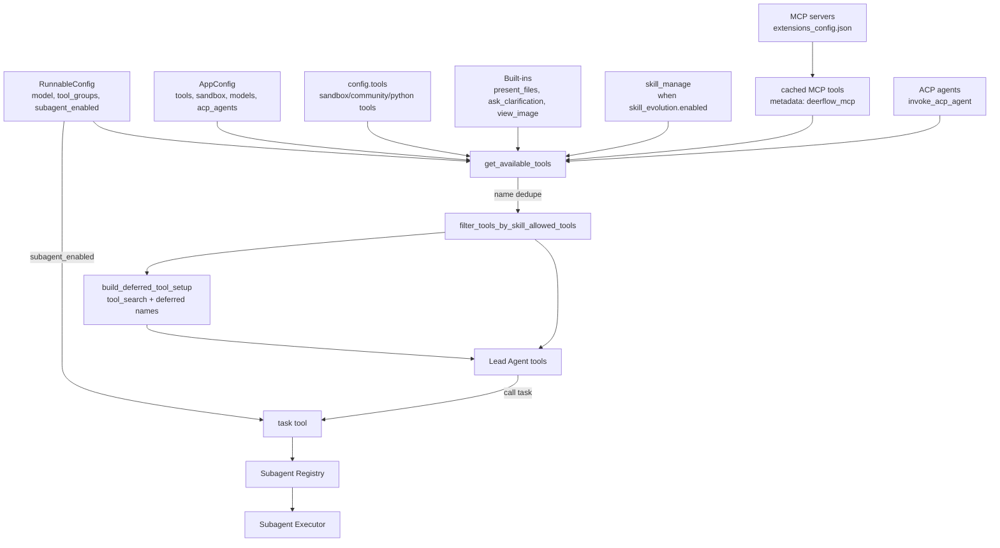
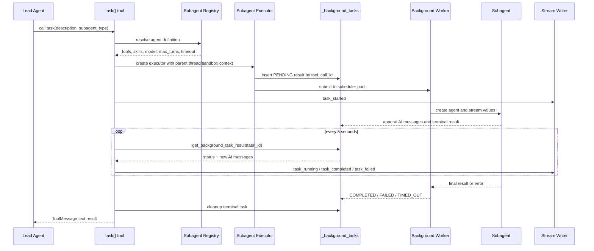
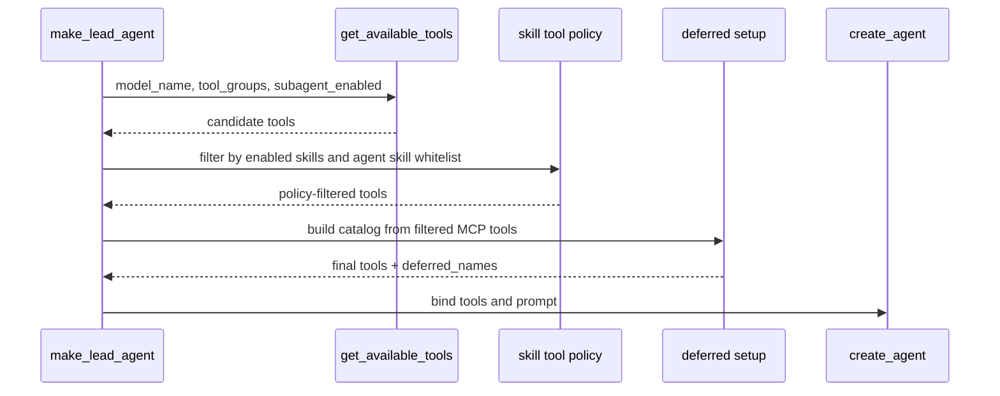
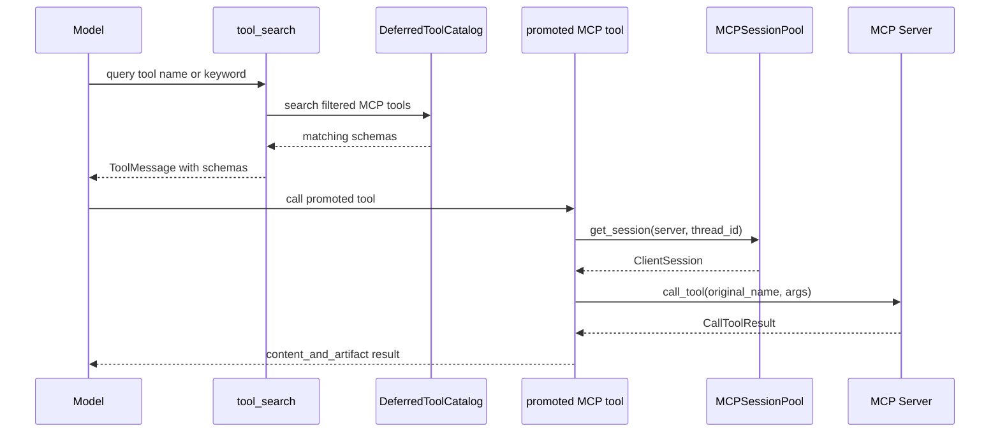
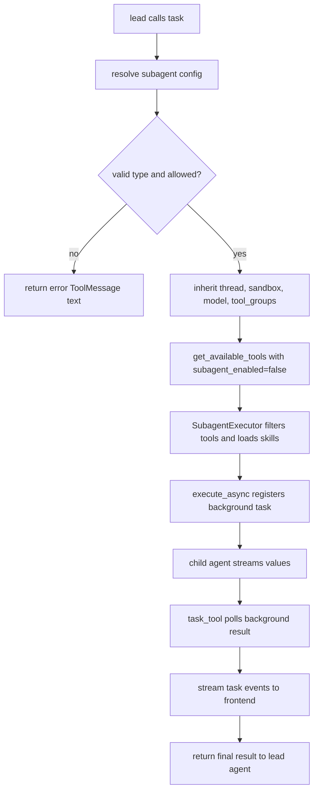

# 第 6 章：工具系统、MCP 与 Subagent 委派

## 阅读目标

本章解释 DeerFlow 的工具生态：配置工具、内置工具、sandbox 工具、MCP 工具、skill 管理工具、ACP 工具和 subagent 委派工具如何合并成 agent 可调用的工具集合。上一章 [[05-middleware-chain|Middleware 链路与横切能力]] 说明了工具运行时依赖的 `runtime.state` 和 middleware，本章继续追踪这些工具是怎样被绑定到 [[04-lead-agent-execution|Lead Agent 的创建与执行模型]] 中的。

读完本章后，需要能回答：

- `get_available_tools()` 如何决定最终工具列表。
- MCP tools 与本地 Python tools 在运行时有什么差异。
- `task()` 如何把工作委派给 subagent，并把结果回传给 lead agent。
- `tool_search` 为什么只暴露 MCP 工具名称，什么时候才把完整 schema 提供给模型。
- ACP agent 与普通 subagent 的集成边界在哪里。

## 架构图说明

工具系统是多来源聚合。配置决定是否启用搜索、抓取、bash、文件工具等能力；MCP 配置提供外部 server tools；skill policy 可能进一步限制工具；`tool_search` 让 MCP schema 在过滤之后再延迟暴露；`task` 工具把一次工具调用扩展成新的 subagent 执行链。



## Subagent 委派时序图



## 核心源码入口

- [backend/packages/harness/deerflow/tools/tools.py](/Users/mrl/lgx/project/deer-flow/backend/packages/harness/deerflow/tools/tools.py)
- [backend/packages/harness/deerflow/tools/builtins/task_tool.py](/Users/mrl/lgx/project/deer-flow/backend/packages/harness/deerflow/tools/builtins/task_tool.py)
- [backend/packages/harness/deerflow/tools/builtins/tool_search.py](/Users/mrl/lgx/project/deer-flow/backend/packages/harness/deerflow/tools/builtins/tool_search.py)
- [backend/packages/harness/deerflow/mcp/tools.py](/Users/mrl/lgx/project/deer-flow/backend/packages/harness/deerflow/mcp/tools.py)
- [backend/packages/harness/deerflow/mcp/session_pool.py](/Users/mrl/lgx/project/deer-flow/backend/packages/harness/deerflow/mcp/session_pool.py)
- [backend/packages/harness/deerflow/subagents/registry.py](/Users/mrl/lgx/project/deer-flow/backend/packages/harness/deerflow/subagents/registry.py)
- [backend/packages/harness/deerflow/subagents/executor.py](/Users/mrl/lgx/project/deer-flow/backend/packages/harness/deerflow/subagents/executor.py)
- [backend/packages/harness/deerflow/agents/lead_agent/agent.py](/Users/mrl/lgx/project/deer-flow/backend/packages/harness/deerflow/agents/lead_agent/agent.py)
- [backend/packages/harness/deerflow/tools/builtins/invoke_acp_agent_tool.py](/Users/mrl/lgx/project/deer-flow/backend/packages/harness/deerflow/tools/builtins/invoke_acp_agent_tool.py)

## 核心概念

### 工具来源不是一种

`get_available_tools()` 聚合的是 LangChain `BaseTool` 对象，但来源不同：

| 来源 | 代表工具 | 进入方式 | 运行时特点 |
| --- | --- | --- | --- |
| `config.tools` | `bash`、`read_file`、搜索/抓取工具 | `resolve_variable(cfg.use, BaseTool)` | 由 `config.yaml` 的 `tools` 声明控制，可按 `group` 过滤 |
| 内置工具 | `present_files`、`ask_clarification` | `BUILTIN_TOOLS` 固定加入 | 不依赖 `config.tools`，用于交互和产物展示 |
| 视图工具 | `view_image` | 模型 `supports_vision=True` 时加入 | 只有视觉模型可见 |
| skill 管理工具 | `skill_manage` | `skill_evolution.enabled=True` 时加入 | 用于创建和演化 custom skill |
| subagent 工具 | `task` | `subagent_enabled=True` 时加入 | 会启动新的 agent 执行链 |
| MCP 工具 | server-prefixed tools | 从 MCP cache 读取 | 会被标记 `metadata.deerflow_mcp=True`，可进入 `tool_search` |
| ACP 工具 | `invoke_acp_agent` | 存在 `acp_agents` 配置时加入 | 调用外部 ACP-compatible agent，不走 subagent registry |

这一层只做“收集、包装、去重”。真正的权限收缩发生在 agent 构建处：`make_lead_agent()` 先调用 `get_available_tools()`，再调用 `filter_tools_by_skill_allowed_tools()`，最后才调用 `_assemble_deferred()` 生成 `tool_search` 和最终工具列表。

### MCP 工具是延迟暴露的

MCP server 可能带来大量工具和很大的 schema。DeerFlow 不是把所有 MCP schema 直接绑定给模型，而是：

1. `get_mcp_tools()` 从 enabled MCP servers 发现工具。
2. `get_available_tools()` 从 MCP cache 取工具并打上 `deerflow_mcp` 标记。
3. `make_lead_agent()` 先执行 skill/agent 工具策略过滤。
4. `_assemble_deferred()` 调用 `build_deferred_tool_setup()`，只把过滤后仍允许的 MCP 工具放入 `DeferredToolCatalog`。
5. prompt 只显示 `<available-deferred-tools>` 名称列表。
6. 模型需要时调用 `tool_search(query)`，返回匹配工具的完整 OpenAI function schema，并把 promoted names 写入线程 state。

这里的顺序很重要：catalog 必须在权限过滤之后建立，否则 `tool_search` 可能泄露当前 agent 不该知道的 MCP 工具 schema。

### Subagent 是“工具调用触发的新 agent”

`task()` 看起来是普通工具，实际做了三件事：

- 从 registry 解析 `subagent_type`，支持 built-in 和 `config.yaml` 的 custom subagent。
- 继承父 agent 的 thread id、sandbox state、thread data、model、tool groups 和可用 skill 白名单。
- 创建 `SubagentExecutor`，后台执行并轮询 `_background_tasks`，把中间 AI 消息和最终结果写回 stream。

subagent 默认不会再次获得 `task` 工具。`task_tool.py` 调用 `get_available_tools(..., subagent_enabled=False)`，`SubagentConfig` 的默认 `disallowed_tools` 也包含 `task`，这样可以避免递归委派失控。

## 关键源码逐段讲解

### `tools.py`：工具聚合和去重

`get_available_tools()` 的执行顺序可以按代码分成七段：

1. **读取配置工具**：先从 `config.tools` 取工具声明。如果调用方传入 `groups`，只保留 `tool.group in groups` 的配置项。
2. **过滤 host bash**：当 `sandbox.allow_host_bash` 没有显式允许时，会移除 `group == "bash"` 或 `use == "deerflow.sandbox.tools:bash_tool"` 的 host bash 执行面。
3. **反射加载工具对象**：通过 `resolve_variable(cfg.use, BaseTool)` 加载真实工具对象，并检查配置名与工具对象 `.name` 是否不一致。
4. **加入内置工具**：默认加入 `present_files` 和 `ask_clarification`；skill evolution 开启时加入 `skill_manage`；`subagent_enabled` 为真时加入 `task`。
5. **按模型加入视觉工具**：如果当前模型配置 `supports_vision=True`，加入 `view_image`。
6. **加入 MCP 和 ACP**：MCP 从 `get_cached_mcp_tools()` 获取，ACP 通过 `build_invoke_acp_agent_tool()` 构造。
7. **按名称去重**：最终顺序是 `config.tools -> builtins -> MCP -> ACP`，同名工具保留先出现者。

要注意，`get_available_tools()` 不知道当前 skill 的 `allowed-tools`。它只是返回“候选全集”。第 8 章 [[08-skills-and-agent-config|Skills、Agent 配置与可扩展工作流]] 会继续讲工具策略如何作用在这个候选全集上。

### `tool_search.py`：MCP schema 的 deferred catalog

`DeferredToolCatalog` 是不可变目录，内部持有一组 MCP 工具。搜索支持三种 query：

- `select:tool_a,tool_b`：按工具名精确选择。
- `+slack send`：要求名称含 `slack`，再按剩余词排序。
- 普通关键词或正则：在工具名和 description 中匹配。

`build_tool_search_tool()` 返回一个闭包工具。这个闭包捕获 catalog 和 catalog hash，模型调用后返回 `Command(update=...)`：

- `messages`：一个 `ToolMessage`，内容是匹配工具的完整 schema。
- `promoted`：写入 `{catalog_hash, names}`，由 `ThreadState.merge_promoted()` 合并。

这个设计让 MCP 工具 schema 可以按需进入上下文，同时用 `catalog_hash` 避免旧线程里的 promoted name 错配到新 catalog。

### `mcp/tools.py` 与 `mcp/session_pool.py`：MCP 工具发现和会话复用

`get_mcp_tools()` 从 `ExtensionsConfig.from_file()` 读取最新的 `extensions_config.json`，再用 `build_servers_config()` 转换为 MCP adapter 的 server 配置。这里特意不用进程内缓存的 extensions config，是为了让 Gateway API 修改 MCP 配置后，初始化工具时能看到磁盘上的最新值。

MCP transport 的处理有差异：

- `stdio`：工具会被 `_make_session_pool_tool()` 包装，按 `(server_name, thread_id)` 复用 `ClientSession`。这对 Playwright 这类有状态 server 很关键，否则每次工具调用都会丢失浏览器状态。
- `http` / `sse`：工具不走 session pool。源码注释说明这些 transport 内部使用 anyio TaskGroup，跨 async task 清理会出错。

`MCPSessionPool` 用 `OrderedDict` 做 LRU，容量上限是 `MAX_SESSIONS = 256`。它还检查 session 所属 event loop，如果同一个 key 的旧 session 属于另一个 loop，会关闭旧 session 并创建新的。

### `task_tool.py`：把工具调用变成 subagent 任务

`task_tool()` 的关键路径如下：

1. 从 runtime 取 `app_config`、`thread_id`、`sandbox_state`、`thread_data`、父模型名和 trace id。
2. 调用 `get_available_subagent_names()` 和 `get_subagent_config()`。如果 `subagent_type` 不存在，直接返回错误；如果请求 `bash` 但 host bash 未允许，也直接返回错误。
3. 如果父 agent 有 `metadata.available_skills`，用 `_merge_skill_allowlists()` 把父白名单和子配置白名单取交集。
4. 调用 `get_available_tools()` 重新获取工具，但传入 `subagent_enabled=False`，避免子 agent 再拿到 `task`。
5. 创建 `SubagentExecutor`，传入父线程和 sandbox 上下文。
6. 使用 `tool_call_id` 作为 `task_id`，调用 `execute_async()`。
7. 每 5 秒读取 `get_background_task_result()`，向 stream writer 发出 `task_started`、`task_running`、`task_completed`、`task_failed`、`task_cancelled` 或 `task_timed_out`。
8. 终态后调用 `cleanup_background_task()`，并把结果以文本返回给 lead agent。

这里的 polling timeout 是 `config.timeout_seconds + 60` 秒缓冲，再除以 5 秒得到最大轮询次数。真正执行也有 `SubagentExecutor.execute_async()` 里的 `Future.result(timeout=config.timeout_seconds)` 约束。

### `registry.py` 与 `executor.py`：subagent 定义和执行

`registry.py` 负责解析 subagent 定义：

- built-in subagent 来自 `deerflow.subagents.builtins`。
- custom subagent 来自 `config.yaml` 的 `subagents.custom_agents`。
- built-in 会吃到全局 `timeout_seconds` 和 `max_turns` 默认值；custom subagent 保留自己的默认值，除非有 per-agent override。
- `bash` subagent 会在 host bash 不允许时从可用列表中隐藏。

`SubagentExecutor` 则负责真正执行：

- `_filter_tools()` 先按 subagent config 的 `tools` allowlist 和 `disallowed_tools` denylist 过滤。
- `_load_skills()` 加载 enabled skills，并按 subagent 的 `skills` 白名单过滤。
- `_apply_skill_allowed_tools()` 再按 skill frontmatter 的 `allowed-tools` 过滤工具。
- `_load_skill_messages()` 读取每个 skill 的 `SKILL.md`，把内容放进 subagent 初始 SystemMessage。
- `_aexecute()` 用 `agent.astream(..., stream_mode="values")` 执行，捕获中间 `AIMessage`，最终提取最后一个 AIMessage 的文本作为结果。
- `execute_async()` 把任务注册到 `_background_tasks`，再提交给 `_scheduler_pool`，实际 coroutine 运行在持久 isolated event loop 上。

`MAX_CONCURRENT_SUBAGENTS = 3` 出现在 executor 模块中，但限制提示和运行时约束主要在 lead agent prompt 与 subagent limit middleware；阅读时不要只看这个常量就断定所有并发控制都在 executor 内完成。

### ACP 工具：外部 agent 不是 registry subagent

`invoke_acp_agent` 是 `get_available_tools()` 在检测到 `acp_agents` 配置后加入的普通工具。它不会经过 `subagents/registry.py`，也不使用 `SubagentExecutor`。

它的边界是：

- 为每个 thread 创建独立的 `acp-workspace`。
- 把 DeerFlow enabled MCP servers 转为 ACP `mcpServers` payload。
- 通过 `spawn_agent_process()` 启动外部 agent 进程。
- 收集 ACP session update 的文本返回。
- 输出文件位于 `/mnt/acp-workspace/`，如果要交给用户，prompt 要求复制到 `/mnt/user-data/outputs/` 后调用 `present_files`。

## 调用链追踪

### Lead agent 获取工具



关键检查点：

- 如果 `tool_groups` 为空，`config.tools` 全部参与候选；如果不为空，只保留匹配 group 的工具。
- skill `allowed-tools` 过滤在 MCP deferred catalog 之前。
- `tool_search` 本身是在 `_assemble_deferred()` 后追加到 final tools 的，不来自 `config.tools`。

### MCP 工具调用



### Subagent task



## 可运行验证实验

这些实验都以源码阅读为目的，默认在项目根目录执行。若本机使用 `uv` 管理 backend 依赖，可以把 `python` 替换为 `uv run python` 并在 `backend/` 目录执行。

### 实验 1：列出不含 MCP 的候选工具

```bash
PYTHONPATH=backend/packages/harness python - <<'PY'
from deerflow.tools import get_available_tools

tools = get_available_tools(include_mcp=False, subagent_enabled=True)
for tool in tools:
    print(f"{tool.name}\t{type(tool).__name__}")
PY
```

观察点：

- `present_files` 和 `ask_clarification` 即使不在 `config.tools` 里也应出现。
- `task` 只有 `subagent_enabled=True` 时出现。
- 如果默认模型支持视觉，`view_image` 会出现；否则不会出现。

### 实验 2：验证 subagent 可见列表

```bash
PYTHONPATH=backend/packages/harness python - <<'PY'
from deerflow.subagents.registry import get_available_subagent_names, list_subagents

print(get_available_subagent_names())
for cfg in list_subagents():
    print(cfg.name, cfg.model, cfg.max_turns, cfg.timeout_seconds, cfg.disallowed_tools)
PY
```

观察点：

- host bash 未允许时，`bash` 不应出现在 `get_available_subagent_names()` 中。
- built-in 和 custom subagent 都会通过 registry 返回。

### 实验 3：验证 deferred MCP 只收集 MCP 标记工具

```bash
PYTHONPATH=backend/packages/harness python - <<'PY'
from langchain_core.tools import tool
from deerflow.tools.builtins.tool_search import build_deferred_tool_setup

@tool
def normal_tool() -> str:
    return "normal"

@tool
def mcp_like_tool() -> str:
    return "mcp"

mcp_like_tool.metadata = {"deerflow_mcp": True}

setup = build_deferred_tool_setup([normal_tool, mcp_like_tool], enabled=True)
print("deferred:", sorted(setup.deferred_names))
print("has tool_search:", setup.tool_search_tool is not None)
PY
```

观察点：

- 只有 `mcp_like_tool` 进入 deferred catalog。
- `tool_search` 的创建和普通工具无关，只依赖 `deerflow_mcp` 标记。

## 常见改造点

1. **新增普通 Python 工具**：优先在已有工具模块中定义 `BaseTool` 或 `@tool`，再在 `config.yaml` 的 `tools` 中声明 `name/group/use`。不要直接塞进 `BUILTIN_TOOLS`，除非它真的是所有 agent 都需要的基础能力。
2. **新增工具分组**：让 `tool.group` 与 custom agent 的 `tool_groups` 对齐。改动后要验证 `make_lead_agent()` 中 `metadata.tool_groups` 能传给 subagent。
3. **新增 MCP server**：通过 Gateway MCP API 或 `extensions_config.json` 启用。注意 stdio server 才会进入 session pool，HTTP/SSE 不会。
4. **调整 MCP 暴露策略**：修改 `tool_search.py` 前先确认策略发生在 skill tool policy 之后，避免 schema 越权。
5. **新增 subagent 类型**：在 `config.yaml` 的 `subagents.custom_agents` 中配置 `description/system_prompt/tools/disallowed_tools/skills/model/max_turns/timeout_seconds`。如果只是想调用外部进程 agent，应考虑 ACP 工具，而不是强行塞进 subagent registry。
6. **改变 subagent 并发**：需要同时看 prompt 中的 `max_concurrent_subagents`、SubagentLimitMiddleware 和 executor 的后台线程池。只改一个常量通常不够。

## 风险和调试入口

- **工具名冲突**：`get_available_tools()` 按名称去重，config 工具优先。日志中出现 `Duplicate tool name` 时，后面的同名 MCP/ACP/builtin 会被跳过。
- **配置名和工具对象名不一致**：`Tool name mismatch` 日志表示 `config.yaml` 的 `name` 和工具对象 `.name` 不一致，模型 schema 与运行时路由可能错位。
- **MCP 工具不可见**：先看 `extensions_config.json` 是否启用 server，再看 MCP cache 初始化是否成功，最后看 skill `allowed-tools` 是否把它过滤掉。
- **`tool_search` 找不到工具**：检查目标工具是否带 `metadata.deerflow_mcp=True`，以及 `_assemble_deferred()` 是否在 policy-filtered tools 之后执行。
- **MCP state 丢失**：stdio server 要确认 `MCPSessionPool` 的 scope key 能解析到 thread id；没有 thread id 时会落到默认 scope，容易混淆状态。
- **subagent 卡住**：看 `task_tool.py` 的 trace 日志、`_background_tasks` 状态、`task_timed_out` stream event，以及 executor 是否在工具调用内部长时间无 yield。
- **subagent 没有某个工具**：按顺序检查父 agent `tool_groups`、subagent config `tools/disallowed_tools`、skill `allowed-tools`。任一层都可能过滤掉工具。
- **ACP 无输出或文件不可见**：`invoke_acp_agent` 返回的是外部 agent 文本；文件在 `/mnt/acp-workspace/`，必须复制到 `/mnt/user-data/outputs/` 并调用 `present_files` 才会进入 artifact panel。artifact 生命周期详见 [[07-sandbox-files-artifacts|Sandbox、文件系统与 Artifact 生命周期]]。

## 后续深读任务

- 逐段阅读 `get_available_tools()`，列出每类工具的启用条件、过滤条件和去重优先级。
- 用一个 MCP server 配置样例追踪工具发现、session pool 和 `tool_search` promoted state。
- 追踪 `task_tool.py` 到 `executor.py`，解释轮询间隔、超时、取消、token usage 汇总和错误回传。
- 对比 `task` 和 `invoke_acp_agent`：一个是 DeerFlow 内部 subagent，一个是外部 ACP 进程工具。
