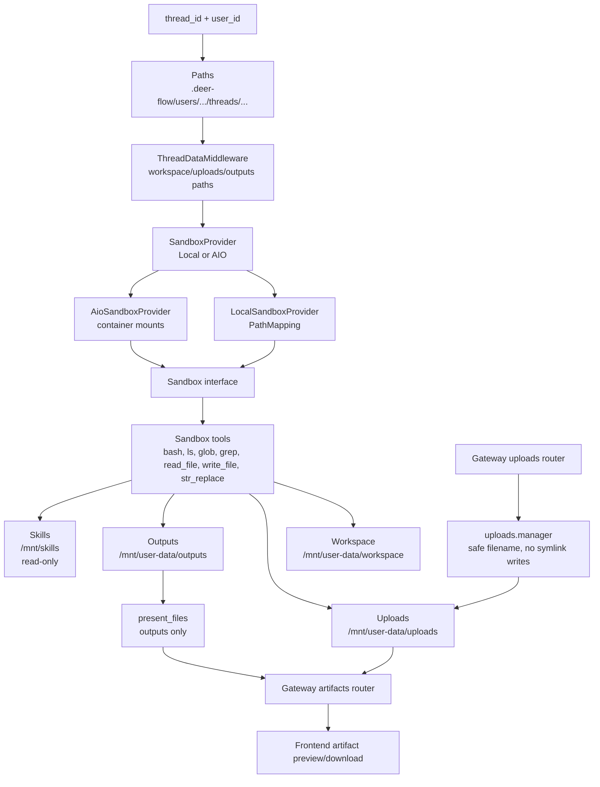
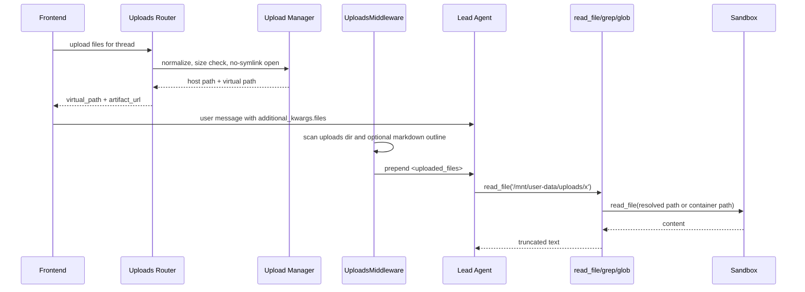
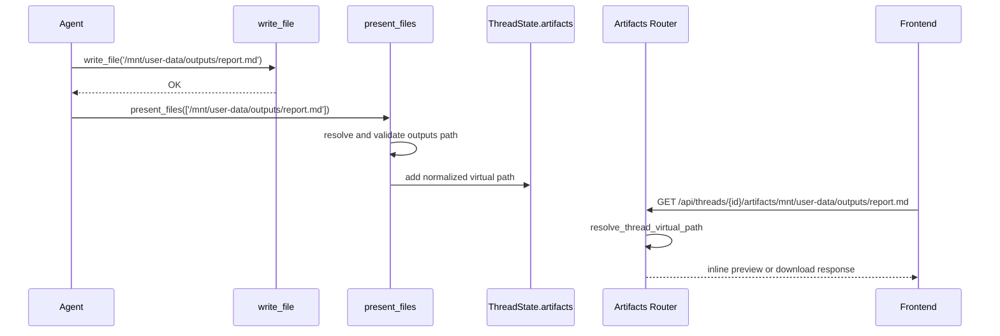
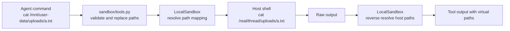

# 第 7 章：Sandbox、文件系统与 Artifact 生命周期

## 阅读目标

本章解释 DeerFlow 如何给 agent 提供文件读写、命令执行、上传处理和 artifact 展示能力。重点是虚拟路径映射、安全边界和文件生命周期。它承接 [[05-middleware-chain|Middleware 链路与横切能力]] 中的 `ThreadDataMiddleware`、`UploadsMiddleware`、`SandboxMiddleware`，也为上一章 [[06-tools-mcp-subagents|工具系统、MCP 与 Subagent 委派]] 中的 `bash/read_file/write_file/present_files` 工具提供运行背景。

读完本章后，需要能回答：

- LocalSandbox 和 AioSandbox 的职责差异。
- `/mnt/user-data/workspace`、`/mnt/user-data/uploads`、`/mnt/user-data/outputs`、`/mnt/skills` 如何映射到真实路径。
- 上传文件如何进入线程目录，生成文件如何作为 artifact 返回给前端。
- 为什么 `present_files` 只接受 `/mnt/user-data/outputs` 下的文件。
- 本地 sandbox 的路径校验和 AIO sandbox 的容器隔离分别能防住什么，防不住什么。

## 架构图说明

Sandbox 把 agent 看到的虚拟文件系统和宿主机真实路径隔离开。`ThreadDataMiddleware` 计算线程目录，`SandboxMiddleware` 或文件工具懒加载获取 sandbox，文件工具通过 `Sandbox` 抽象执行读写，Gateway uploads router 把用户文件放进 uploads，Gateway artifacts router 再把 uploads 和 outputs 暴露给前端。



## 文件生命周期流程图

```mermaid
flowchart TD
    A[User uploads file] --> B[POST /api/threads/{id}/uploads]
    B --> C[Validate thread_id, filename, size limits]
    C --> D[Open destination without following symlinks]
    D --> E[Write host uploads directory]
    E --> F{uploads.auto_convert_documents?}
    F -->|yes and supported extension| G[Convert companion Markdown]
    F -->|no| H[Keep original file only]
    G --> I{provider uses thread data mounts?}
    H --> I
    I -->|yes| J[Sandbox sees host uploads via mount]
    I -->|no| K[sandbox.update_file to /mnt/user-data/uploads]
    J --> L[UploadsMiddleware injects uploaded_files block]
    K --> L
    L --> M[Agent reads via read_file, grep, glob]
    M --> N[Agent writes deliverable to /mnt/user-data/outputs]
    N --> O[present_files normalizes and updates artifacts state]
    O --> P[GET /api/threads/{id}/artifacts/mnt/user-data/outputs/...]
    P --> Q[Artifacts router resolves virtual path]
    Q --> R[Frontend previews or downloads]
```

## 核心源码入口

- [backend/packages/harness/deerflow/sandbox/sandbox.py](/Users/mrl/lgx/project/deer-flow/backend/packages/harness/deerflow/sandbox/sandbox.py)
- [backend/packages/harness/deerflow/sandbox/sandbox_provider.py](/Users/mrl/lgx/project/deer-flow/backend/packages/harness/deerflow/sandbox/sandbox_provider.py)
- [backend/packages/harness/deerflow/sandbox/local/local_sandbox.py](/Users/mrl/lgx/project/deer-flow/backend/packages/harness/deerflow/sandbox/local/local_sandbox.py)
- [backend/packages/harness/deerflow/community/aio_sandbox](/Users/mrl/lgx/project/deer-flow/backend/packages/harness/deerflow/community/aio_sandbox)
- [backend/packages/harness/deerflow/sandbox/tools.py](/Users/mrl/lgx/project/deer-flow/backend/packages/harness/deerflow/sandbox/tools.py)
- [backend/packages/harness/deerflow/uploads/manager.py](/Users/mrl/lgx/project/deer-flow/backend/packages/harness/deerflow/uploads/manager.py)
- [backend/app/gateway/routers/uploads.py](/Users/mrl/lgx/project/deer-flow/backend/app/gateway/routers/uploads.py)
- [backend/app/gateway/routers/artifacts.py](/Users/mrl/lgx/project/deer-flow/backend/app/gateway/routers/artifacts.py)
- [backend/packages/harness/deerflow/config/paths.py](/Users/mrl/lgx/project/deer-flow/backend/packages/harness/deerflow/config/paths.py)
- [backend/packages/harness/deerflow/sandbox/local/local_sandbox_provider.py](/Users/mrl/lgx/project/deer-flow/backend/packages/harness/deerflow/sandbox/local/local_sandbox_provider.py)
- [backend/packages/harness/deerflow/sandbox/middleware.py](/Users/mrl/lgx/project/deer-flow/backend/packages/harness/deerflow/sandbox/middleware.py)
- [backend/packages/harness/deerflow/tools/builtins/present_file_tool.py](/Users/mrl/lgx/project/deer-flow/backend/packages/harness/deerflow/tools/builtins/present_file_tool.py)
- [backend/packages/harness/deerflow/agents/middlewares/uploads_middleware.py](/Users/mrl/lgx/project/deer-flow/backend/packages/harness/deerflow/agents/middlewares/uploads_middleware.py)

## 核心概念

### 虚拟路径是 agent 的稳定协议

DeerFlow 不希望模型看到宿主机真实路径，例如 `/Users/.../.deer-flow/...` 或容器内部临时目录。agent 应该使用稳定的虚拟路径：

| 虚拟路径 | 宿主目录来源 | 主要用途 | 写入权限 |
| --- | --- | --- | --- |
| `/mnt/user-data/workspace` | `Paths.sandbox_work_dir(thread_id, user_id)` | 临时工作区、脚本、分析中间文件 | 可写 |
| `/mnt/user-data/uploads` | `Paths.sandbox_uploads_dir(thread_id, user_id)` | 用户上传文件和转换出的 Markdown | 通常可读，可被工具写入但不建议当最终输出 |
| `/mnt/user-data/outputs` | `Paths.sandbox_outputs_dir(thread_id, user_id)` | 要展示给用户的最终产物 | 可写 |
| `/mnt/skills` | `config.skills.get_skills_path()` | public/custom skills 的 `SKILL.md` 和支持文件 | read-only mount |
| `/mnt/acp-workspace` | `Paths.acp_workspace_dir(thread_id, user_id)` | ACP 外部 agent 输出 | AIO 中只读；local provider 中映射为本地目录 |

`VIRTUAL_PATH_PREFIX` 固定是 `/mnt/user-data`。Gateway artifact 路由也只接受这个前缀下的虚拟路径，再用 `Paths.resolve_virtual_path()` 映射回真实文件。

### Provider 管生命周期，Sandbox 管操作

`SandboxProvider` 是生命周期抽象：

- `acquire(thread_id)` / `acquire_async(thread_id)`：拿到 sandbox id。
- `get(sandbox_id)`：拿到具体 `Sandbox` 实例。
- `release(sandbox_id)`：释放或归还。
- `reset()` / `shutdown()`：清理缓存和资源。

`Sandbox` 是操作抽象：

- `execute_command()`
- `read_file()` / `download_file()`
- `list_dir()`
- `write_file()` / `update_file()`
- `glob()` / `grep()`

文件工具调用的是 `Sandbox` 接口，具体是 local 文件系统还是 AIO 容器，由 provider 决定。

### LocalSandbox 与 AioSandbox 的差异

`LocalSandbox` 并不启动隔离容器。它把虚拟路径通过 `PathMapping` 映射到宿主机目录，然后在宿主 shell 里运行命令或直接读写文件。因此它需要额外的路径校验，尤其是 host bash。

`AioSandbox` 通过 `agent_sandbox` 客户端连接一个容器中的 sandbox 服务。线程目录和 skills 通过 provider 计算 volume mounts 挂进去，命令在容器中执行。它的隔离边界主要来自容器和挂载配置，但仍需要 Gateway 和工具层做路径、下载大小、上传安全校验。

### Artifact 不是自动发现出的所有文件

DeerFlow 的 artifact state 来自 `present_files`。agent 生成文件后，必须把最终产物放在 `/mnt/user-data/outputs`，再调用 `present_files(filepaths=[...])`。该工具会校验路径确实位于当前 thread 的 outputs 目录，然后把规范化后的虚拟路径写入 `ThreadState.artifacts`。

上传文件也可以通过 artifact router 访问，因为 uploads router 会返回 `artifact_url`。但这不等于上传文件自动进入 `ThreadState.artifacts` 面板；用户上传上下文主要通过 `UploadsMiddleware` 注入给模型。

## 关键源码逐段讲解

### `paths.py`：线程目录和虚拟路径映射

`Paths` 统一管理 DeerFlow 的运行目录。线程相关目录的宿主结构是：

```text
{base_dir}/users/{user_id}/threads/{thread_id}/
└── user-data/
    ├── workspace/
    ├── uploads/
    └── outputs/
```

如果没有 user isolation，旧路径会落到 `{base_dir}/threads/{thread_id}/...`。路径方法都先验证 `thread_id` 和 `user_id`，避免把路径分隔符或 `..` 带入文件系统。

重点方法：

- `sandbox_work_dir()`、`sandbox_uploads_dir()`、`sandbox_outputs_dir()`：返回宿主真实路径。
- `host_sandbox_*()`：返回 Docker daemon 可识别的 host mount source，支持 `DEER_FLOW_HOST_BASE_DIR`。
- `ensure_thread_dirs()`：创建 workspace/uploads/outputs/acp-workspace，并 chmod 为容器可写。
- `resolve_virtual_path()`：把 `/mnt/user-data/...` 解析成当前 thread 的宿主路径，并检查 path traversal。

### `ThreadDataMiddleware` 与 `SandboxMiddleware`：路径状态和 sandbox 生命周期

`ThreadDataMiddleware.before_agent()` 从 runtime context 或 LangGraph config 中取 `thread_id`，再把 `workspace_path/uploads_path/outputs_path` 写入 `state["thread_data"]`。默认 `lazy_init=True` 时，它只计算路径，不立刻创建目录；目录会在文件工具首次调用时创建。

`SandboxMiddleware` 也支持 lazy/eager 两种模式：

- `lazy_init=True`：不在 `before_agent()` 里启动 sandbox，由文件工具的 `ensure_sandbox_initialized()` 首次触发。
- `lazy_init=False`：在 `before_agent()` 或 `abefore_agent()` 中直接 acquire sandbox。

源码注释写到“sandbox reused across turns”，但 `after_agent()` 会调用 provider `release()`。这不是矛盾：`LocalSandboxProvider.release()` 是空操作，会保留 per-thread cached sandbox；AIO provider 的 release 会把实例移到 warm pool 或从当前活动表移除，具体行为取决于 provider 实现。

### `local_sandbox_provider.py` 与 `local_sandbox.py`：本地映射和路径反解

`LocalSandboxProvider` 有两类映射：

- 静态映射：skills 目录和 `config.sandbox.mounts`。
- per-thread 映射：`/mnt/user-data`、workspace、uploads、outputs、`/mnt/acp-workspace`。

它会为每个 thread 返回 `local:{thread_id}` 形式的 sandbox id，并用 LRU 缓存 per-thread `LocalSandbox`，默认上限是 256。

`LocalSandbox` 内部有两类路径转换：

- 正向解析：`_resolve_path_with_mapping()` 把虚拟路径映射到宿主路径，并检查解析结果仍在 mount root 内。
- 反向解析：`_reverse_resolve_path()` 和 `_reverse_resolve_paths_in_output()` 把命令输出中的宿主路径替换回虚拟路径，避免把真实路径暴露给模型。

读写细节：

- read-only mount 会在 `write_file()` 和 `update_file()` 中拒绝写入。
- `execute_command()` 会先把命令里的虚拟路径改成宿主路径，再运行 shell，最后把输出里的宿主路径反解回虚拟路径。
- `read_file()` 只对 agent 曾经通过 `write_file()` 写过的文件做内容反解，避免把用户上传文件里的真实字符串错误改写。

### `AioSandboxProvider` 与 `AioSandbox`：容器挂载和远程执行

`AioSandboxProvider._get_thread_mounts()` 会创建并返回这些 mount：

- host workspace -> `/mnt/user-data/workspace`
- host uploads -> `/mnt/user-data/uploads`
- host outputs -> `/mnt/user-data/outputs`
- host ACP workspace -> `/mnt/acp-workspace`，read-only

`_get_skills_mount()` 会把 `config.skills.get_skills_path()` 挂到 `config.skills.container_path`，也是 read-only。Docker-in-Docker/DooD 场景下会优先使用 `DEER_FLOW_HOST_SKILLS_PATH` 和 `DEER_FLOW_HOST_BASE_DIR`，因为真正解析 bind mount 的是宿主 Docker daemon。

`AioSandbox` 通过 HTTP client 操作容器内 sandbox 服务：

- `execute_command()` 用锁串行化 shell 执行。源码说明 AIO sandbox 容器维护单一 shell session，并发命令可能污染输出。
- `download_file()` 明确拒绝 `..` traversal 和 `/mnt/user-data` 之外的路径，并限制下载总大小。
- `write_file()` 对 append 的处理是先读旧内容再写回。

### `sandbox/tools.py`：文件工具的安全包装

文件工具不是直接调用 sandbox，它们先做运行时解析和路径校验：

- `ensure_sandbox_initialized()`：从 runtime state 复用 sandbox；没有则根据 thread id acquire，并写回 `runtime.state["sandbox"]`。
- `ensure_sandbox_initialized_async()`：异步版本，避免 AIO 启动阻塞 event loop。
- `ensure_thread_directories_exist()`：本地 sandbox 下首次使用工具时创建 workspace/uploads/outputs。
- `validate_local_bash_command_paths()`：本地 host bash 的绝对路径扫描和 traversal 检查。源码也强调这只是 host bash opt-in 的 best-effort guard，不是安全 sandbox 边界。
- `replace_virtual_paths_in_command()`：把 `/mnt/user-data`、`/mnt/skills`、`/mnt/acp-workspace` 替换成宿主路径。
- `get_file_operation_lock(sandbox, path)`：`write_file` 和 `str_replace` 在同一 `(sandbox_id, path)` 上串行化，避免并发覆盖。

各工具的输出会按配置裁剪：

- `bash_output_max_chars`
- `ls_output_max_chars`
- `read_file_output_max_chars`

这些配置防止长输出把模型上下文或 stream 事件撑爆。

### `uploads/manager.py` 与 `uploads.py`：上传安全和同步

上传流程的关键安全点在 `uploads.manager`：

- `validate_thread_id()` 限制线程 id 字符。
- `normalize_filename()` 只保留 basename，拒绝空名、`.`、`..`、反斜杠和超长文件名。
- `claim_unique_filename()` 处理同一请求中的重名文件，追加 `_N`。
- `open_upload_file_no_symlink()` 使用 `O_NOFOLLOW` 或 Windows 双重 `lstat/fstat` 检查，避免 sandbox 预先放置 symlink 后让 Gateway 写穿 uploads 目录。
- `delete_file_safe()` 删除时也做 path traversal 校验。

Gateway router 还加了应用级限制：

- 默认最多 `10` 个文件。
- 默认单文件最大 `50 * 1024 * 1024` 字节。
- 默认总大小最大 `100 * 1024 * 1024` 字节。
- `uploads.auto_convert_documents` 默认关闭；开启且扩展名支持时，才调用 `convert_file_to_markdown()` 生成 companion Markdown。

同步分支取决于 provider：

- `uses_thread_data_mounts=True`：例如 LocalSandboxProvider 和本地 AIO 容器 mount，写入宿主 uploads 后 sandbox 直接可见。
- `uses_thread_data_mounts=False`：router 会 acquire sandbox，并调用 `sandbox.update_file(virtual_path, bytes)` 同步到 sandbox。

上传成功后返回的每个文件包含 `virtual_path` 和 `artifact_url`。`UploadsMiddleware` 会在下一次 agent run 前读取当前消息的 `additional_kwargs.files` 和历史 uploads 目录，向最后一条 HumanMessage 前面注入 `<uploaded_files>` 上下文。

### `present_file_tool.py` 与 `artifacts.py`：展示最终产物

`present_files` 的 `_normalize_presented_filepath()` 接受两种输入：

- `/mnt/user-data/outputs/report.md` 这类虚拟路径。
- 当前 thread outputs 目录下的宿主真实路径。

它最终都会规范化成 `/mnt/user-data/outputs/...`。如果路径不在当前 thread 的 outputs 目录下，会返回错误 ToolMessage。这是为了把“模型工作文件”和“用户可见产物”分开。

Gateway artifact 路由 `/api/threads/{thread_id}/artifacts/{path:path}` 做三类处理：

- 普通虚拟路径：用 `resolve_thread_virtual_path()` 映射到宿主文件。
- `.skill` archive 内部文件：支持读取 `xxx.skill/SKILL.md` 这类压缩包成员，并限制单成员读取大小。
- active content：HTML、XHTML、SVG 总是作为 attachment 下载，避免在应用 origin 中执行脚本。

文本文件会 inline 返回，二进制文件按 MIME type 返回，用户也可以用 `?download=true` 强制下载。

## 调用链追踪

### Agent 读取上传文件



### Agent 生成 artifact



### LocalSandbox 路径转换



## 可运行验证实验

这些实验不需要启动前端。默认在项目根目录执行；如果依赖由 `uv` 管理，可以在 `backend/` 下用 `uv run python` 执行同样脚本。

### 实验 1：查看 thread 的真实目录和虚拟路径

```bash
PYTHONPATH=backend/packages/harness python - <<'PY'
from deerflow.config.paths import VIRTUAL_PATH_PREFIX, get_paths

thread_id = "deep-teaching-demo"
paths = get_paths()
paths.ensure_thread_dirs(thread_id)

print("virtual root:", VIRTUAL_PATH_PREFIX)
print("workspace:", paths.sandbox_work_dir(thread_id))
print("uploads:", paths.sandbox_uploads_dir(thread_id))
print("outputs:", paths.sandbox_outputs_dir(thread_id))
print("resolve output:", paths.resolve_virtual_path(thread_id, "/mnt/user-data/outputs/report.md"))
PY
```

观察点：

- 三个目录都会位于同一个 thread 的 `user-data/` 下。
- `resolve_virtual_path()` 会把虚拟路径映射到当前 thread，而不是全局 outputs。

### 实验 2：查看 LocalSandboxProvider 的 path mappings

```bash
PYTHONPATH=backend/packages/harness python - <<'PY'
from deerflow.sandbox.local.local_sandbox_provider import LocalSandboxProvider

provider = LocalSandboxProvider()
sandbox_id = provider.acquire("deep-teaching-demo")
sandbox = provider.get(sandbox_id)
print("sandbox_id:", sandbox_id)
for mapping in sandbox.path_mappings:
    print(mapping.container_path, "=>", mapping.local_path, "readonly=", mapping.read_only)
PY
```

观察点：

- 应能看到 `/mnt/user-data`、workspace、uploads、outputs 的 per-thread 映射。
- 如果 skills 目录存在，会看到 `/mnt/skills` 的 read-only 映射。

### 实验 3：验证 artifact URL 构造

```bash
PYTHONPATH=backend/packages/harness python - <<'PY'
from deerflow.uploads.manager import upload_artifact_url, upload_virtual_path

thread_id = "deep-teaching-demo"
filename = "report 1.md"
print(upload_virtual_path(filename))
print(upload_artifact_url(thread_id, filename))
PY
```

观察点：

- virtual path 保留 `/mnt/user-data/uploads/...`。
- artifact URL 会对文件名做 percent-encoding，适合直接返回给前端。

## 常见改造点

1. **增加新的虚拟目录**：优先从 `Paths` 增加宿主路径方法，再更新 LocalSandboxProvider、AioSandboxProvider、sandbox tools 的路径识别和 Gateway artifact 解析。不要只在 prompt 里写一个新路径。
2. **调整上传限制**：修改 uploads 配置后，验证 `get_upload_limits()`、上传 router 和前端提示是否一致。默认值在 router 中兜底。
3. **开启自动文档转换**：设置 `uploads.auto_convert_documents`。要确认转换工具链可用，并检查 `UploadsMiddleware` 是否能读取生成的 `.md` outline。
4. **增加自定义 mount**：使用 `sandbox.mounts`。Local provider 会拒绝和 `/mnt/user-data`、`/mnt/acp-workspace`、skills container path 冲突的 container path。
5. **改变 artifact 规则**：如果允许展示 outputs 之外的文件，必须同时修改 `present_files`、Gateway path resolution 和前端假设；否则容易把 uploads、skills 或宿主路径暴露给用户。
6. **替换 sandbox backend**：实现 `SandboxProvider` 和 `Sandbox` 接口，确保 `download_file()`、`update_file()` 和 `acquire_async()` 的行为与现有工具预期一致。

## 风险和调试入口

- **本地 host bash 不是强隔离**：`validate_local_bash_command_paths()` 是 best-effort guard。需要强隔离时使用 AIO/container sandbox，并限制 mount。
- **路径前缀混淆**：`/mnt/user-dataX` 不应被当成 `/mnt/user-data`。`Paths.resolve_virtual_path()` 做了 segment-boundary 校验，新增路径解析时要保持同样约束。
- **symlink 写穿上传目录**：上传写入必须走 `open_upload_file_no_symlink()`，不要用普通 `Path.write_bytes()` 复刻上传逻辑。
- **AIO 容器读不到上传文件**：检查 provider 是否 `uses_thread_data_mounts`、host mount source 是否使用了正确的 `DEER_FLOW_HOST_BASE_DIR`、文件权限是否通过 `_make_file_sandbox_readable()` 调整。
- **artifact 404**：先确认文件真实存在于当前 thread 的 outputs/uploads 下，再检查请求路径是否包含 `mnt/user-data/...` 前缀，最后看 `resolve_thread_virtual_path()` 的用户隔离路径是否和当前 user_id 一致。
- **`present_files` 报路径错误**：该工具只接受当前 thread outputs 目录。让 agent 先把文件复制或写入 `/mnt/user-data/outputs`。
- **并发写文件内容丢失**：`write_file` 和 `str_replace` 对同一 `(sandbox_id, path)` 有锁，但 bash 命令直接写文件不经过这个锁。需要多工具并发写同一文件时，避免混用 bash 重定向和 `write_file`。
- **active content 安全**：artifact router 对 HTML/XHTML/SVG 强制 attachment。若改为 inline，需要重新评估同源脚本执行风险。
- **subagent 文件访问异常**：subagent 会继承父 thread data 和 sandbox state；若 child 读不到文件，回到 [[06-tools-mcp-subagents|工具系统、MCP 与 Subagent 委派]] 检查 `task_tool.py` 传入 executor 的 `thread_data/sandbox_state/thread_id`。

## 后续深读任务

- 用一个 thread id 追踪真实目录结构、`ThreadDataState`、Local path mapping 和 artifact URL。
- 阅读 `str_replace` 的锁机制，解释为什么锁粒度包含 sandbox id 和 path。
- 对比 LocalSandbox 与 AioSandbox 的命令执行风险、上传同步路径和适用场景。
- 找一个前端 artifact preview 请求，追踪它如何进入 Gateway artifact router；前端数据流见 [[10-frontend-workspace-debugging|Frontend Workspace、数据流与端到端调试]]。
