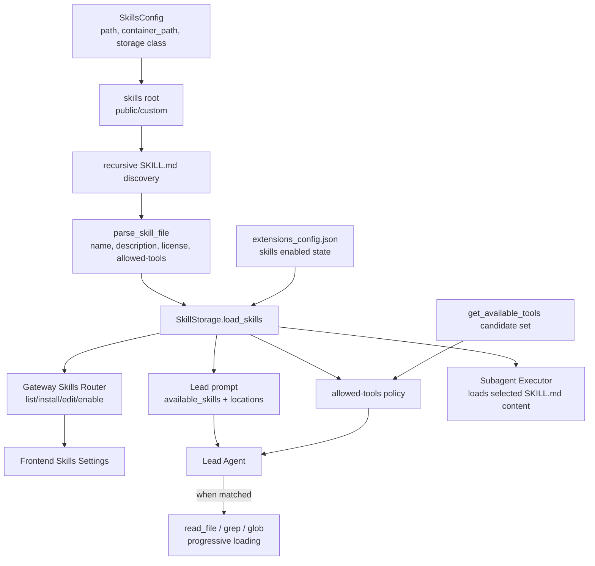
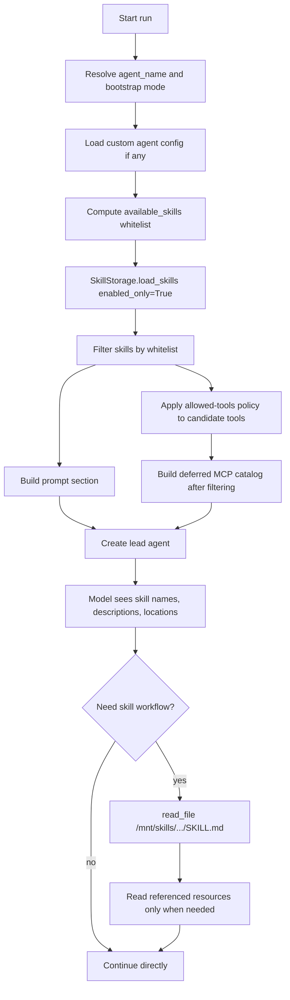
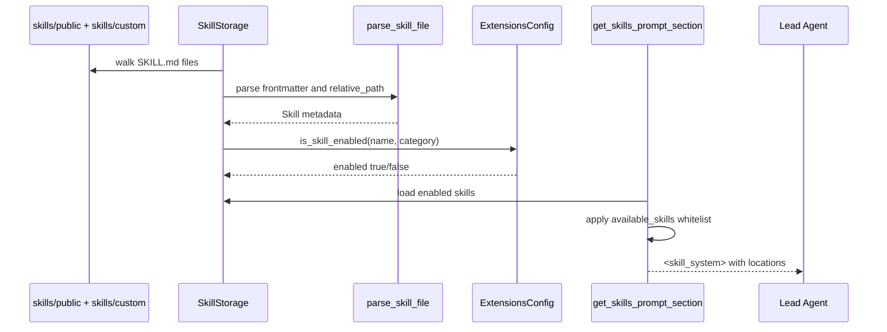
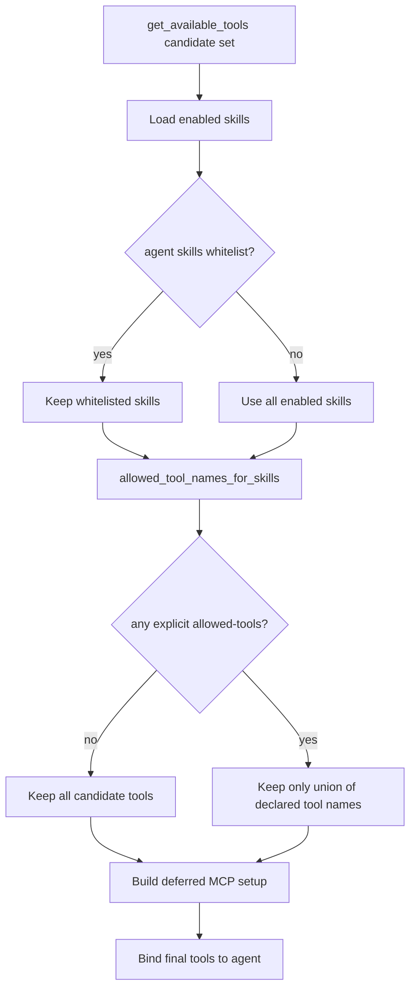
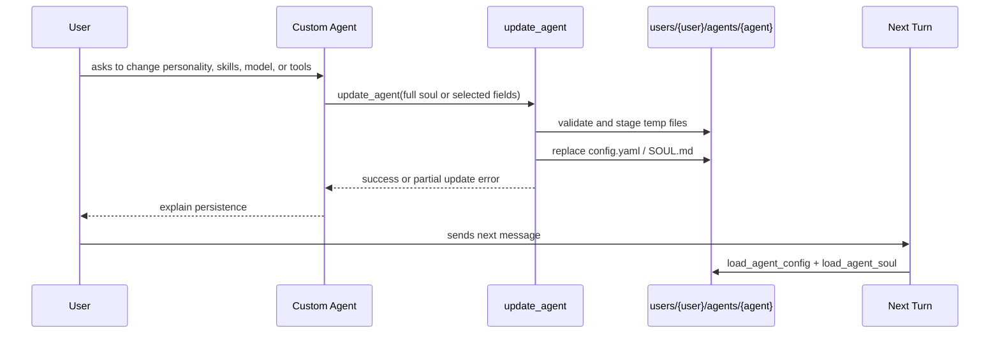

# 第 8 章：Skills、Agent 配置与可扩展工作流

## 阅读目标

本章解释 DeerFlow 如何用 `SKILL.md` 和 agent 配置扩展能力。Skills 是 prompt-level workflow 能力，agent config 是 persona、模型、工具组和 skill 白名单入口，两者共同让 DeerFlow 避免把所有业务逻辑写死在核心代码里。它和 [[06-tools-mcp-subagents|工具系统、MCP 与 Subagent 委派]] 关系很紧：工具全集先被聚合，再由 skill 的 `allowed-tools` 和 agent 配置收缩。

读完本章后，需要能回答：

- `skills/public` 和 custom skills 如何被发现、解析、启用和注入 prompt。
- skill 的权限和 allowed tools 如何影响最终工具集合。
- 自定义 agent、`SOUL.md`、setup/update agent 工具之间是什么关系。
- lead agent 与 subagent 加载 skill 的方式有什么差异。
- skill 编辑、安装和 agent 自更新分别写入哪些文件。

## 架构图说明

Skills 系统从文件系统发现 `SKILL.md`，解析 frontmatter，合并 `extensions_config.json` 中的启用状态，再被 Gateway 展示给前端，也被 Lead Agent 注入 prompt。工具策略会根据已加载 skill 的 `allowed-tools` 声明过滤工具集合。



## Skill 注入流程图



## 核心源码入口

- [backend/packages/harness/deerflow/skills/parser.py](/Users/mrl/lgx/project/deer-flow/backend/packages/harness/deerflow/skills/parser.py)
- [backend/packages/harness/deerflow/skills/validation.py](/Users/mrl/lgx/project/deer-flow/backend/packages/harness/deerflow/skills/validation.py)
- [backend/packages/harness/deerflow/skills/security_scanner.py](/Users/mrl/lgx/project/deer-flow/backend/packages/harness/deerflow/skills/security_scanner.py)
- [backend/packages/harness/deerflow/skills/storage/local_skill_storage.py](/Users/mrl/lgx/project/deer-flow/backend/packages/harness/deerflow/skills/storage/local_skill_storage.py)
- [backend/packages/harness/deerflow/skills/tool_policy.py](/Users/mrl/lgx/project/deer-flow/backend/packages/harness/deerflow/skills/tool_policy.py)
- [backend/app/gateway/routers/skills.py](/Users/mrl/lgx/project/deer-flow/backend/app/gateway/routers/skills.py)
- [backend/packages/harness/deerflow/tools/builtins/setup_agent_tool.py](/Users/mrl/lgx/project/deer-flow/backend/packages/harness/deerflow/tools/builtins/setup_agent_tool.py)
- [backend/packages/harness/deerflow/tools/builtins/update_agent_tool.py](/Users/mrl/lgx/project/deer-flow/backend/packages/harness/deerflow/tools/builtins/update_agent_tool.py)
- [backend/packages/harness/deerflow/skills/installer.py](/Users/mrl/lgx/project/deer-flow/backend/packages/harness/deerflow/skills/installer.py)
- [backend/packages/harness/deerflow/skills/types.py](/Users/mrl/lgx/project/deer-flow/backend/packages/harness/deerflow/skills/types.py)
- [backend/packages/harness/deerflow/skills/storage/skill_storage.py](/Users/mrl/lgx/project/deer-flow/backend/packages/harness/deerflow/skills/storage/skill_storage.py)
- [backend/packages/harness/deerflow/agents/lead_agent/agent.py](/Users/mrl/lgx/project/deer-flow/backend/packages/harness/deerflow/agents/lead_agent/agent.py)
- [backend/packages/harness/deerflow/agents/lead_agent/prompt.py](/Users/mrl/lgx/project/deer-flow/backend/packages/harness/deerflow/agents/lead_agent/prompt.py)
- [backend/packages/harness/deerflow/config/agents_config.py](/Users/mrl/lgx/project/deer-flow/backend/packages/harness/deerflow/config/agents_config.py)
- [backend/packages/harness/deerflow/config/extensions_config.py](/Users/mrl/lgx/project/deer-flow/backend/packages/harness/deerflow/config/extensions_config.py)

## 核心概念

### Skill 是“可按需加载的工作流说明”

DeerFlow 的 lead agent prompt 不直接塞入所有 `SKILL.md` 正文。它注入的是一个 `<skill_system>` 块，里面包含：

- skills 根路径，例如 `/mnt/skills`。
- progressive loading 规则。
- 可用 skill 的 `<name>`、`<description>`、`<location>`。

当用户任务匹配某个 skill 时，模型应调用 `read_file` 读取 `location` 指向的 `SKILL.md`。`SKILL.md` 中引用的 `references/`、`templates/`、`scripts/`、`assets/` 等支持文件，也按需读取，而不是一次性全部塞进上下文。

Subagent 有一个不同点：`SubagentExecutor._load_skill_messages()` 会直接读取它加载到的 skill `SKILL.md`，并把内容并入初始 SystemMessage。也就是说，lead agent 是“列目录 + 按需读取”，subagent 是“按配置加载选中 skill 内容”。

### Skill frontmatter 是协议入口

`SKILL.md` 必须以 YAML frontmatter 开头。解析器读取这些字段：

| 字段 | 是否必需 | 作用 |
| --- | --- | --- |
| `name` | 必需 | skill 名称，后续启用状态、agent 白名单和工具策略都用它匹配 |
| `description` | 必需 | 注入 prompt，帮助模型判断何时读取 skill |
| `license` | 可选 | 展示和元数据用途 |
| `allowed-tools` | 可选 | 限制加载该 skill 后可用的工具集合 |

校验器还允许 `metadata`、`compatibility`、`version`、`author` 等字段，但解析成 `Skill` 对象的核心字段仍然是上表几项。

### Enabled state 不在 `SKILL.md` 里

`parse_skill_file()` 创建的 `Skill.enabled` 初始为 `True`，实际状态来自 `extensions_config.json`。`ExtensionsConfig.is_skill_enabled()` 的规则是：

- 如果某个 skill 没有出现在 `extensions_config.json` 的 `skills` 字段中，public 和 custom skill 默认启用。
- 如果出现了，使用 `{ "enabled": true | false }`。

Gateway 的 `/api/skills/{skill_name}` PUT 会改写 `extensions_config.json`，调用 `reload_extensions_config()`，并刷新 skills prompt cache。

### `allowed-tools` 是工具集合过滤规则

`allowed-tools` 的语义容易误读。真实规则在 `tool_policy.py`：

- 没有任何已加载 skill 声明 `allowed-tools`：返回 `None`，保留所有候选工具。
- 至少一个已加载 skill 声明了 `allowed-tools`：取所有声明的并集。
- 某个 skill 声明 `allowed-tools: []`：它贡献空集合，不会关闭其它 skill 的限制。
- 未声明 `allowed-tools` 的 legacy skill 在有其它显式声明时，不贡献工具。

因此一旦引入带 `allowed-tools` 的 skill，就要确认当前任务需要的工具都在并集中，否则 `read_file`、`bash`、`present_files`、`tool_search` 等都可能被过滤掉。

### Custom agent 是 prompt、模型和工具策略的另一个入口

Custom agent 存在 per-user 目录：

```text
{base_dir}/users/{user_id}/agents/{agent_name}/
├── config.yaml
└── SOUL.md
```

`config.yaml` 支持：

- `name`
- `description`
- `model`
- `tool_groups`
- `skills`

`SOUL.md` 通过 `get_agent_soul()` 注入 lead system prompt 的 `<soul>` 块。`skills` 字段不是 enabled state，而是该 agent 的 skill 白名单：

- 省略或 `null`：使用所有 enabled skills。
- `[]`：禁用所有 skills。
- `["a", "b"]`：只允许这些 enabled skills 出现在 prompt 和工具策略中。

## 关键源码逐段讲解

### `skills_config.py` 与 `storage/__init__.py`：技能根目录和 storage factory

`SkillsConfig.get_skills_path()` 的解析顺序是：

1. `config.yaml` 中显式 `skills.path`。
2. 环境变量 `DEER_FLOW_SKILLS_PATH`。
3. 调用方项目根目录下的 `skills/`。
4. monorepo 兼容候选路径。
5. 如果都不存在，返回项目根目录下的默认 `skills/`，让调用方看到稳定路径。

`get_or_new_skill_storage()` 根据 `skills.use` 反射创建 storage。当前默认是 `LocalSkillStorage`。传入 `app_config` 时会创建新实例，不污染进程级 singleton；没有传入时才使用 singleton。这一点和 Gateway 依赖注入有关：API 请求拿到的 config 应该按请求生效。

### `local_skill_storage.py` 与 `skill_storage.py`：发现、排序和启用状态合并

`LocalSkillStorage._iter_skill_files()` 会递归扫描：

- `<root>/public/**/SKILL.md`
- `<root>/custom/**/SKILL.md`

它跳过以 `.` 开头的目录，并按目录名排序。`relative_path` 使用 `md_path.parent.relative_to(category_root)`，所以 nested skill path 会被保留下来，例如 `public/domain/foo/SKILL.md` 会在容器中显示为 `/mnt/skills/public/domain/foo/SKILL.md`。

`SkillStorage.load_skills(enabled_only=False)` 是模板方法：

1. 调用 `_iter_skill_files()` 找到所有 `SKILL.md`。
2. 用 `parse_skill_file()` 解析 frontmatter。
3. 用 `skills_by_name[skill.name] = skill` 合并同名 skill；后扫描到的同名 skill 会覆盖先前值。
4. 每次调用都重新读取 `ExtensionsConfig.from_file()`，合并 enabled 状态。
5. 如果 `enabled_only=True`，过滤掉 disabled skill。
6. 按 `skill.name` 排序返回。

这里没有读取 `SKILL.md` 正文的业务内容，只解析 frontmatter 和路径。

### `parser.py` 与 `validation.py`：解析和校验边界

`parse_skill_file()` 做宽松解析：没有 frontmatter、YAML 非 mapping、缺少 `name/description`、`allowed-tools` 格式错误时返回 `None`，并记录日志。这适合 discovery，因为某个坏文件不应让整个技能列表崩溃。

`_validate_skill_frontmatter()` 更严格，用于安装和编辑：

- 必须有 frontmatter。
- frontmatter 只能包含允许字段。
- `name` 必须是 hyphen-case：小写字母、数字、连字符，不能首尾连字符、不能连续连字符，长度不超过 64。
- `description` 不能包含 `<` 或 `>`，长度不超过 1024。
- `allowed-tools` 必须是字符串列表。

因此“扫描列表”和“写入新 skill”不是同一强度的校验。写入路径要使用 validation，不要只调用 parser。

### `installer.py` 与 `security_scanner.py`：安装 `.skill` 包

`.skill` 文件本质是 ZIP archive。安装流程在 `LocalSkillStorage.ainstall_skill_from_archive()` 和 `installer.py`：

1. 检查文件存在且后缀为 `.skill`。
2. 用 `safe_extract_skill_archive()` 解包到临时目录。
3. 拒绝绝对路径、`..` traversal、zip bomb，跳过 symlink entry。
4. 定位 skill 根目录，校验 `SKILL.md` frontmatter。
5. 如果目标 custom skill 已存在，抛 `SkillAlreadyExistsError`。
6. 扫描 `SKILL.md`、prompt 输入支持文件和 `scripts/` 文件。
7. 先复制到 staging，再移动到保留的目标目录，最后设置 sandbox 可读权限。

`scan_skill_content()` 会调用配置中的 moderation model。失败时不是放行，而是保守返回 `block`；可执行内容在 scanner 不可用时也会被 block。

安装包里如果出现嵌套 `SKILL.md`，扫描会阻止。这和 storage 的递归 discovery 不矛盾：手工放入嵌套 skill 可以被发现，但通过 `.skill` 安装包不允许一个包内再藏另一个 `SKILL.md`。

### `routers/skills.py`：Gateway 管理接口

Skills router 提供几类能力：

- `GET /api/skills`：列出 public 和 custom skills。
- `POST /api/skills/install`：从当前 thread artifact 路径安装 `.skill` archive。
- `GET/PUT/DELETE /api/skills/custom/{skill_name}`：读取、编辑、删除 custom skill。
- `GET /api/skills/custom/{skill_name}/history`：读取编辑历史。
- `POST /api/skills/custom/{skill_name}/rollback`：回滚到历史版本。
- `PUT /api/skills/{skill_name}`：修改 enabled 状态。

编辑、删除、回滚会写 history JSONL。编辑和回滚都跑 frontmatter validation 和 security scanner。安装、编辑、删除、回滚、启停后都会调用 `refresh_skills_system_prompt_cache_async()`，让下一次 prompt 生成看到新状态。

### `lead_agent/prompt.py`：prompt 注入

`get_skills_prompt_section()` 做三件事：

1. 调用 `get_enabled_skills_for_config()` 获取 enabled skills。
2. 如果 custom agent 传入 `available_skills`，只保留白名单内的 skill。
3. 构造 `<skill_system>`，列出每个 skill 的 name、description 和 container file path。

这个 prompt 明确要求 progressive loading：

- 匹配 skill use case 时先 `read_file` 主 `SKILL.md`。
- 再按需加载支持资源。
- 遵守 skill 内部工作流。

`apply_prompt_template()` 同时还注入：

- `<soul>`：来自 custom agent 的 `SOUL.md`。
- `<self_update>`：custom agent 才有，用来指导它调用 `update_agent`。
- `<available-deferred-tools>`：MCP deferred tool names。
- subagent section、ACP section、自定义 mount section。

### `lead_agent/agent.py`：agent 白名单、工具过滤和 deferred setup

`_make_lead_agent()` 是 skill 真正影响工具的地方：

1. 解析 `agent_name`、bootstrap 模式、模型名、subagent 开关。
2. custom agent 非 bootstrap 时读取 `load_agent_config(agent_name)`。
3. `_available_skill_names()` 计算白名单：bootstrap 固定 `{"bootstrap"}`；custom agent 若 `skills` 非 `None` 则使用配置值；否则不限制。
4. `get_available_tools()` 获取候选工具。
5. `_load_enabled_skills_for_tool_policy()` 获取用于工具策略的 enabled skills，并按白名单过滤。
6. `filter_tools_by_skill_allowed_tools()` 执行 `allowed-tools` 策略。
7. `_assemble_deferred()` 在过滤后的工具中生成 MCP deferred catalog 和 `tool_search`。
8. 创建 LangChain agent。

这解释了为什么第 6 章中强调 `tool_search` 必须在工具策略之后构建：否则被 skill 禁掉的 MCP 工具仍可能通过 search 暴露 schema。

### `setup_agent_tool.py` 与 `update_agent_tool.py`：agent 创建和自更新

`setup_agent` 用于 bootstrap 或创建 agent：

- 从 runtime context 取 `agent_name`。
- 如果有 agent name，写入当前用户目录的 `config.yaml` 和 `SOUL.md`。
- `skills` 参数可选：`None` 表示不写入白名单，`[]` 表示写入空白名单。
- 如果创建过程中失败，且目录是本次新建的，会清理目录。

`update_agent` 只在 custom agent chat 内可用：

- 没有 `agent_name` 时返回错误。
- `model` 必须是 `config.yaml` 中存在的模型名，否则不写文件。
- 只更新显式传入的字段。
- `soul` 必须是完整替换文本，不支持 patch。
- 写入前把目标文件内容 stage 到临时 sibling，全部准备好后再逐个 `replace()`。
- 如果部分 replace 已提交而后续失败，会返回 partial update 错误，让 agent 和用户知道需要重试。

### `skill_manage_tool.py`：agent 管理 custom skill

`skill_manage` 只在 `skill_evolution.enabled=True` 时加入工具集合。它支持：

- `create`
- `edit`
- `patch`
- `delete`
- `write_file`
- `remove_file`

它使用 per-skill `asyncio.Lock` 串行化同名 skill 修改，并复用 storage validation、security scanner、history 和 prompt cache refresh。支持文件只能写在 `references/`、`templates/`、`scripts/`、`assets/` 下，避免 agent 任意写 custom skill 目录外的内容。

### Summarization 对 skill 上下文的保留

`DeerFlowSummarizationMiddleware` 不是 skill loader，但它会识别读取 `/mnt/skills` 下文件的工具调用 bundle。触发总结时，它会在预算内保留最近的 skill read tool call 和对应 ToolMessage，避免刚读过的 skill 被立即总结掉。这是第 5 章 middleware 链路与本章 skill progressive loading 的交叉点。

## 调用链追踪

### 从文件到 lead prompt



### 从 enabled skill 到工具集合



### Custom agent 自更新



## 可运行验证实验

这些实验以源码行为验证为主。默认在项目根目录执行；如果 backend 依赖由 `uv` 管理，可以在 `backend/` 下用 `uv run python` 执行同样脚本。

### 实验 1：列出发现到的 skills 和容器路径

```bash
PYTHONPATH=backend/packages/harness python - <<'PY'
from deerflow.skills.storage import get_or_new_skill_storage

storage = get_or_new_skill_storage()
for skill in storage.load_skills(enabled_only=False)[:20]:
    print(skill.name, skill.category, skill.enabled, skill.get_container_file_path(storage.get_container_root()))
PY
```

观察点：

- public/custom category 会进入容器路径。
- nested skill 的 `relative_path` 会保留在路径里。
- 未写入 extensions config 的 skill 默认 enabled。

### 实验 2：解析一个具体 `SKILL.md`

```bash
PYTHONPATH=backend/packages/harness python - <<'PY'
from pathlib import Path
from deerflow.skills.parser import parse_skill_file
from deerflow.skills.types import SkillCategory

path = Path("skills/public/bootstrap/SKILL.md")
skill = parse_skill_file(path, SkillCategory.PUBLIC, relative_path=Path("bootstrap"))
print(skill.name)
print(skill.description[:120])
print(skill.allowed_tools)
print(skill.get_container_file_path("/mnt/skills"))
PY
```

观察点：

- `bootstrap` 示例没有 `allowed-tools`，所以解析结果应为 `None`。
- prompt 里展示的 location 是 `/mnt/skills/public/bootstrap/SKILL.md`。

### 实验 3：验证 `allowed-tools` 并集语义

```bash
PYTHONPATH=backend/packages/harness python - <<'PY'
from types import SimpleNamespace
from deerflow.skills.tool_policy import allowed_tool_names_for_skills, filter_tools_by_skill_allowed_tools

skills = [
    SimpleNamespace(name="a", allowed_tools=None),
    SimpleNamespace(name="b", allowed_tools=["read_file", "present_files"]),
    SimpleNamespace(name="c", allowed_tools=[]),
]
tools = [
    SimpleNamespace(name="read_file"),
    SimpleNamespace(name="bash"),
    SimpleNamespace(name="present_files"),
]

print(allowed_tool_names_for_skills(skills))
print([tool.name for tool in filter_tools_by_skill_allowed_tools(tools, skills)])
PY
```

观察点：

- 结果应只保留 `read_file` 和 `present_files`。
- 未声明 `allowed_tools` 的 skill `a` 不会把 `bash` 加回来。

### 实验 4：查看 prompt 中的 skill 列表

```bash
PYTHONPATH=backend/packages/harness python - <<'PY'
from deerflow.agents.lead_agent.prompt import get_skills_prompt_section

section = get_skills_prompt_section(available_skills={"bootstrap"})
print(section[:1500])
PY
```

观察点：

- 输出应包含 `<skill_system>` 和 `<available_skills>`。
- 只应出现 `bootstrap`，且包含 `location`。
- 不应包含完整 `SKILL.md` 正文。

## 常见改造点

1. **新增 public skill**：放入 `skills/public/<name>/SKILL.md`，frontmatter 使用 hyphen-case `name` 和清晰 `description`。如果需要支持文件，放在 skill 目录内，由正文引用。
2. **新增 custom skill 编辑能力**：优先复用 `SkillStorage` 的 validation、history 和 `make_skill_written_path_sandbox_readable()`。不要绕过 storage 直接写文件。
3. **新增 storage backend**：实现 `SkillStorage` 的抽象操作，保留 `load_skills()` 这个模板方法，避免不同 backend 对 enabled state 和排序行为不一致。
4. **改变 skill 启用策略**：修改 `ExtensionsConfig.is_skill_enabled()` 前要评估 public/custom 默认启用的产品含义，以及 Gateway skills 列表的表现。
5. **给 skill 加 `allowed-tools`**：把该 skill 工作流需要的工具全部列出，包括 `read_file`、`grep`、`glob`、`write_file`、`present_files`、`tool_search` 等。漏掉读取工具会导致模型看到 skill 名称却无法读取 `SKILL.md`。
6. **新增 custom agent 字段**：需要同时更新 `AgentConfig`、Gateway agents router、`setup_agent`/`update_agent` 工具和 prompt 注入位置。
7. **调整 prompt 注入方式**：如果想把完整 `SKILL.md` 注入 lead prompt，要重新评估上下文长度、prefix cache 和 summarization 行为。现有设计刻意使用 progressive loading。

## 风险和调试入口

- **skill 没出现**：检查 `skills.path` / `DEER_FLOW_SKILLS_PATH` 是否指向正确目录，`SKILL.md` 是否有合法 frontmatter，`load_skills(enabled_only=False)` 是否能发现。
- **skill 被禁用**：检查 `extensions_config.json` 的 `skills` 字段，以及 Gateway `PUT /api/skills/{skill_name}` 是否刷新了 extensions config 和 prompt cache。
- **prompt 里没有 skill**：custom agent 的 `skills` 白名单可能排除了它；bootstrap 模式只允许 `bootstrap`。
- **模型看到 skill 但不能读取**：检查 skill `allowed-tools` 是否把 `read_file` 过滤掉。工具策略会在 prompt 注入之外独立生效。
- **MCP 工具突然不可用**：可能是某个 loaded skill 声明了 `allowed-tools`，导致 MCP 工具和 `tool_search` 被过滤。回到 [[06-tools-mcp-subagents|工具系统、MCP 与 Subagent 委派]] 检查 deferred setup。
- **安装 `.skill` 失败**：看 archive 是否有 unsafe path、symlink、过大内容、嵌套 `SKILL.md`，以及 security scanner 是否返回 block。
- **security scanner 不可用**：源码采取 conservative fallback，通常会 block，而不是放行。
- **custom agent 更新后本轮没生效**：`update_agent` 明确提示新配置在下一轮 rebuild lead agent 时生效。
- **历史 skill 上下文丢失**：查看 summarization 配置中的 `preserve_recent_skill_count`、`preserve_recent_skill_tokens` 和 `skill_file_read_tool_names`。更完整的持久化与运行历史见 [[09-memory-persistence-runtime-history|Memory、Persistence、Checkpointer 与运行历史]]。

## 后续深读任务

- 选择一个 `skills/public/*/SKILL.md`，追踪它从文件发现、frontmatter 解析、enabled state 合并，到 prompt location 的完整路径。
- 解释 nested skill path 如何通过 `relative_path` 保留到容器路径中，并说明 `.skill` 安装为何拒绝嵌套 `SKILL.md`。
- 阅读 setup/update agent 工具，判断它们如何创建或修改 agent 的 `SOUL.md`、`config.yaml`、skill 白名单和 tool groups。
- 构造一个带 `allowed-tools` 的 custom skill，验证它如何改变最终工具集合和 MCP deferred catalog。
