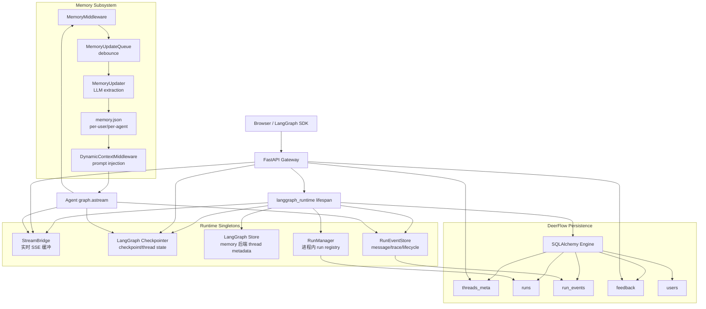
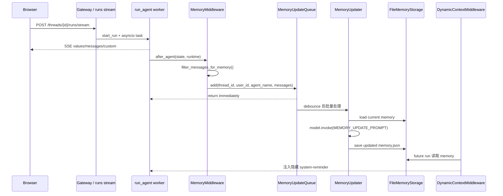
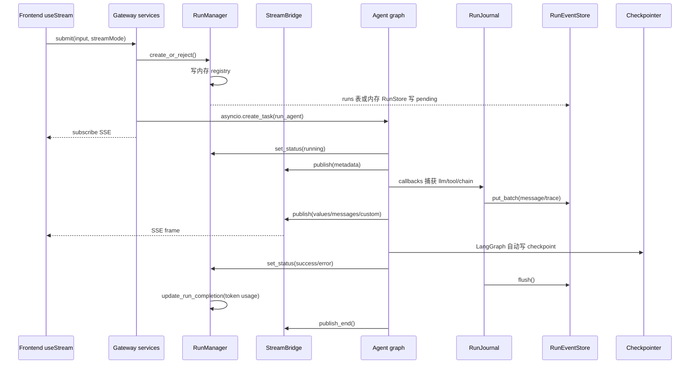

# 第 9 章：Memory、Persistence、Checkpointer 与运行历史

## 阅读目标

本章解释 DeerFlow 如何保存短期会话状态、长期 memory、run 事件和用户反馈。重点不是“找到一个数据库表”，而是区分几套相互协作但职责不同的存储：

- LangGraph checkpointer 保存 graph/thread 的 checkpoint，也就是多轮对话能恢复的权威状态。
- LangGraph Store 在 memory 后端下承载 thread metadata；SQL 后端下 thread metadata 改由 DeerFlow ORM 表保存。
- DeerFlow persistence 保存 `threads_meta`、`runs`、`run_events`、`feedback`、`users` 等应用数据。
- Memory 子系统把对话提炼成用户长期上下文，默认写入 per-user 或 per-agent `memory.json`。
- StreamBridge 只做执行期实时事件桥接，不等于历史存储；历史消息和调试事件来自 `RunEventStore`。

读完本章后，需要能回答：

- thread state、thread metadata、run record、run event、feedback、memory 分别由谁保存。
- Gateway 启动时如何初始化 checkpointer、store、persistence engine、event store 和 run manager。
- MemoryMiddleware 如何把对话交给异步 memory extraction，未来轮次又如何注入 memory。
- 一次 run 的 SSE 实时事件和可回放 run journal 为什么是两条路径。
- 删除 thread 时，哪些数据由当前 handler 清理，哪些不会自动级联。

## 核心概念

### Checkpointer：会话状态的权威来源

`backend/packages/harness/deerflow/runtime/checkpointer/async_provider.py` 创建 LangGraph checkpointer。它优先使用旧版 `checkpointer:` 配置；如果没有旧配置，会根据统一的 `database:` 配置选择 memory、sqlite 或 postgres。`backend/packages/harness/deerflow/config/database_config.py` 说明 sqlite 模式下 checkpointer 和 DeerFlow ORM 共用 `{sqlite_dir}/deerflow.db` 文件，但表生命周期仍然分开。

线程的 `messages`、`title`、`todos`、`artifacts` 等 graph channel value 最终写在 checkpoint 里。`backend/app/gateway/routers/threads.py` 的 `/state`、`/history`、`/wait` 都会读 `checkpointer.aget_tuple()` 或 `checkpointer.alist()`。

### Store 与 ThreadMetaStore：线程列表不是完整状态

`backend/packages/harness/deerflow/runtime/store/async_provider.py` 创建 LangGraph Store。它跟随旧版 `checkpointer:` 配置；当没有 `checkpointer:` 时会退回 `InMemoryStore`。真正对外的线程列表抽象是 `ThreadMetaStore`：

- SQL 后端：`backend/packages/harness/deerflow/persistence/thread_meta/sql.py` 写 `threads_meta` 表。
- memory 后端：`backend/packages/harness/deerflow/persistence/thread_meta/memory.py` 写 LangGraph Store 的 `("threads",)` namespace。

这解释了一个常见误解：`threads/search` 不是直接扫 checkpoint；它优先查 thread metadata。checkpoint 里才有完整 graph state。

### Persistence：DeerFlow 应用数据

`backend/packages/harness/deerflow/persistence/base.py` 明确说明：DeerFlow ORM 的 `Base` 不管理 LangGraph checkpointer 表。它管理的是 DeerFlow 自己的应用表，模型注册入口在 `backend/packages/harness/deerflow/persistence/models/__init__.py`：

- `threads_meta`：线程列表、状态、display name、metadata。
- `runs`：run 状态、模型名、请求参数摘要、token usage、首条 human 和最后 AI 消息等便利字段。
- `run_events`：message、trace、lifecycle、middleware 等可回放事件。
- `feedback`：用户对 run 或 message 的点赞/点踩与备注。
- `users`：认证用户。

`backend/packages/harness/deerflow/persistence/engine.py` 在 Gateway lifespan 中初始化 SQLAlchemy async engine。`database.backend=memory` 时不会建 ORM engine，相关 repository 会退回内存实现。

### RunEventStore：历史消息和调试事件

Run 事件不是直接从 SSE 缓冲区回放。`backend/packages/harness/deerflow/runtime/events/store/base.py` 定义 `RunEventStore`，实现包括：

- `MemoryRunEventStore`：开发或测试用，进程结束即丢失。
- `DbRunEventStore`：写 `run_events` 表，适合可查询历史和多进程。
- `JsonlRunEventStore`：写 `.deer-flow/threads/{thread_id}/runs/{run_id}.jsonl`，适合轻量单进程持久化。

`backend/packages/harness/deerflow/runtime/events/store/__init__.py` 的 `make_run_event_store()` 根据 `run_events.backend` 选择实现；如果配置成 `db` 但 `database.backend=memory`，会退回 memory store。

### StreamBridge：实时 SSE 桥接

`backend/packages/harness/deerflow/runtime/stream_bridge/memory.py` 是按 `run_id` 分组的内存事件日志。agent worker 调 `publish()`，SSE endpoint 调 `subscribe()`。它支持 heartbeat、`Last-Event-ID` 和 bounded replay，但 cleanup 默认在 run 结束后延迟 60 秒释放，所以它不是持久历史。

### Memory：长期用户上下文

Memory 由四个部分组成：

- `MemoryMiddleware.after_agent()`：run 完成后过滤 user 和最终 assistant message，然后入队。
- `MemoryUpdateQueue`：按 `(thread_id, user_id, agent_name)` debounce，异步批处理。
- `MemoryUpdater`：调用 memory model 生成 JSON 更新，应用到 memory data。
- `FileMemoryStorage`：默认写 `memory.json`，支持 per-user、per-agent 路径和 mtime cache。

Memory 的 prompt 注入不是从 checkpointer 恢复来的。`backend/packages/harness/deerflow/agents/lead_agent/prompt.py` 的 `_get_memory_context()` 读取 memory storage 并格式化；`backend/packages/harness/deerflow/agents/middlewares/dynamic_context_middleware.py` 把 `<memory>` 和 `<current_date>` 包成隐藏的 `<system-reminder>` HumanMessage 注入。

## 架构图说明

DeerFlow 的持久化是多层结构。下图把 checkpointer、store、persistence、memory 和 stream bridge 放在一起看。



## Memory 更新时序图



## Run 与 Stream 时序图



## 核心源码入口

- [backend/app/gateway/deps.py](/Users/mrl/lgx/project/deer-flow/backend/app/gateway/deps.py)
- [backend/app/gateway/services.py](/Users/mrl/lgx/project/deer-flow/backend/app/gateway/services.py)
- [backend/app/gateway/routers/threads.py](/Users/mrl/lgx/project/deer-flow/backend/app/gateway/routers/threads.py)
- [backend/app/gateway/routers/thread_runs.py](/Users/mrl/lgx/project/deer-flow/backend/app/gateway/routers/thread_runs.py)
- [backend/packages/harness/deerflow/runtime/checkpointer/async_provider.py](/Users/mrl/lgx/project/deer-flow/backend/packages/harness/deerflow/runtime/checkpointer/async_provider.py)
- [backend/packages/harness/deerflow/runtime/store/async_provider.py](/Users/mrl/lgx/project/deer-flow/backend/packages/harness/deerflow/runtime/store/async_provider.py)
- [backend/packages/harness/deerflow/runtime/stream_bridge/memory.py](/Users/mrl/lgx/project/deer-flow/backend/packages/harness/deerflow/runtime/stream_bridge/memory.py)
- [backend/packages/harness/deerflow/runtime/runs/manager.py](/Users/mrl/lgx/project/deer-flow/backend/packages/harness/deerflow/runtime/runs/manager.py)
- [backend/packages/harness/deerflow/runtime/runs/worker.py](/Users/mrl/lgx/project/deer-flow/backend/packages/harness/deerflow/runtime/runs/worker.py)
- [backend/packages/harness/deerflow/runtime/journal.py](/Users/mrl/lgx/project/deer-flow/backend/packages/harness/deerflow/runtime/journal.py)
- [backend/packages/harness/deerflow/runtime/events/store](/Users/mrl/lgx/project/deer-flow/backend/packages/harness/deerflow/runtime/events/store)
- [backend/packages/harness/deerflow/persistence](/Users/mrl/lgx/project/deer-flow/backend/packages/harness/deerflow/persistence)
- [backend/packages/harness/deerflow/agents/memory/queue.py](/Users/mrl/lgx/project/deer-flow/backend/packages/harness/deerflow/agents/memory/queue.py)
- [backend/packages/harness/deerflow/agents/memory/storage.py](/Users/mrl/lgx/project/deer-flow/backend/packages/harness/deerflow/agents/memory/storage.py)
- [backend/packages/harness/deerflow/agents/memory/updater.py](/Users/mrl/lgx/project/deer-flow/backend/packages/harness/deerflow/agents/memory/updater.py)
- [backend/packages/harness/deerflow/agents/middlewares/memory_middleware.py](/Users/mrl/lgx/project/deer-flow/backend/packages/harness/deerflow/agents/middlewares/memory_middleware.py)
- [backend/packages/harness/deerflow/agents/middlewares/dynamic_context_middleware.py](/Users/mrl/lgx/project/deer-flow/backend/packages/harness/deerflow/agents/middlewares/dynamic_context_middleware.py)

## 关键源码逐段讲解

### 1. Gateway lifespan：一次性装配运行时

`backend/app/gateway/deps.py` 的 `langgraph_runtime()` 是后端运行期存储边界的起点。顺序很重要：

1. `make_stream_bridge(config)`：先创建执行期 SSE bridge。
2. `init_engine_from_config(config.database)`：初始化 DeerFlow ORM engine；Postgres 自动建库逻辑也在这里。
3. `make_checkpointer(config)`：创建 LangGraph checkpointer。
4. `make_store(config)`：创建 LangGraph Store。
5. 根据 `get_session_factory()` 决定 `RunRepository`/`FeedbackRepository` 还是内存 store。
6. `make_thread_store(sf, app.state.store)`：SQL 可用时走 `ThreadMetaRepository`，否则走 `MemoryThreadMetaStore`。
7. `make_run_event_store(run_events_config)`：创建 message/trace 历史存储。
8. `RunManager(store=app.state.run_store)`：进程内 registry 加持久化后备。

这个函数的注释还说明了配置热加载边界：这些持有连接、文件句柄或进程内状态的组件绑定启动快照，修改相关配置后需要重启 Gateway。

### 2. Checkpointer 与 ORM 表生命周期分离

`persistence/base.py` 的注释是理解边界的锚点：LangGraph checkpointer 表不由 DeerFlow ORM 管。`persistence/migrations/env.py` 也只把 DeerFlow 应用表交给 Alembic，LangGraph 的表由 LangGraph saver 自己 `setup()`。

因此 sqlite 模式下即使物理上共享一个 `deerflow.db` 文件，也要按逻辑分成两类：

- checkpoint/store 表：LangGraph saver/store 管。
- `threads_meta`、`runs`、`run_events`、`feedback`、`users`：DeerFlow ORM 管。

如果排查迁移，不要用 Alembic 去猜 LangGraph checkpoint 表；如果排查 conversation state，不要只看 `runs` 表。

### 3. Thread metadata 与 checkpoint 状态分工

`threads.py` 的 `create_thread()` 同时做两件事：写 `thread_store.create()` 让 thread 出现在 `/threads/search`，再用 `checkpointer.aput()` 写一个空 checkpoint，让 `/state` 能立即读到状态。

`get_thread()` 先读 `ThreadMetaStore`，再读 `checkpointer.aget_tuple()` 推导准确状态和 `values`。如果旧数据只有 checkpoint 没有 metadata，代码会从 checkpoint metadata 合成一个最小 record，这是兼容逻辑，不是新数据的正常路径。

`search_threads()` 只委托 `ThreadMetaStore.search()`，不会扫描所有 checkpoint。所以 title 同步很重要：`run_agent()` 结束时会从 checkpoint 的 `channel_values.title` 读标题，并调用 `thread_store.update_display_name()`。

### 4. RunManager：运行中状态加持久化后备

`RunManager` 的 `_runs` 是当前 worker 的活跃 registry，`RunStore` 是持久化后备。`create_or_reject()` 在锁内检查同一 thread 是否已有 pending/running run，然后写 `runs` 记录。SQLite 写入有 bounded retry，避免短时锁冲突让 run 创建或状态更新失败。

`get()` 和 `list_by_thread()` 会先看内存，再从 store hydrate。被 hydrate 出来的 `RunRecord.store_only=True`，表示这个 run 只在持久化层存在，当前 worker 没有对应 task。因此 `/runs/{run_id}/stream` 遇到 store-only run 会返回 409，而不是假装还能继续实时流。

启动恢复只在 sqlite 分支里执行：`reconcile_orphaned_inflight_runs()` 会把重启前遗留的 pending/running row 标记成 error，避免 UI 一直显示活跃 run。

### 5. run_agent：实时流、checkpoint、journal 的交汇点

`runtime/runs/worker.py` 的 `run_agent()` 是执行路径中心：

- 创建 `RunJournal` 并作为 LangChain callback 注入 `config["callbacks"]`。
- 通过 `RunManager.set_status()` 把 run 标记为 running。
- 读取 pre-run checkpoint，给 rollback 做快照。
- 向 `StreamBridge` 发布 `metadata`。
- 构造 runtime context，把 `thread_id`、`run_id`、`app_config` 和内部 `__run_journal` 放进去。
- 给 agent 挂上 `checkpointer` 和 `store`。
- 调 `agent.astream()`，把 LangGraph `values`、`messages`、`custom` 等 chunk 序列化后发布到 bridge。
- finally 中 flush journal，写 run completion，更新 thread title/status，最后 `publish_end()`。

这里有一个重要结论：SSE 的 `values/messages/custom` 是实时 UI 用的；journal callbacks 写入 `RunEventStore` 是历史和调试用的。两者都来自同一次 run，但不是同一个存储。

### 6. RunJournal：从 callbacks 生成 run_events

`runtime/journal.py` 把 LangChain callbacks 标准化成 event records：

- `on_chat_model_start()` 捕获首条 human input，写 `llm.human.input`，并记录 `first_human_message`。
- `on_llm_end()` 写 `llm.ai.response`，累积 token usage，并按 caller 区分 lead agent、subagent、middleware。
- `on_tool_end()` 写 tool result message。
- `record_middleware()` 允许 middleware 写审计事件。
- `flush()` 把 buffer 通过 `RunEventStore.put_batch()` 写入。
- `get_completion_data()` 给 `RunManager.update_run_completion()` 写回 `runs` 表的 token 和摘要字段。

`DbRunEventStore` 会保证同一 thread 内 `seq` 单调递增；Postgres 用 advisory lock，其他 dialect 用 `FOR UPDATE` 思路。`JsonlRunEventStore` 明确只保证单进程内 seq 安全，多进程应使用 DB backend。

### 7. MemoryMiddleware 与 MemoryUpdateQueue

`MemoryMiddleware.after_agent()` 只做筛选和入队：

- 从 `runtime.context` 或 LangGraph configurable 拿 `thread_id`。
- 从 state 取 `messages`。
- `filter_messages_for_memory()` 去掉 tool call、上传文件标记和纯上传回合。
- 至少有 human 和 ai message 才入队。
- 检测 correction/reinforcement，用于 memory prompt 加权。
- 捕获 `user_id`，因为 `threading.Timer` 不会继承 ContextVar。

`MemoryUpdateQueue` 以 `(thread_id, user_id, agent_name)` 做 debounce key。多次更新会合并到最新 conversation context，timer 到期后同步调用 `MemoryUpdater.update_memory()`。

### 8. MemoryUpdater 与 FileMemoryStorage

`MemoryUpdater` 负责把 LLM 输出转成可信 memory 更新：

- `_prepare_update_prompt()` 读取当前 memory，并用 `format_conversation_for_update()` 组装 prompt。
- `_parse_memory_update_response()` 从模型响应中找符合顶层 key 的 JSON。
- `_normalize_memory_update_data()` 过滤 malformed facts，避免 `factsToRemove` 和坏数据组合造成危险部分更新。
- `_strip_upload_mentions_from_memory()` 删除上传文件事件，避免长期 memory 记住会话内临时路径。
- `_finalize_update()` 写回 storage。

`FileMemoryStorage` 默认按用户隔离：

- `get_paths().user_memory_file(user_id)`：普通用户 memory。
- `get_paths().user_agent_memory_file(user_id, agent_name)`：自定义 agent memory。
- `memory.storage_path` 为空时走 per-user；绝对路径会绕过用户隔离，所有用户共享同一文件。

### 9. DynamicContextMiddleware：未来轮次注入 memory

Memory 更新完成后不会修改当前已经结束的回复。下一次 run 开始时，`DynamicContextMiddleware.before_agent()` 构造隐藏 HumanMessage：

```text
<system-reminder>
<memory>...</memory>

<current_date>2026-05-08, Friday</current_date>
</system-reminder>
```

它使用 ID-swap 技巧把 reminder 插入到第一条 user message 前，并标记 `hide_from_ui`。前端的 `isHiddenFromUIMessage()` 会过滤这些控制消息。这样做的目的不是 UI 展示，而是让模型看到长期上下文和日期。

## 调用链追踪

### 启动链路

```text
backend/app/gateway/app.py lifespan
  -> deps.langgraph_runtime(app, startup_config)
  -> make_stream_bridge()
  -> init_engine_from_config(database)
  -> make_checkpointer()
  -> make_store()
  -> RunRepository / MemoryRunStore
  -> FeedbackRepository
  -> make_thread_store()
  -> make_run_event_store()
  -> RunManager(store=run_store)
```

### 创建并流式执行 run

```text
POST /api/threads/{thread_id}/runs/stream
  -> thread_runs.stream_run()
  -> services.start_run()
  -> RunManager.create_or_reject()
  -> thread_store.create() or update_status("running")
  -> asyncio.create_task(run_agent())
  -> services.sse_consumer()
  -> StreamBridge.subscribe()
```

后台 task：

```text
run_agent()
  -> RunManager.set_status(running)
  -> bridge.publish("metadata")
  -> agent_factory(...)
  -> agent.checkpointer = checkpointer
  -> agent.store = store
  -> agent.astream(...)
  -> bridge.publish("values" / "messages" / "custom")
  -> RunJournal callbacks -> RunEventStore.put_batch()
  -> checkpointer writes checkpoint
  -> RunManager.set_status(success/error/interrupted)
  -> journal.flush()
  -> RunManager.update_run_completion()
  -> thread_store.update_display_name/update_status()
  -> bridge.publish_end()
```

### 历史读取链路

```text
GET /api/threads/{thread_id}/state
  -> checkpointer.aget_tuple()
  -> serialize_channel_values(channel_values)

POST /api/threads/{thread_id}/history
  -> checkpointer.alist()
  -> latest checkpoint includes messages

GET /api/threads/{thread_id}/runs
  -> RunManager.list_by_thread()
  -> RunStore.list_by_thread()

GET /api/threads/{thread_id}/runs/{run_id}/events
  -> RunEventStore.list_events()

GET /api/threads/{thread_id}/runs/{run_id}/messages
  -> RunEventStore.list_messages_by_run()
```

### 删除 thread 的清理边界

`DELETE /api/threads/{thread_id}` 当前做三件事：

1. `_delete_thread_data()` 删除 `Paths.thread_dir()` 下的本地文件目录。
2. 如果 checkpointer 有 `adelete_thread`，best-effort 删除 checkpoint。
3. `thread_store.delete()` 删除 thread metadata。

当前 handler 没有显式删除 `runs`、`run_events`、`feedback`。如果你需要“删除 thread 即清空所有 run history 和反馈”，应该新增明确的级联逻辑，并配套测试；不要假设数据库自动完成，因为模型里没有看到 thread 外键级联关系。

## 可运行验证实验

下面实验假设 Gateway 已启动，并且你能访问本地 API。鉴权开启时需要带登录 cookie/CSRF；如果你在未鉴权开发模式下验证，可直接运行。

### 实验 1：确认 storage backend

查看配置：

```bash
rg -n "database:|run_events:|memory:|checkpointer:" config.yaml
```

预期判断：

- `database.backend: memory`：checkpoint、run store、event store 默认都不会跨进程持久化。
- `database.backend: sqlite`：ORM 表和 checkpointer 默认使用 `.deer-flow/data/deerflow.db`。
- `run_events.backend: jsonl`：run event 在 `.deer-flow/threads/{thread_id}/runs/{run_id}.jsonl`。
- `memory.storage_path` 为空：memory 走 `{base_dir}/users/{user_id}/memory.json`。

### 实验 2：创建 thread 并检查 checkpoint 与 metadata

```bash
curl -sS -X POST http://127.0.0.1:8000/api/threads \
  -H "Content-Type: application/json" \
  -d '{"metadata":{"purpose":"deep-teaching-test"}}'
```

拿到 `thread_id` 后：

```bash
curl -sS http://127.0.0.1:8000/api/threads/{thread_id}
curl -sS http://127.0.0.1:8000/api/threads/{thread_id}/state
curl -sS -X POST http://127.0.0.1:8000/api/threads/search \
  -H "Content-Type: application/json" \
  -d '{"limit":10,"metadata":{"purpose":"deep-teaching-test"}}'
```

观察点：

- `/threads/search` 来自 thread metadata。
- `/state` 来自 checkpointer。
- 新 thread 即使还没有消息，也应该有空 checkpoint。

### 实验 3：启动一次 stream 并追踪 run history

```bash
curl -N -X POST http://127.0.0.1:8000/api/threads/{thread_id}/runs/stream \
  -H "Content-Type: application/json" \
  -d '{
    "assistant_id":"lead_agent",
    "input":{"messages":[{"type":"human","content":"请用一句话回答：DeerFlow 的 checkpoint 保存什么？"}]},
    "stream_mode":["values","messages-tuple","custom"],
    "stream_subgraphs":true,
    "context":{"mode":"flash"}
  }'
```

从 SSE 的 `Content-Location` 或 `metadata` 事件拿 `run_id`。然后查询：

```bash
curl -sS http://127.0.0.1:8000/api/threads/{thread_id}/runs
curl -sS http://127.0.0.1:8000/api/threads/{thread_id}/runs/{run_id}/messages
curl -sS http://127.0.0.1:8000/api/threads/{thread_id}/runs/{run_id}/events
curl -sS http://127.0.0.1:8000/api/threads/{thread_id}/token-usage
```

观察点：

- SSE 结束不代表 bridge 中事件会永久保留；历史消息应该从 run event store 读。
- `runs` 记录状态和 token summary。
- `events` 比 `messages` 更适合调试，因为它包含 trace、middleware 等类别。

### 实验 4：手动验证 memory API

先手动创建一个 fact：

```bash
curl -sS -X POST http://127.0.0.1:8000/api/memory/facts \
  -H "Content-Type: application/json" \
  -d '{"content":"用户正在阅读 DeerFlow memory 教学章节","category":"context","confidence":0.9}'
```

然后读取：

```bash
curl -sS http://127.0.0.1:8000/api/memory
```

观察点：

- 这个 API 直接读写 memory storage，不经过 checkpointer。
- 如果启用用户隔离，文件路径在 `{base_dir}/users/{user_id}/memory.json`。

### 实验 5：删除 thread 后确认边界

```bash
curl -sS -X DELETE http://127.0.0.1:8000/api/threads/{thread_id}
curl -sS http://127.0.0.1:8000/api/threads/{thread_id}/state
curl -sS http://127.0.0.1:8000/api/threads/{thread_id}/runs
```

预期：

- `/state` 应该找不到 checkpoint 或返回 404。
- `/threads/search` 不应再列出该 thread。
- run rows / run events 是否还存在，取决于当前代码是否新增了级联清理；按本章阅读到的源码，删除 handler 没有显式清理它们。

## 常见改造点

- **把 run history 持久化到数据库**：设置 `run_events.backend: db`，并确保 `database.backend` 不是 memory。适合多进程和可查询审计。
- **轻量单机事件持久化**：设置 `run_events.backend: jsonl`。注意 JSONL store 的 seq 只保证单进程安全。
- **扩展 memory storage**：实现 `MemoryStorage.load/reload/save`，并在 `memory.storage_class` 指向新类。不要在 `MemoryMiddleware` 里直接写数据库。
- **调整 memory 更新频率**：改 `memory.debounce_seconds`。过短会增加 LLM 调用，过长会让后续轮次看不到最新 memory。
- **改 token usage 展示**：后端入口是 `RunJournal.get_completion_data()` 和 `RunStore.aggregate_tokens_by_thread()`，前端入口在第 10 章。
- **实现 thread 删除级联**：需要同时处理本地 thread dir、checkpointer、thread metadata、run rows、run events、feedback，并明确是否删除 memory。memory 默认是用户级长期数据，不应该随单个 thread 自动删除。
- **恢复跨进程 stream**：当前 `MemoryStreamBridge` 是进程内实现；如果要多 worker join/reconnect，需要实现 Redis 或其他共享 bridge。

## 风险和调试入口

- **混淆 checkpoint 和 run events**：checkpoint 是 graph state；run events 是回放/审计日志。调试 UI 消息缺失时先看 `/runs/{run_id}/messages`，调试状态恢复先看 `/state`。
- **memory 异步 best-effort**：Memory queue 用 daemon timer，进程退出前可能还没 flush。需要稳定测试时调用 `get_memory_queue().flush()` 或使用 memory API 手动验证。
- **ContextVar 跨线程丢失**：memory queue 显式把 `user_id` 存进 `ConversationContext`，不要改回运行时读取 ContextVar。
- **SQLite 锁竞争**：RunManager 对短 store 写入有 retry，但 event store 和 checkpointer 仍可能暴露锁等待。高并发部署更适合 Postgres。
- **Store-only run 不能 join stream**：重启后 run row 还在，但原来的 asyncio task 没了；`/stream` 返回 409 是正确保护。
- **删除 thread 非全量级联**：当前源码没有删除 `runs/run_events/feedback` 的显式逻辑。做数据治理前必须先定义 retention 策略。
- **Memory 注入隐藏消息影响导出**：前端 `isHiddenFromUIMessage()` 和 `stripInternalMarkers()` 负责避免系统 marker 泄漏；如果新增 marker，要同步更新过滤逻辑。

## 后续深读任务

- 对照 `config.yaml` 当前配置，画出你本机实际使用的 checkpointer、store、run store、event store、memory file 路径。
- 从一次 run 结束开始，追踪 `RunJournal.flush()`、`RunManager.update_run_completion()`、`MemoryUpdateQueue.add()` 三条后处理路径。
- 验证 thread 删除流程中本地 `user-data` 目录、checkpoint、thread metadata、run rows、run events、feedback 的实际保留情况。
