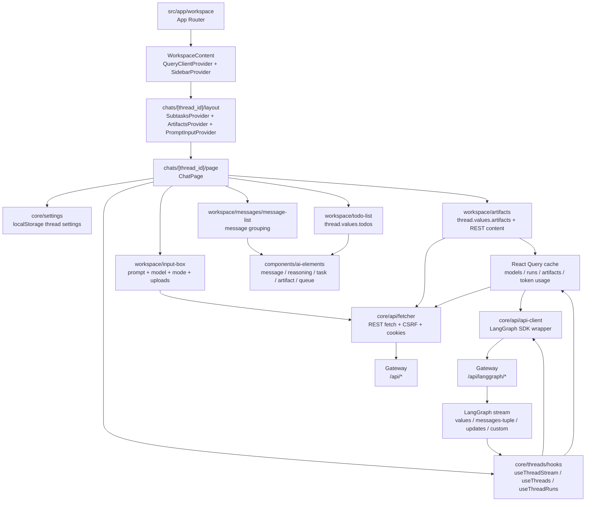
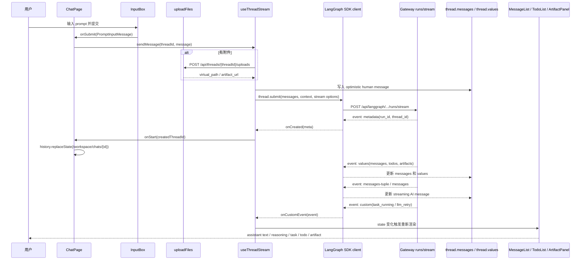
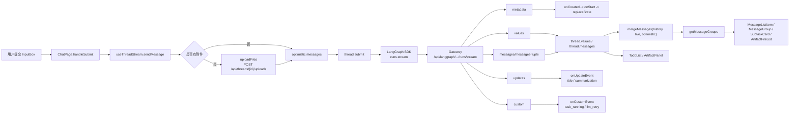
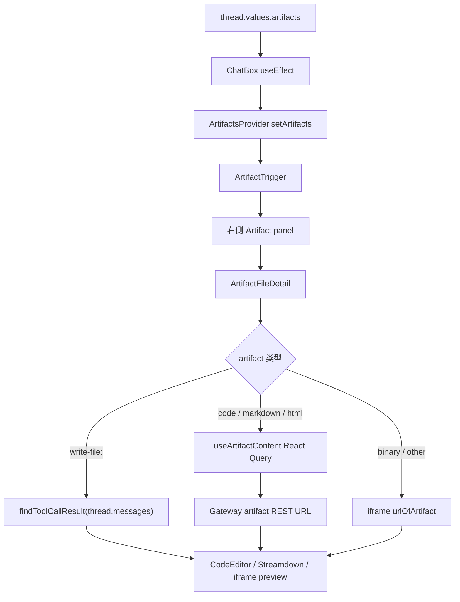
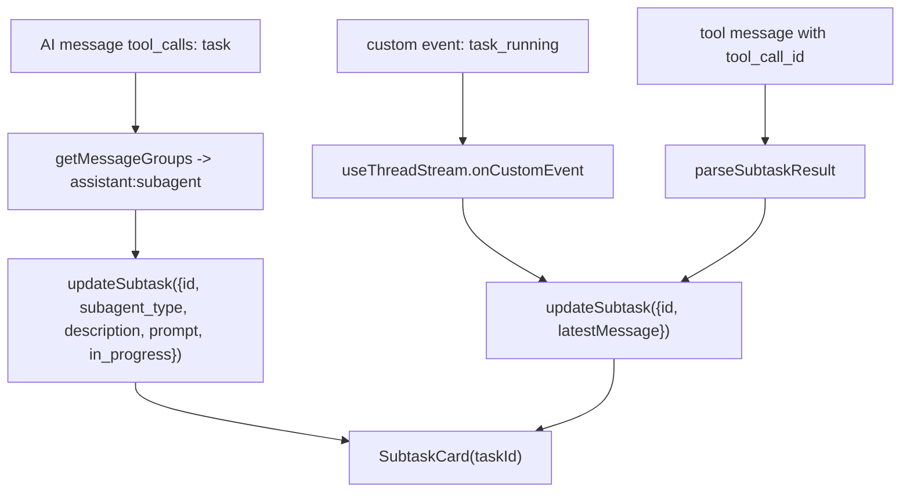

# 第 10 章：Frontend Workspace、数据流与端到端调试

## 阅读目标

本章解释 Next.js 前端如何组织 workspace、调用 Gateway、消费 LangGraph stream，并把消息、reasoning、task、todo、artifact、settings 等 UI 状态呈现出来。第 10 章是前后端链路的收束章节：前面的 Gateway、runtime、tools、artifact 和 memory 最终都会以 thread state、stream event 或 REST response 的形式进入这里。

读完本章后，需要能回答：

- App Router 页面、workspace layout、sidebar、input box 和 ai-elements 的职责。
- React Query、API client、LangGraph SDK 和 hooks 如何分工。
- 从用户点击发送到后端流式事件渲染成 UI 的完整链路。
- todo、artifact、subagent task、reasoning 和 token usage 分别来自哪类数据。
- 前端出问题时，应该先看网络请求、stream event、React Query cache、message grouping 还是具体组件。

## 核心概念

### App Router 是 workspace 的外壳

`frontend/src/app/workspace/layout.tsx` 先调用 `getServerSideUser()` 判断认证和系统初始化状态。认证通过时，它把 workspace 子路由包进 `AuthProvider`，再交给 `WorkspaceContent`；未登录、未 setup、Gateway 不可用等状态会在 layout 层重定向或显示不可用提示。

`WorkspaceContent` 是 server component，会读取 `sidebar_state` cookie，计算侧边栏初始展开状态，然后在客户端层包上：

- `QueryClientProvider`：给 React Query 查询模型、threads、runs、artifact、token usage 等数据。
- `SidebarProvider`、`WorkspaceSidebar`、`SidebarInset`：提供 workspace 左侧导航和右侧内容区域。
- `CommandPalette`、`Toaster`：提供命令面板和 toast。

`frontend/src/app/workspace/page.tsx` 不渲染聊天 UI，只负责重定向：静态站点模式会跳到 `public/demo/threads` 下第一个 demo thread，否则跳到 `/workspace/chats/new`。

### ChatPage 是工作台状态的总装点

`frontend/src/app/workspace/chats/[thread_id]/page.tsx` 是聊天页主体。它把这些状态组装到一个页面：

- `useThreadChat()`：从 URL 参数得到 thread id；`/new` 时先生成客户端 UUID，但不会马上让 SDK 拉 history。
- `useThreadSettings(threadId)`：从 localStorage 得到当前 thread 的模型、模式、reasoning effort。
- `useThreadStream(...)`：用 LangGraph SDK 连接 run stream，返回 live thread、发送函数、历史加载函数和上传状态。
- `MessageList`：渲染 thread messages。
- `TodoList`：读取 `thread.values.todos`。
- `ArtifactTrigger` 和 `ChatBox`：读取 `thread.values.artifacts` 并打开 artifact 面板。
- `InputBox`：负责用户输入、附件、模型选择、模式选择和 stop。

这里有一个重要边界：`isNewThread` 表示后端是否已经创建 thread，`isWelcomeMode` 只表示视觉布局。发送第一条消息时先关闭 welcome 布局，但 `threadId` 仍不传给 `useStream`，直到 `onStart` 收到后端创建的 thread id，避免 SDK 提前请求 `/history` 或 `/runs`。

### API client、React Query、LangGraph SDK 的分工

前端不是用一个万能 client 处理所有数据：

- LangGraph SDK client 在 `frontend/src/core/api/api-client.ts` 创建，用于 `/api/langgraph/*` compatible endpoints，例如 thread search、runs stream、runs list、thread state/history。
- `fetcher.ts` 包装普通 `fetch`，自动携带 cookie，并在 `POST`、`PUT`、`DELETE`、`PATCH` 注入 `X-CSRF-Token`。
- React Query 管理非 streaming 或可缓存数据，例如 `useModels()`、`useThreads()`、`useThreadRuns()`、`useThreadTokenUsage()`、`useArtifactContent()`。
- `useStream<AgentThreadState>()` 管理 live stream。它接收 LangGraph stream 后，把 `values`、`messages/messages-tuple`、`updates` 和 `custom` 等事件映射为 `thread.values`、`thread.messages`、metadata callback 和 custom callback。

`api-client.ts` 还会给 LangGraph SDK 加一层兼容处理：

- `injectCsrfHeader()`：对状态改变请求注入 CSRF header。
- `sanitizeRunStreamOptions()`：如果调用方带 `streamMode`，只保留前端支持的 `values`、`messages`、`messages-tuple`、`updates`、`events`、`debug`、`tasks`、`checkpoints`、`custom`。
- `joinStream()`：遇到 “run not active on this worker” 的 409 时，清理 sessionStorage 中的 reconnect metadata。
- 静态站点模式下用 `createStaticClient()` 读 `public/demo/threads`，并让 stream 方法返回空流。

### LangGraph stream 到 UI 的基本映射

stream 不直接渲染 DOM，而是先进入 `useThreadStream()`：

- `values`：SDK 更新 `thread.values` 和 `thread.messages`。聊天消息、todo、artifact 都从这里读。
- `messages` / `messages-tuple`：SDK 更新 live message；前端用 `getMessagesMetadata()` 判断哪些 AI message 正在 streaming。
- `updates`：`onUpdateEvent()` 处理局部 state update，例如标题变化和 summarization middleware 的消息搬移。
- `custom`：`onCustomEvent()` 处理自定义事件。目前源码里处理 `task_running` 更新 subtask 最新消息，处理 `llm_retry` 弹 toast。
- LangChain event：`onLangChainEvent()` 捕获 `on_tool_end`，通过 `onToolEnd` 回调向外暴露工具结束事件。

## 架构图说明

前端按页面、核心业务模块和组件层拆分。`src/app` 提供路由和 layout，`src/core` 封装 API 与领域状态，`src/components/workspace` 组织工作台，`src/components/ai-elements` 专门渲染 AI 消息和工具结果。



## 发送消息时序图



## 核心源码入口

- [frontend/src/app/workspace/workspace-content.tsx](/Users/mrl/lgx/project/deer-flow/frontend/src/app/workspace/workspace-content.tsx)
- [frontend/src/app/workspace/page.tsx](/Users/mrl/lgx/project/deer-flow/frontend/src/app/workspace/page.tsx)
- [frontend/src/components/workspace/input-box.tsx](/Users/mrl/lgx/project/deer-flow/frontend/src/components/workspace/input-box.tsx)
- [frontend/src/components/workspace/workspace-sidebar.tsx](/Users/mrl/lgx/project/deer-flow/frontend/src/components/workspace/workspace-sidebar.tsx)
- [frontend/src/components/ai-elements/message.tsx](/Users/mrl/lgx/project/deer-flow/frontend/src/components/ai-elements/message.tsx)
- [frontend/src/components/ai-elements/artifact.tsx](/Users/mrl/lgx/project/deer-flow/frontend/src/components/ai-elements/artifact.tsx)
- [frontend/src/core/api/api-client.ts](/Users/mrl/lgx/project/deer-flow/frontend/src/core/api/api-client.ts)
- [frontend/src/core/threads/hooks.ts](/Users/mrl/lgx/project/deer-flow/frontend/src/core/threads/hooks.ts)
- [frontend/src/core/uploads/hooks.ts](/Users/mrl/lgx/project/deer-flow/frontend/src/core/uploads/hooks.ts)
- [frontend/src/core/models/hooks.ts](/Users/mrl/lgx/project/deer-flow/frontend/src/core/models/hooks.ts)

## 关键源码逐段讲解

### `layout.tsx` 和 `workspace-content.tsx`：workspace 外壳

workspace 外壳分两层：

1. `layout.tsx`：处理 server-side auth、setup、Gateway unavailable、config error，并在 authenticated 分支挂 `AuthProvider`。
2. `workspace-content.tsx`：处理 workspace UI provider。

`WorkspaceContent` 做三件事：

1. 从 cookie 读取 `sidebar_state`，用 `parseSidebarOpenCookie()` 转成 `boolean | undefined`。
2. 用 `QueryClientProvider` 包住 workspace，保证子组件可以使用 React Query。
3. 用 `SidebarProvider` 创建左侧 `WorkspaceSidebar` 和右侧 `SidebarInset`。

调试 workspace 全局状态时，先确认 layout 是否进入 authenticated 分支，再确认 `WorkspaceContent` 里的 provider 是否存在。React Query、sidebar、command palette、toast 都是在这个层级挂上的。

### `page.tsx`：workspace 根路由重定向

`frontend/src/app/workspace/page.tsx` 的逻辑很小，但决定进入真实聊天页的入口：

- `NEXT_PUBLIC_STATIC_WEBSITE_ONLY === "true"` 时，读取 `public/demo/threads` 的第一个目录并跳转到 demo thread。
- 非静态模式跳转到 `/workspace/chats/new`。

因此，打开 `/workspace` 看不到聊天组件是正常现象；需要继续跟到 `/workspace/chats/[thread_id]`。

### `chats/[thread_id]/layout.tsx` 和 `providers.tsx`：聊天页上下文

聊天页 layout 只包一层 `ChatProviders`。`ChatProviders` 提供：

- `SubtasksProvider`：保存 subagent task 的中间状态。
- `ArtifactsProvider`：保存 artifact 面板开关、选中文件、artifact 列表。
- `PromptInputProvider`：保存 prompt input 内部 controller 和附件状态。

这些 provider 的位置说明：task、artifact、input state 都是聊天页级别状态，不是全局 workspace 状态。

### `ChatPage`：新线程、防竞态和页面拼装

`ChatPage` 的关键控制点：

- `useThreadChat()` 读取 `[thread_id]`，如果路径是 `new`，先生成一个 UUID 供上传和本地状态使用。
- `useThreadStream({ threadId: isNewThread ? undefined : threadId })` 是防竞态核心。新聊天时不把客户端 UUID 传给 SDK，避免 SDK 在 thread 尚未创建时请求 `/history` 或 `GET /runs`。
- `onSend()` 只关闭 welcome 视觉布局，不改变 `isNewThread`。
- `onStart(createdThreadId)` 在 stream metadata 返回后设置真实 thread id，并用 `history.replaceState()` 改 URL。这里刻意不用 Next router，因为重新 mount 会丢失 streaming state。
- `onFinish(state)` 在页面失焦时用最后一条消息发系统通知。

页面渲染层对应：

- header：`ThreadTitle`、`TokenUsageIndicator`、`ExportTrigger`、`ArtifactTrigger`。
- main：`MessageList`。
- input 区：`TodoList` 和 `InputBox`。
- 外层：`ChatBox` 管理 artifact resizable panel。

### `input-box.tsx`：输入、模型和模式

`InputBox` 不直接调用 Gateway stream。它负责把用户意图整理成 `PromptInputMessage`，再交给 `onSubmit`：

- `useModels()` 从 `/api/models` 加载模型列表。
- `getResolvedMode()` 根据模型是否支持 thinking，把不支持的模式降级到 `flash`。
- `handleModelSelect()` 更新 `context.model_name`。
- `handleModeSelect()` 更新 `mode`，并映射 `reasoning_effort`：`flash -> minimal`，`thinking -> low`，`pro -> medium`，`ultra -> high`。
- `handleSubmit()` 在 streaming 时调用 `onStop()`；空文本且无文件时不提交；模型自动选择尚未写入 settings 时会先补齐 context，再延迟提交。

真正提交发生在 `ChatPage.handleSubmit()`，它调用 `sendMessage(threadId, message)`。

### `useThreadStream()`：发送、接流和合并消息

`frontend/src/core/threads/hooks.ts` 是第 10 章最重要的源码。它把 SDK stream、历史消息、optimistic UI 和 React Query cache 合并起来。

发送路径：

1. `sendMessage()` 用 `sendInFlightRef` 防止重复发送。
2. 记录当前 message baseline，用于 token usage pending 计算。
3. 如果有附件，先通过 `uploadFiles(threadId, files)` 上传到 `/api/threads/{threadId}/uploads`，再把 `virtual_path` 写入 human message 的 `additional_kwargs.files`。
4. 先插入 optimistic human message；附件上传中还会插入一个 `additional_kwargs.element === "task"` 的临时 AI message。
5. 调用 `thread.submit(...)`，传入：
   - `messages`：一条 human message。
   - `threadId`：当前 thread id。
   - `streamSubgraphs: true`：接收 subgraph stream。
   - `streamResumable: true`：允许恢复 stream。
   - `config.recursion_limit: 1000`。
   - `context`：模型、模式、`thinking_enabled`、`is_plan_mode`、`subagent_enabled`、`reasoning_effort`、`thread_id`。

接收路径：

- `onCreated(meta)`：把新 thread 写入 React Query 的 `["threads", "search"]` cache，并在 agent chat 下补写 thread metadata。
- `onLangChainEvent(event)`：处理 `on_tool_end`。
- `onUpdateEvent(data)`：处理 summarization middleware 的消息搬移；处理 title update 并更新 sidebar thread cache。
- `onCustomEvent(event)`：处理 `task_running` 和 `llm_retry`。
- `onError(error)`：清理 optimistic message、toast 错误，并刷新 token usage。
- `onFinish(state)`：通知上层，刷新 thread search 和 token usage。

消息显示前还会经过三层合并：

- history：`useThreadHistory()` 通过 `useThreadRuns()` 和 `/api/threads/{threadId}/runs/{runId}/messages` 拉历史 run messages。
- live：`thread.messages` 来自 SDK stream。
- optimistic：发送后服务器回显前临时显示的用户消息和上传状态。

`mergeMessages()` 会按 message id 或 tool call id 去重，避免历史消息和 live stream 重叠。

### `api-client.ts`：LangGraph SDK 兼容层

`createCompatibleClient()` 创建 `LangGraphClient`，base URL 来自 `getLangGraphBaseURL()`：

- 有 `NEXT_PUBLIC_LANGGRAPH_BASE_URL` 时使用显式配置。
- mock 模式使用当前 origin 下的 `/mock/api`。
- 默认使用当前 origin 下的 `/api/langgraph`。

它包装了两个 SDK 方法：

- `runs.stream()`：调用前经过 `sanitizeRunStreamOptions()`。
- `runs.joinStream()`：同样清洗参数，并在 inactive stream 409 时清理 reconnect sessionStorage。

这个文件是调试 stream 请求 URL、CSRF、静态 demo、mock mode 的第一入口。

### `fetcher.ts`：普通 REST 请求

普通 REST API 使用 `core/api/fetcher.ts`：

- 始终 `credentials: "include"`。
- 对状态改变方法注入 `X-CSRF-Token`。
- `401` 时跳转 login。

上传、artifact 内容、token usage、thread 删除等都应走这个 fetcher。排查 “SDK 请求正常但 REST 失败” 时，需要检查这里的 cookie、CSRF 和 base URL。

### `uploads/hooks.ts`：上传列表和提交期上传

`frontend/src/core/uploads/hooks.ts` 是上传 REST API 的 React Query 包装：

- `useUploadFiles(threadId)`：调用 `uploadFiles()`，成功后 invalidates `["uploads", "list", threadId]`。
- `useUploadedFiles(threadId)`：查询 `/api/threads/{threadId}/uploads/list`。
- `useDeleteUploadedFile(threadId)`：删除上传文件后刷新列表。
- `useUploadFilesOnSubmit(threadId)`：返回一个提交期上传函数。

当前聊天发送主链路在 `useThreadStream().sendMessage()` 中直接调用 `uploadFiles()`，不是通过 `useUploadFilesOnSubmit()`。因此调试 input submit 的附件上传时，应优先看 `sendMessage()`；调试上传列表或删除时，再看这些 hooks。

### `MessageList` 和 `messages/utils.ts`：消息分组

`MessageList` 不直接按原始 messages 渲染，而是先调用 `getMessageGroups(messages)`：

- human message -> 用户气泡。
- 普通 AI content -> assistant 气泡。
- AI reasoning 或 tool calls -> `assistant:processing`，渲染为 chain of thought / tool call 步骤。
- `present_files` tool call -> `assistant:present-files`，渲染 `ArtifactFileList`。
- `task` tool call -> `assistant:subagent`，渲染 `SubtaskCard`。
- `ask_clarification` tool message -> `assistant:clarification`。
- `hide_from_ui` 或 `summary`、`loop_warning`、`todo_reminder`、`todo_completion_reminder` 等控制消息会被过滤。

这解释了为什么后端只要改变 message 的 `tool_calls`、`additional_kwargs` 或 `name`，前端 UI 形态就会改变。

### `MessageListItem` 和 ai-elements：文本、reasoning、附件

`MessageListItem` 把单条 message 交给 `components/ai-elements/message.tsx` 的基础容器。`MessageContent_` 负责内容解析：

- human message 会剥掉 `<uploaded_files>` 标记，并把 `additional_kwargs.files` 渲染成附件列表。
- AI message 会用 `MarkdownContent` 渲染文本。
- `additional_kwargs.reasoning_content`、content array 里的 thinking block、或字符串里的 `<think>...</think>` 会进入 reasoning UI。
- `/mnt/...` 图片或链接会通过 `resolveArtifactURL(src, threadId)` 转成 Gateway artifact URL。
- `additional_kwargs.element === "task"` 是上传中的临时任务样式。

### `TodoList`：LangGraph state 驱动的轻量队列

`TodoList` 的输入是 `thread.values.todos ?? []`。每个 todo 只有：

- `content`
- `status: pending | in_progress | completed`

所以 todo UI 的问题通常不是组件内部问题，而是 upstream state 没有把 `todos` 放进 `values`，或 stream 没有把最新 `values` 推到 SDK state。

### `ChatBox` 和 artifacts：两类 artifact 展示

artifact 有两条展示路径：

- 消息内展示：`present_files` tool call 被 `extractPresentFilesFromMessage()` 解析成路径列表，然后渲染 `ArtifactFileList`。
- 右侧面板展示：`ChatBox` 监听 `thread.values.artifacts`，写入 `ArtifactsProvider`，`ArtifactTrigger` 打开面板，`ArtifactFileDetail` 显示内容。

`ArtifactFileDetail` 的细节：

- `write-file:` URL 表示文件还在写入，内容来自当前 thread messages 中对应 tool result。
- 普通 code artifact 通过 `useArtifactContent()` 拉内容。
- markdown/html 可以切换 code 和 preview。
- 非代码文件通过 iframe 打开 `urlOfArtifact({ filepath, threadId })`。
- `.skill` 文件会显示安装按钮，并调用 `installSkill()`。

## 调用链追踪

### 从点击发送到 UI 渲染



### 从 artifact 路径到预览



### 从 subagent stream event 到 task card



## 可运行验证实验

这些实验用于验证理解，执行前需要确认后端或 mock 已按对应场景启动。本次文档扩写没有执行这些命令。

### 实验 1：验证新聊天首发请求顺序

目的：确认 `/workspace/chats/new` 首次发送时，不会在 `POST /runs/stream` 前请求 `/history` 或 `GET /runs`。

推荐命令：

```bash
cd frontend
pnpm test:e2e -- tests/e2e/chat-thread-init-ordering.spec.ts
```

源码依据：`ChatPage` 在 `isNewThread` 为 true 时传给 `useThreadStream` 的 `threadId` 是 `undefined`；`onStart` 收到 metadata 后才设置真实 thread id。

### 实验 2：验证最小 stream 渲染

目的：确认 `values` event 能让页面显示 AI 文本。

推荐命令：

```bash
cd frontend
pnpm test:e2e -- tests/e2e/chat.spec.ts
```

mock stream 在 `tests/e2e/utils/mock-api.ts` 的 `handleRunStream()` 中返回：

- `event: metadata`
- `event: values`，包含 human message 和 AI message `Hello from DeerFlow!`
- `event: end`

如果页面没有显示文本，优先检查 `useThreadStream()`、SDK client base URL、`MessageList` 和 `getMessageGroups()`。

### 实验 3：验证 artifact preview

目的：确认 artifact 面板能展示写入中和写入完成后的 artifact。

推荐命令：

```bash
cd frontend
pnpm test:e2e -- tests/e2e/artifact-preview.spec.ts
```

重点观察：

- `thread.values.artifacts` 是否进入 `ChatBox`。
- `ArtifactTrigger` 是否出现。
- `ArtifactFileDetail` 是否正确选择 `write-file:`、code、markdown、html 或 iframe 路径。

### 实验 4：验证单元级 message / client 行为

目的：定位不需要浏览器的纯逻辑问题。

推荐命令：

```bash
cd frontend
pnpm test -- tests/unit/core/threads/message-merge.test.ts
pnpm test -- tests/unit/core/api/api-client.test.ts
pnpm test -- tests/unit/core/api/stream-mode.test.ts
```

分别覆盖：

- history、live、optimistic messages 的去重和合并。
- inactive stream 409 的 reconnect 清理。
- streamMode 清洗。

### 实验 5：人工观察 stream 和 state

目的：真实后端下定位 stream event 到 UI 的断点。

步骤：

1. 启动后端和前端，打开 `/workspace/chats/new`。
2. 打开浏览器 DevTools Network，过滤 `runs/stream`。
3. 发送一条消息。
4. 检查 stream 是否依次出现 `metadata`、`values`、`messages` 或 `messages-tuple`、`custom`、`end`。
5. 对照 React DevTools 中 `ChatPage -> MessageList` 的 props，确认 `thread.messages` 和 `thread.values` 是否更新。

## 常见改造点

### 新增一个 stream custom event

改造位置：

- 后端发出新的 `custom` event。
- 前端在 `useThreadStream().onCustomEvent()` 增加类型判断。
- 如果只是 toast 或全局状态，直接在 hook 内处理。
- 如果要渲染组件，优先写入已有 context，例如 task 走 `SubtasksProvider`；artifact 走 `ArtifactsProvider` 或 `thread.values.artifacts`。

风险：custom event 不会自动进入 `thread.messages`。如果 UI 需要持久历史，应该让后端同时写入 state 或 run messages。

### 增加一种工具结果 UI

改造位置：

- `core/messages/utils.ts`：增加识别函数和 message group 类型。
- `MessageList`：增加 group render 分支。
- `components/ai-elements/*` 或 `components/workspace/messages/*`：实现具体展示组件。

风险：不要只靠 tool message content 字符串解析。已有代码更偏向用 `message.type`、`tool_calls.name`、`tool_call_id`、`additional_kwargs` 做结构化判断。

### 调整模型选择或模式策略

改造位置：

- `core/models/api.ts` 和 `useModels()`：模型列表来源。
- `input-box.tsx`：`getResolvedMode()`、`handleModelSelect()`、`handleModeSelect()`。
- `core/settings/local.ts` 和 `store.ts`：localStorage 默认值和 thread model override。
- `useThreadStream().sendMessage()`：把 mode 映射为 `thinking_enabled`、`is_plan_mode`、`subagent_enabled`、`reasoning_effort`。

风险：前端 mode 只是 context，后端是否真正支持取决于模型配置和 agent runtime。

### 修改 artifact 展示

改造位置：

- artifact 列表来源：`thread.values.artifacts` 和 `present_files` tool call。
- artifact 内容读取：`core/artifacts/hooks.ts`、`loader.ts`、`utils.ts`。
- 右侧面板：`artifact-file-detail.tsx`。

风险：`write-file:` artifact 和普通 artifact 的内容来源不同。写入中的文件来自 tool result；普通文件通过 Gateway artifact URL 读取。

### 修改新聊天创建流程

改造位置：

- `useThreadChat()`：URL 和本地 thread id。
- `ChatPage`：`isNewThread`、`isWelcomeMode`、`onSend`、`onStart`。
- `useThreadStream()`：`threadId` 传给 `useStream` 的时机。

风险：不要让 SDK 在后端 thread 创建前看到客户端 UUID。否则会重现 `/history` 或 `GET /runs` 早于 `/runs/stream` 的竞态。

## 风险和调试入口

### stream 请求失败

优先看：

- `core/config/index.ts`：`getLangGraphBaseURL()` 是否指向正确 `/api/langgraph`。
- `core/api/api-client.ts`：CSRF header、`sanitizeRunStreamOptions()`、inactive stream 409。
- Network：`POST /api/langgraph/.../runs/stream` 状态码和 SSE 内容。
- `useThreadStream().onError()`：toast 展示的错误是否来自 nested error。

### REST 请求失败

优先看：

- `core/api/fetcher.ts`：cookie、CSRF、401 redirect。
- `getBackendBaseURL()`：为空时走同源代理；有 env 时拼成显式后端地址。
- 具体 API hook：models、uploads、artifact、token usage、thread delete 是否使用了 fetcher。

### 消息到了但 UI 不显示

优先看：

- `isHiddenFromUIMessage()` 是否过滤了 message。
- `getMessageGroups()` 是否把 message 分到了预期 group。
- `hasContent()`、`hasReasoning()`、`hasToolCalls()`、`hasPresentFiles()`、`hasSubagent()` 判断是否命中。
- `MessageList` 对该 group 是否有 render 分支。

### todo 不显示

优先看：

- stream `values` 里是否有 `todos`。
- `thread.values.todos` 是否更新。
- `ChatPage` 中 `hasTodos = (thread.values.todos?.length ?? 0) > 0` 是否为 true。

### artifact 不显示

优先看：

- 右侧面板：`thread.values.artifacts` 是否有路径。
- 消息内列表：AI message 是否包含 `present_files` tool call，且 `args.filepaths` 是数组。
- 内容预览：`useArtifactContent()` 的 query 是否 enabled，Gateway artifact URL 是否可访问。

### 历史消息重复或消失

优先看：

- `messageIdentity()` 用 message id 或 `tool_call_id` 去重。
- `mergeMessages(history, thread.messages, optimisticMessages)` 的输入顺序。
- `useThreadHistory()` 是否把 middleware caller 的历史消息过滤掉。
- summarization update 是否触发 `appendMessages()` 和 `messagesRef.current = []`。

### token usage 不准

优先看：

- `pendingUsageBaselineMessageIdsRef` 是否在发送、错误、完成时正确设置。
- `useThreadTokenUsage()` 是否启用，`/api/threads/{threadId}/token-usage` 是否返回。
- `TokenUsageIndicator` 和 `MessageTokenUsageList` 的 inline mode。

## 后续深读任务

- 从 `input-box.tsx` 找到发送入口，追踪到 thread hook 和 Gateway 请求。
- 选择一个 stream event，追踪它如何变成 message、task 或 artifact UI。
- 跑前端单元测试和 E2E 测试，建立 UI 回归验证入口。
- 选一个后端 tool call，例如 `present_files` 或 `task`，从后端 message 结构追到 `getMessageGroups()` 和最终组件。
- 在真实浏览器里抓一次 `runs/stream`，把每个 event 对应到本章的渲染分支。
